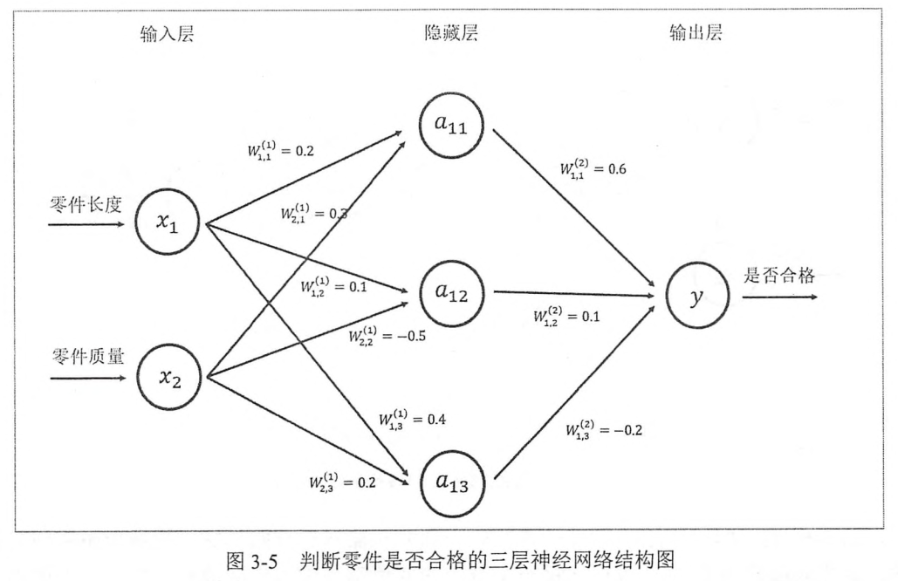
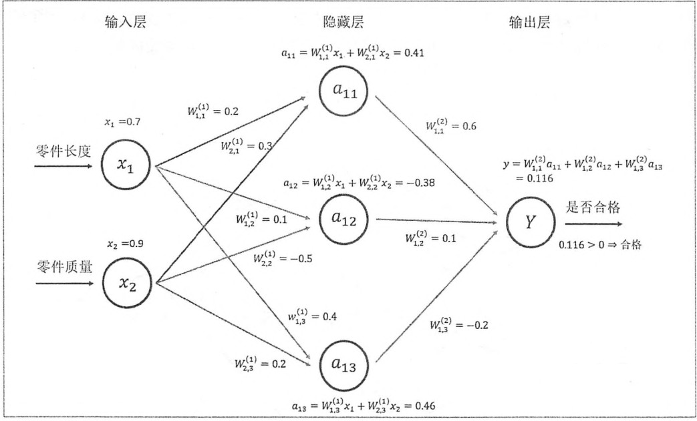
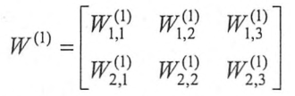
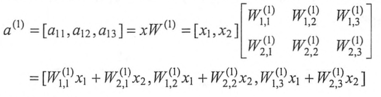
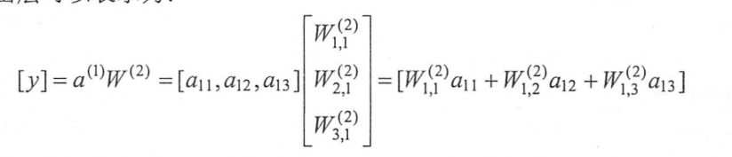
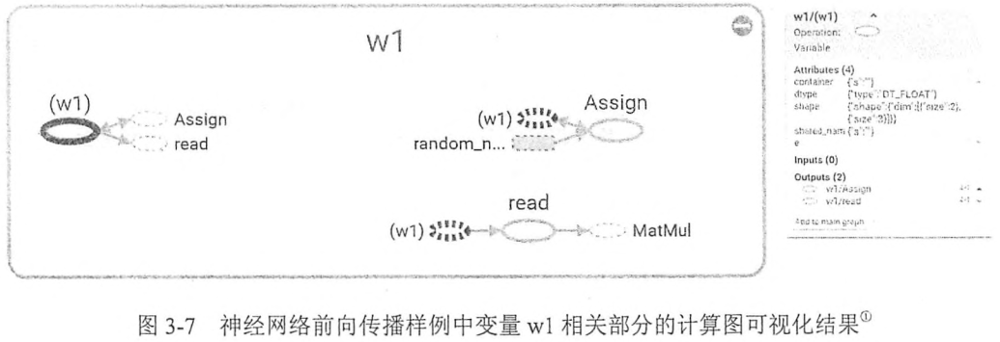
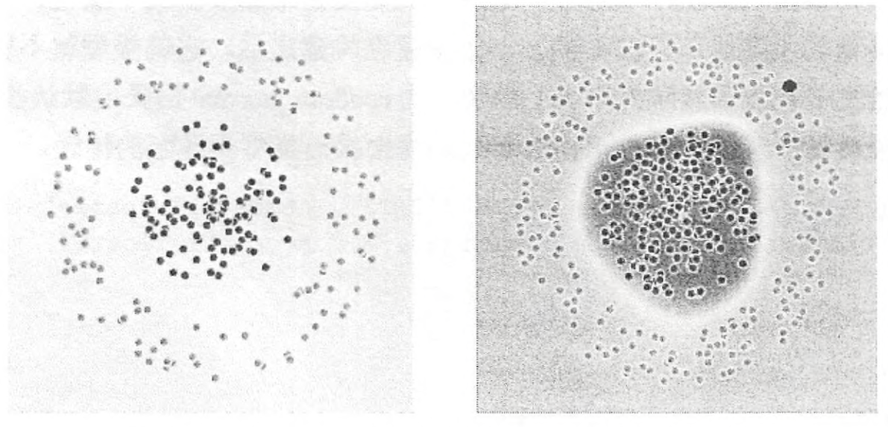
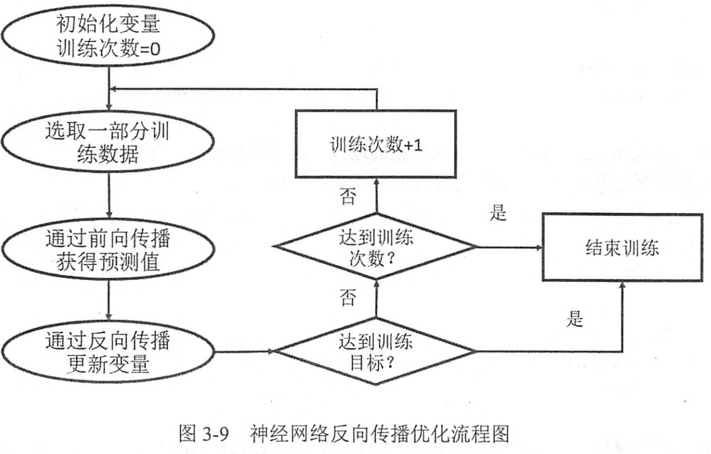

# Chapter2 张量
## 2.2 TF数据模型--张量
在TF中，所有的数据都通过张量的形式来表示，从功能的角度来看，张量可以被简单理解为多维数组，零阶张量表示标量(scalar)，也就是一个数；第一阶张量为向量(vector)，也就是一个一维数组；但是张量在TF中的实现并不是直接采用数组的形式，它只是对TF中运算结果的引用。在张量中并没有真正保存数字，它保存的是如何得到这些数字的计算过程。还是以向量加法为例，当运行如下代码的时候，并不会得到加法的结果，而是会得到对结果的一个引用
```python
import tensorflow as tf 
def A():
    a = tf.constant([1.0, 2.0], name = "a")
    b = tf.constant([2.0, 3.0], name = "b")
    #result = a + b
    result = tf.add(a, b, name = "add")
    print(result)
A()
#输出：Tensor("add:0", shape=(2,), dtype=float32)
#result这个张量是计算节点“add"输出的第一个结果
#是一个一维数组，数组的长度为2
```
可以看出来，TF的张量和Numpy中的数组不同，TF计算的结果不是一个具体的数字，而是一个张量的结构。一个张量中主要保存了三个属性：名字(name)、维度(shape)和类型(type)。
张量的第一个属性名字不仅是张量的唯一标识符，同样给出了这个张量是如何计算的。张量和计算图上的节点所代表的计算结果是对应的。这样张量的命名就可以通过”node:src_output"的形式给出来。node为节点名称，src_output表示当前张量来自节点的第几个输出。

## 2.3 张量的使用
第一类用途是对中间计算结果的引用，当一个计算包含很多中间结果的时候，使用张量可以提高可读性，比如上面的代码利用a和b保存，来结算和result。同时通过张量来存储中间结果，这样可以方便的获取中间结果。比如在卷积神经网络中，卷积层或者池化层可能改变张量的维度，通过 *result.get_shape* 函数来获取张量的维度信息可以避免人工计算的麻烦。
第二类用途是当计算图构造完成之后，张量可以用来获得计算结果，即真实的数字。虽然张量本身没有存储具体的数字，但是通过 *session* 就可以得到这些具体的数字。比如在上述代码中，可以使用 *tf.Session().run(result)* 来得到计算结果。

## 2.4 会话
本节说明如何使用TF中的会话(session)来执行定义好的运算。会话拥有并管理TF程序运行时的所有资源。当所有计算完成之后需要关闭会话来帮助系统回收资源，否则会出现资源泄露的问题。TF中使用会话的模式一般有两种，第一种模式需要明确的调用会话生成函数和关闭会话函数：
```python
#创建一个会话
sess = tf.Session()
#使用这个创建好的会话来得到关心的运算的结果，比如sess.run(result).
sess.run(print(sess.run(result)))
sess.close()
```
第二种模式：
```python
with tf.Session() as sess:
    #使用创建好的会话来计算关心的结果
    sess.run(...)
# 不需要再调用”Session.close()"函数来关闭对话
# 当上下文退出时会话关闭和资源释放也就自动完成了
```
通过python上下文管理器的机制，只要将所有的计算放在"with"的内部就可以，当上下文管理器退出时会自动释放所有资源。这样即解决了因为异常退出时资源释放的问题，同时也解决了忘记调用*Session.close*函数而产生的志愿泄露。
TF会自动产生一个默认的计算图，如果没有特殊指定，运算会自动加入这个计图，TF的会话也有类似的机制，到那时TF不会自动生成默认的会话，而是需要手动指定，当默认的会话被指定之后可以通过**tf.Tensor.eval**函数来计算一个张量的取值，
```python
sess = tf.Session()
with sess.as_default():
    print(result.eval())
```
利用以下代码也可以完成
```python
import tensorflow as tf 
sess = tf.Session()
print(sess.run(result))
print(result.eval(session = sess)) #如果不指定session，会出现ValueError: Cannot evaluate tensor using `eval()`: No default session is registered.
# Use `with sess.as_default()` or pass an explicit session to `eval(session=sess)`
```
在交互式环境下(python脚本或jupyter编辑器)，通过设置默认会话的方式来获取张量的取值更加方便，所以TF提供了一种在交互环境下直接构建默认会话的函数，*tf.InteractiveSession*.使用这个函数会自动将生成的会话注册为默认会话。
```python
sess = tf.InteractiveSession()
print(result.eval())
sess.close()

```
通过 *tf.InteractiveSession* 函数可以省去将产生的会话注册为默认会话的过程，无论用那种方法都可以通过 *ConfigProto Protocol Buffer* 来配置需要生成的会话:
```python
config = tf.ConfigProto(allow_soft_placement = True,
                        log_device_placement = True)
sess1 = tf.InteractiveSession(config = config)
sess2 = tf.Session(config = config)
```
通过ConfigProto可以配置类似并行的线程数、GPU分配策略、运算超时时间等参数。在这些参数中最常使用的有两个。第一个是 *allow_soft_placement*,这是一个布尔型的参数，当它为*True*时，在以下任意一个条件成立的时候，GPU上的运算可以放到CPU上进行：
 1. 运算无法在GPU上执行
 2. 没有GPU资源（比如运算被指定第二个GPU上运行，但是机器只有一个GPU)
 3. 运算输入包含对CPU计算结果的引用
这个参数默认值为False,但是为了使得代码的可移植性更好，在有GPU的环境下，这个参数一般被设置为 True。
第二个使用的时 *log_device_placement* ，当它为True时日志中将会记录每个节点被安排在哪个设备上以方便调试，而在生产环境中，这个参数设置为 false可以减少日志量。

## 3.4 TF实现神经网络

### 3.4.1 TF游乐场
http://playground.tensorflow.org
第一层时输入层，代表特征向量中每一个特征的取值。在输入和输出层之间的神经网络叫做隐藏层，TF游乐场可以设置每一层的节点数，学习率(learning rate),激活函数(activation),正则化(regularization)。
在playground中，每个小格子代表神经网络的一个节点，而边代表节点之间的连接，每个节点和边都被图上了不同深浅的颜色。边上颜色代表了参数取值，颜色越深，取值越大，反之，接近白色，取值为0；节点输出值的绝对值越大，颜色越深。

### 3.4.2 前向传播算法
全连接层：相邻两层之间任意两个节点之间都有连接。W来表示神经元的参数，W的上标表明了神经网络的层数，比如 $W^{(1)}$表示第一层节点的参数。W的下标表明了连接节点编号，比如 $W_{1,2}^{(1)}$ 表示连接 $x_1$ 和 $a_12$ 节点边上的权重。

前向传播过程

$W^{(1)}$组织成一个2*3的矩阵：

这样通过矩阵乘法得到隐藏层三个节点所组成的向量取值：

类似的输出层可以表示为：


在TF中，变量 **tf.Variable** 的作用就是保存和更新神经网络中的参数，参数也需要指定初始值，一般使用随机数给TF中的变量初始化。下面的代码给出了TF中声明一个 2*3 的矩阵变量的方法：
>weights = tf.Variable(tf.random_normal([2, 3], stddev = 2))

调用了TF变量声明函数tf.Variable,在变量声明函数中给出了初始化这个变量的方法。TF中变量的初始值可以设置成随机数、常数或者是通过其他变量的初始值计算得到。上面的例子中，tf.random_normal([2,3],stddv=2)会产生一个2*3的矩阵，矩阵元素均值是0，标准差为2的随机数。*tf.random_normal* 可以通过参数 *mean* 来指定平均值，在没有指定时默认为0.
函数名称 | 随机数分布 |主要参数
:--: | :--: | :--: |
*tf.random_normal* | 正太分布 | mean stddev dtype
*tf.truncated* | 正态分布，但如果随机出来的值偏离平均值超过2个标准差，那么这个数将会被重新随机 | mean stddev dtype
*tf.random_uniform* |平均分布 |最大最小值
*tf.random_gamma* | gamma分布 | 类型

常数初始化变量声明
函数名称 | 功能 | 样例
:--: | :--: | :--: |
tf.zeros | 产生全为0的数组 | tf.zeros([2,3],int32) ->[ [0,0,0],[0,0,0] ]
tf.ones | 产生全为1的数组 | tf.ones([2,3],int32) -> [ [1,1,1], [1,1,1] ]
tf.fill | 产生一个全部为给定数字的数组 | tf.fill([2,3],9) -> [ [9,9,9],[9,9,9] ]
tf.constant | 产生一个给定值的常量 | tf.constant([1,2,3]) -> [1,2,3]
在神经网络中，偏置项(bias)通常会使用常数来设置初始值，比如：
> biases = tf.Variable(tf.zeros([3]))
> 
除了使用随机数或者常数，还可以：

> w2 = tf.Variable(weifhts.initialized_value())
> w3 = tf.Variable(weithts.initialized_value() * 2.0)

现在来使用代码计算两个输入x1,x2，一个三节点中间层，一个输出y.
```python
import tensorflow as tf

#声明w1,w2两个变量，这里还通过seed参数设定了随机种子
#这样可以保证每次运行得到的结果是一样的
 w1 = tf.Variable(tf.random_normal([2,3],stddev = 1, seed =1))
 w2 = tf.Variable(tf.random_normal([3,1], stddev =1, seed =1))

 #暂时将输入的特征向量定义为一个常量，注意这里x是一个1*2的矩阵
 x = tf.constant([[0.7,0.9]])

 #通过矩阵乘法
 a = tf.matmul(x,w1)
 y = tf.matmul(a,w2)

# with tf.Session() as sess:
#     sess.run(w1.initializer)
#     sess.run(w2.initializer)
#     print(y.eval())

with tf.Session() as sess:
    tf.global_variables_initializer().run()
    print(sess.run(y))
```
TF的w1是一个 *Variable* 运算。w1通过一个 *read* 操作将值供给了一个乘法运算，这个乘法操作就是 *tf.matmul(x,w1)*.初始化变量 *w1* 是通过 *Assign* 操作完的，*Assign* 这个节点的输入为 *随机生成函数* 的输出，而输出赋给了变量 *w1*.

TF中的 集合(*collection*)的概念，所有的变量都会被自动的加入 *GraphKeys.VARIABLES* 这个集合中，通过 *tf.all_variables* 函数可以拿到当前计算图上所有的变量，拿到计算图上所有的变量有助于持久化整个计算图的运行状态。在构建模型的时候，可以用过变量声明函数中的 *trainable* 参数来区分需要优化的参数(神经网络中的参数)和其他参数(比如迭代的轮数)。如果声明的变量参数 *trainable* 为 真，那么这个变量将会被加入到 *GraphKeys.TRAINABLE_VARIABLES*集合。可以用过 *tf.trainable_variables*得到所有需要优化的参数。TF中提供的神经网络优化算法默认会将 *GraphKeys.TRAINABLE_VARIABLES*集合中的对象作为默认的优化对象。
集合名称 | 集合内容 | 使用场景
:--: | :--: | :--:|
tf.GraphKeys.VARIABLES|所有变量 |持久化TF模型
tf.GraphKeys.TRAINABLE_VARIABLES | 可学习的变量(神经网络的参数)|模型训练、生成模型可视化内容
tf.GraphKeys.SUMMARIES | 日志生成相关的张量 |TF的计算可视化
tf.GraphKeys.QUEUE_RUNNERS | 处理输入的QueueRunner | 输入处理
tf.GraphKeys.MOVING_AVERAGE_VARIABLES | 所有计算了滑动平均值的变量 | 计算了变量的滑动平均值
 类似张量，维度(shape)和类型(type)也是变量重要的两个属性，变量的 **类型** 是 **不可以改变的**。一个变量在构建之后，它的类型就不能再改变了，比如在上面给出的前向传播样例中，w1的类型为random_normal结果的 **默认类型** tf.float32,不能被赋予其他类型的值，以下代码将会报出类型不匹配的错误。
 ```python
 w1 = tf.Variable(tf.random_normal([2,3], stddev=1), name = 'w1')
w2 = tf.Variable(tf.random_normal([2,3], stddev=2,dtype= tf.float64),
                name = 'w2')
w1.assign(w2)
with tf.Session() as sess:
    tf.global_variables_initializer().run()
    print('w2: ', sess.run(w2))
    print('w1: ', w1.eval())
 #Input 'value' of 'Assign' Op has type float64 that does 
 # not match type float32 of argument 'ref'
 ```

 维度是变量的另外一个重要的属性。和类型不同，维度在程序中是有可能改变的，但是需要通过设置参数 *validate_shape = Flase* .如下：

```python
w1 = tf.Variable(tf.random_normal([2, 3], stddev=1),
            name = 'w1')
w2 = tf.Variable(tf.random_normal([2, 2], stddev= 1),
            name = 'w2')
#下面这句话会报维度不匹配的错误：
#ValueError：
#tf.assign(w1,w2)
#下面这句话可以执行成功
tf.assign(w1, w2, validate_shape=False)
```
### 3.4.3 通过Tensorflow训练神经网络模型
在上面，完成了神经网络的前向传播过程，在这个示例中，所有的变量取值都是随机的，在使用神经网络解决实际的分类或者回归问题时，需要更好的设置参数取值。设置神经网络参数的过程就是神经网络的训练过程。下图是训练之前之后的效果图。

在神经网络优化算法中，最常用的是反向传播算法(backpropagation).

反向传播算法实现了一个迭代的过程，每次迭代的开始，首先选取一小部分训练数据，这个一小部分训练数据叫做一个 **batch**.这个 **batch** 的样例通过前向传播算法得到神经网络模型的预测结果。因为训练数据都有正确答案标注的，可以计算当前预测答案和正确答案之间的差距，最后，基于这个差距，反向传播算法会相应更新神经网络参数的取值，使得这个 **batch** 上的预测结果和真实答案更加接近。
通过Tensorflow实现反向传播算法的第一步是使用Tensorflow表达一个batch的数据，
> x= tf.constant([0.7, 0.9])

但如果每轮迭代选取的数据通过常量表示，那么TF的计算图将会非常大，因为每有一个常量，TF都会在计算图中增加一个节点，为了解决这个问题，TF提供 **placeholder**机制用于提供输入数据， **placeholder** 相当于定义了一个位置，这个位置中的数据在程序运行时再指定，这样在程序中就不需要生成大量常量来提供输入数据，只需要将数据通过 **placeholder** 传入TF计算图中，在 **placeholder** 定义时，数据类型需要指定且不可以改变，维度信息可以根据提供的数据推导得出，所以并不一定要给出。下面通过 **placeholder** 实现前向传播算法:
```python
w1 = tf.Variable(tf.random_normal([2, 3], stddev =1))
w2 = tf.Variable(tf.random_normal([3, 1],stddev = 1))

#定义 placeholder 作为存放数据的地方，这里维度不一定要定义
# 但是如果维度是确定的，那么给出维度可以降低出错的概率
x = tf.placeholder(tf.float32, shape=(1,2), name = "input")
a = tf.matmul(x, w1)
y = tf.matmul(a, w2)

with tf.Session() as sess:
    tf.global_variables_initializer().run()
    #print(sess.run(y)) #这个会报错InvalidArgumentError (see above for traceback): 
    #You must feed a value for placeholder tensor 'input' with dtype float and shape [1,2]

    print(sess.run(y,feed_dict={x:[[0.7,0.9]]}))
``` 
这段程序中代替了原来通过常量定义的输入的x,需要一个 *feed_dict* 来指定 x的取值， *feed_dict* 是字典。
在训练神经网络时需要每次提供一个batch的训练样例，将输入的1\*2矩阵改为 n\*2 矩阵，那么就可以得到n个样例的前向传播结果了，n\*2矩阵的每一行为一个样例数据，这样前向传播的结果为 n\*1的矩阵，每一行代表一个样例的前向传播结果。
```python
w1 = tf.Variable(tf.random_normal([2, 3], stddev =1))
w2 = tf.Variable(tf.random_normal([3, 1],stddev = 1))
x = tf.placeholder(tf.float32)
a = tf.matmul(x, w1)
y = tf.matmul(a, w2)
with tf.Session() as sess:
    tf.global_variables_initializer().run()
    #print(sess.run(y)) #这个会报错InvalidArgumentError (see above for traceback): 
    #You must feed a value for placeholder tensor 'input' with dtype float and shape [1,2]

    print(sess.run(y,feed_dict={x:[[0.7,0.9],[0.1,0.4],[0.5,0.8]]}))
```
在得到一个batch的前向传播结果之后，需要定义一个损失函数来刻画当前预测值和真实答案之间的差距，以下代码定义了一个简单的损失函数，并通过Tensotflow定义了反向传播的算法。
```pyhton
cross_entropy = -tf.reduce_mean(
    y_* tf.log(tf.clip_by_value(y,1e-10,1.0))
)
learning_rate = 0.001
train_step = \
    tf.train.AdamOptimizer(learning_rate).minimize(cross_entropy)
```
*cross_entropy* 定义了真实值和预测值之间的交叉熵，这是分类问题中一个常用的损失函数，第二行 *train_step* 定义了 反向传播的优化方法。目前TF支持7种不同的优化器，常用的三种为： tf.train.*GradientDescentOptimizer*, tf.train.*AdamOptimizer*, tf.train.*MomentumOPtimizer*. 在定义反向传播算法之后，运行 sess.run(train_step)可以对所有的 GraphKeys.TRAINABLE_VARIABLES集合中的变量进行优化，使得当前 batch下的损失函数更小。

### 完整的神经网络样例程序
```python
import tensorflow as tf
from numpy.random import RandomState

#NumPy是一个科学计算的工具包，这里通过Numpy工具包生成模拟数据集
import numpy as np 

#定义训练数据batch的大小
batch_size = 8

#定义神经网络的参数，这里使用之前的神经网络结构
w1 = tf.Variable(tf.random_normal([2,3],stddev=1,seed=1))
w2 = tf.Variable(tf.random_normal([3,1],stddev=1,seed=1))

'''
在shape的一个维度上使用None可以方便的使用不大的batch大小。
在训练时需要把数据分成比较小的batch, 但是在测试时，
可以一次性使用全部的数据，当数据集比较小时这样比较方便测试，但数据集
比较大时，将大量数据放入一个batch可能会导致内存溢出
x是输入{x1,x2}的数据，Y是标签
'''
x = tf.placeholder(
    tf.float32, shape=(None,2),name='x-input')
y_ = tf.placeholder(
    tf.float32,shape=(None,1),name='y-input'
)

#定义神经网络前向传播的过程
a = tf.matmul(x,w1)
y = tf.matmul(a,w2)

#定义损失函数和反向传播的算法 交叉熵
cross_entropy = -tf.reduce_mean(y_ * tf.log(
    tf.clip_by_value(y, 1e-10, 1.0)))
train_step = \
    tf.train.AdamOptimizer(0.001).minimize(cross_entropy)

#通过随机数生成一个模拟数据集
rdm = RandomState(1) #产生一个随机状态种子
dataset_size = 128
X = rdm.rand(dataset_size, 2) #生成 128行2列的数据

'''
定义规则来给出样本的标签，在这里所有的 x1 + x2 <1的样例被认为是
正样本（比如零件合格），而其他为负样本（比如零件不合格）。和tensorflow
游乐场中的表示法不大一样的地方是，在这里是用0来表示负样本，使用1来表示正样本，
大部分解决分类问题的神经网络都会采用0和1的表示方法。
'''
Y = [[int(x1 + x2 < 1)] for (x1,x2) in X]

#创建一个会话来运行TF程序
with tf.Session() as sess:
    tf.global_variables_initializer().run()
    print("w1: ", sess.run(w1))
    print("w2: ", sess.run(w2))

    #设定训练的次数
    STEPS = 5000
    for i in range(STEPS):
        #每次选取batch_size=8个样本进行训练
        start = (i*batch_size) % dataset_size
        end = min(start + batch_size, dataset_size)

        #通过选取的样本训练神经网络并更新参数,这里将X的128行数据切片喂入
        #
        sess.run(
            train_step, feed_dict={x:X[start:end], y_:Y[start:end]})
        if i % 1000 ==0:
            #每隔一段时间计算在所有数据上的交叉熵并输出
            total_cross_entropy = sess.run(
                cross_entropy, feed_dict={x:X, y_:Y}
            )
            print("After %d training setp(s),\
            cross entropy on all data is %g"%(i,total_cross_entropy))
    #训练之后的神经网络参数
    print("w1: ", sess.run(w1))
    print("w2: ", sess.run(w2))
```


