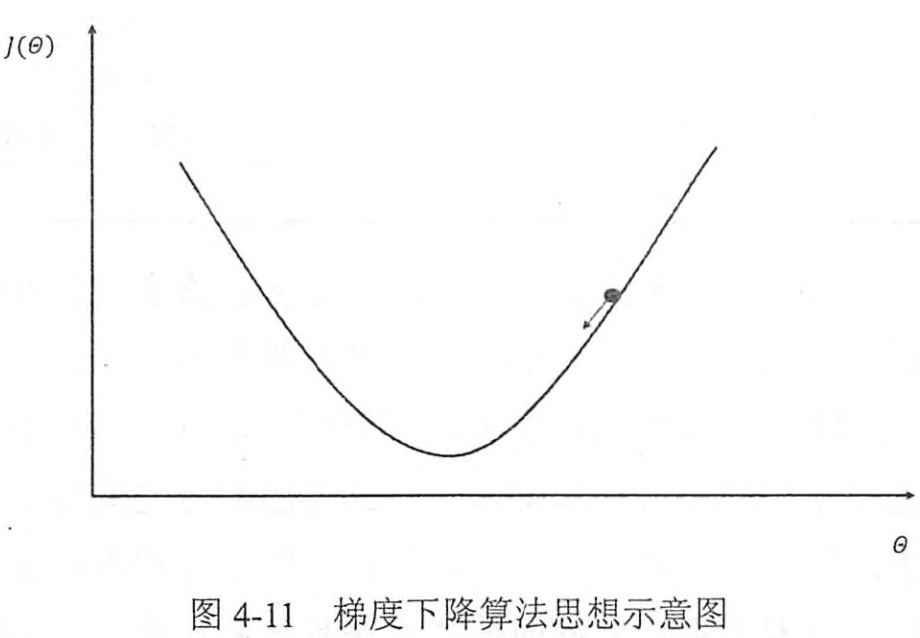
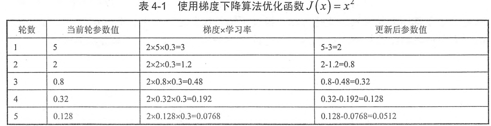
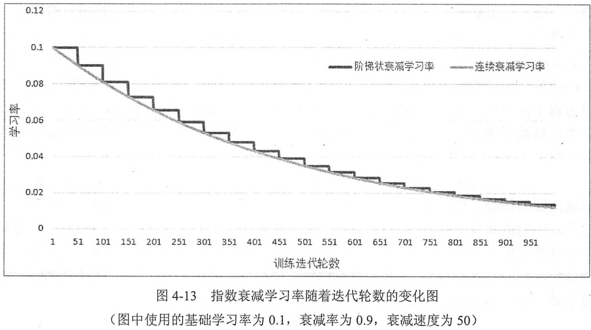
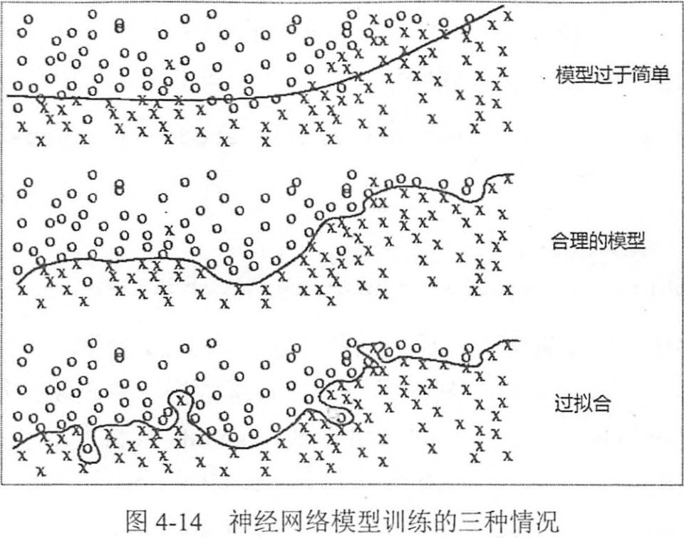
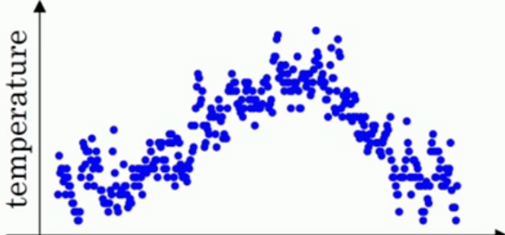
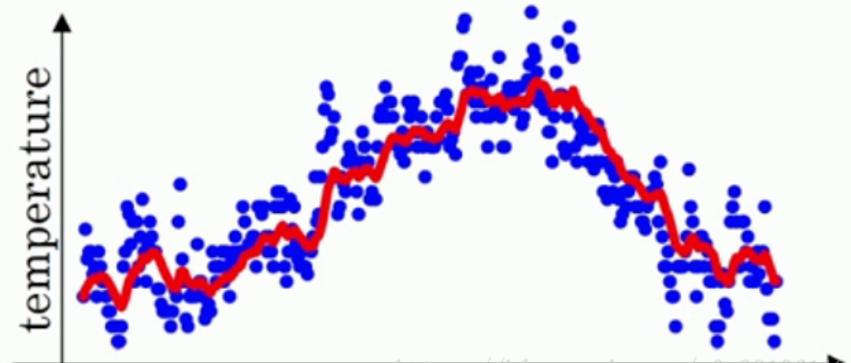
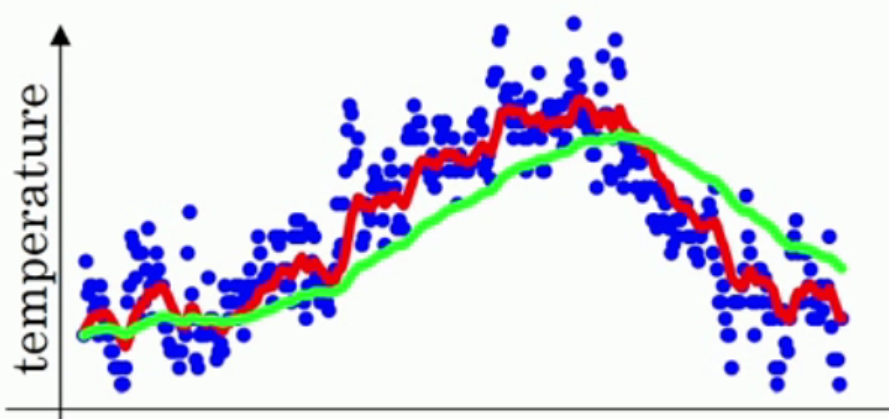
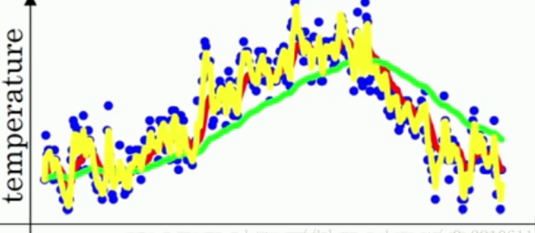
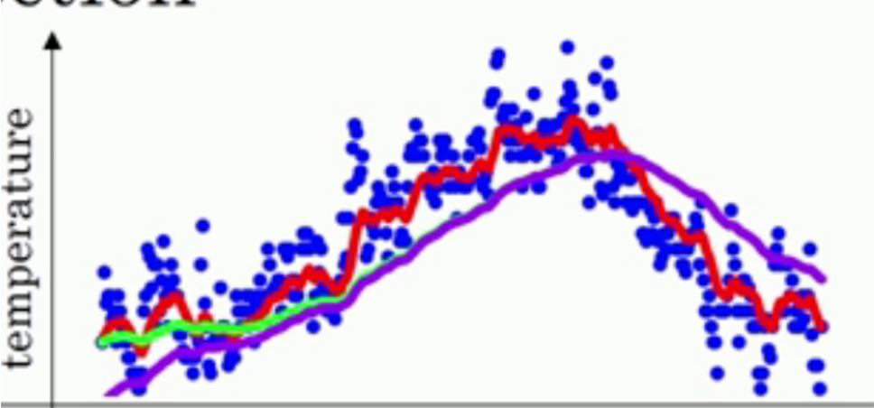

# Chapter3 深层神经网络
在线性模型模型中，模型的输出为输入的加权和。假设一个模型的输出 $y$和输入$x_i$满足以下关系：
$$ y = \sum_iw_ix_i+b $$
其中 $w_i,b \in R$ 为模型参数，当模型的输入只有一个的时候，x和y形成了二维坐标系上的一条直线，称之为线性模型。类似的，当模型为n个输入时，x和y形成了n+1维空间中的一个平面。而一个线性模型中通过输入得到输出的函数被称为一个 **线性变换**， **线性变换**的最大的特点时任意线性模型的组合仍然还是线性模型。在第2章中，**前向传播** 的计算公式也为线性模型：
$$ a^{(1)} = xW^{(1)}, y = a^{(1)}W^{(2)} $$
其中x为输入，W为参数。整理一下可以得到整个模型的输出为：
$$ y = (xW^{(1)})W^{(2)} $$
根据矩阵乘法的结合律有：
$$ y = x(W^{(1)}W^{(2)}) = xW' $$
而 $W^{(1)}W^{(2)}$其实可以被表示为一个新的参数$W'$:


这样输入和输出关系就可以表示为：


其中$W'$是新的参数，这个前向传播算法完全符合线性模型的定义。所以，只要通过 **线性变换**，任意层的 **全连接神经网络**和单层神经网络模型的表达能力没有区别，而且他们都是 **线性模型** 。然而线性模式能够解决的问题是有限的，下面验证其局限性。
http://playground.tensorflow.org
训练数据分布如下：


采用的训练方式如下，激活函数(**Activation**)选择 线性(**Linear**),


可以看见，这个模型只能通过 **直线** 来划分平面，


如果使用 **RELU** 激活函数，或者其他非线性激活函数也可以得到很好的非线性分类效果。


## 激活函数实现去线性化
在上面介绍的神经元结构的 **输出** 为所有 **输入** 的 **加权和**，这导致整个 **神经网络** 是一个 **线性模型**。如果将每一个神经元（就是神经网络的节点）的 **输出**通过一个 **非线性函数**，那么整个神经网络的模型不在是线性的了，这个非线性函数就是 **激活函数**。下图显示了加入 **激活函数** 和 **偏置项** 之后的神经元结构。


下面是添加激活函数以及偏置项后的前向传播算法：


以下是几种常用的 **非线性激活函数** 的图像：


这些函数的图像都不是一条直线，所以通过这些激活函数，每一个节点不再是线性变换，整个神经网络模型也就不再是线性的了。


从图中可以看出，**偏置项** 可以被表达为一个 **输出永远为1** 的节点，隐藏层推导公式：


输出层推导公式：


目前，TF提供7种不同的 $非线性激活函数$，tf.nn.relu、tf.sigmod和tf.tanh.以下代码实现上图的前向传播算法。
```python
a = tf.nn.relu(tf.matmul(x,w1) + biases1)
y = tf.nn.relu(tf.matmul(a,w2) + biases2)
```
## 多层网络解决异或运算
图种通过TF游乐场训练500轮之后的情况。图中使用了一个能够模拟 **异或运算**的数据集，在隐藏层的四个节点中，每个节点都有一个角是黑色的，这四个隐藏节点被认为代表了从输入特征中抽取的更高维的特征。比如第一个节点可以大致表示两个输入的逻辑与操作。可以看出，深层神经网络实际上有组合特征提取的功能。


## 损失函数
神经网络模型的效果以及优化的目标是通过损失函数(loss function)来定义的。
**分类问题** 和 **回归问题** 是监督学习的两个大类，

### 分类问题

**分类问题** 希望解决的是将不同的样本分到事先定义好的类别中。在判别二分类问题时，定义一个有单个输出节点的神经网络，当这个节点的输出越接近0时，这个样本越有可能是不合格的；为了给出具体的分类结果，可以取0.5作为阈值，凡是输出大于0.5的样本被认为是合格的。但是这个不能直接推广到多分类问题。
通过神经网络解决多分类问题最常用的方法是设置n个输出节点，其中n为类别的个数，对于每一个样例，神经网络可以得到可以得到一个n维数组作为输出结果。数组中的每一个维度(也就是每一个输出节点)对应一个类别，在理想情况下，如果一个样本属于类别K，那么这个类别所对应的输出节点的输出值应该为1，而其他的节点输出都为0，以识别数字1为例，神经网络的输出结果越接近[0,1,0,0,0,0,0,0,0]越发，那么如何判断  **向量** 和 **期望的向量** 有多接近呢？**交叉熵**(cross entropy)是最常用的评判方法之一。 **交叉熵** 刻画了两个 **概率分布** 之间的 **距离**，它是分类问题中使用比较广的一种损失函数。
**交叉熵**是一个信息论中的概念，它原本是用来估算 **平均编码长度** 的。在本书中，通过它的公式以及具体的样例来讲解它 **对于评估分类效果** 的意义。给定两个概率分布p和q，通过q来表示p的交叉熵为：
$$ H(p,q) = - \sum_xp(x)log q(x) $$
注意交叉熵刻画的是 **两个概率分布之间的距离**，然而神经网络的输出却不一定是一个概率分布。概率分布刻画了不同事件发生的概率。当事件总数是有限的情况下，概率分布函数 $p(X=x)$满足：
$$ \forall p(X=x) \in [0,1] 且 \sum_xp(X=x) = 1 $$
如果将分类问题“一个样例属于某一个类别”看成一个概率事件，那么训练数据的正确答案就符合一个概率分布，因为事件“一个样例属于不正确的类别”的概率为0，而“一个样例属于正确的类别”的概率为1.如何将神经网络前向传播得到的结果也变成 概率分布呢？Softmax回归就是一个非常常用的方法。
Softmax回归本身可以作为一个学习算法来优化分类结果，但在TF中，Softmax回归的参数被去掉了，它只是一层额外的处理层，将神经网络变成了一个概率分布。


假设原始的神经网络输出为$y_1,y_2,...,y_n$，那么经过Softmax回归处理之后的输出为：
$$ softmax(y)_i = y_i' = \frac{e^{yi}}{\sum^n_{j=1}e^{yj}} $$
从以上公式中可以看出，原始神经网络的输出被用作 **置信度** 来生成新的输出，而新的输出满足概率分布的所有要求。这个新的输出可以理解为：经过神经网络的推导，一个样例为不同类别的概率分别是多大。这样就把神经网络的输出也变成了一个概率分布，从而可以通过 **交叉熵** 来计算预测的概率分布和真实答案的概率分布之间的距离了。
从交叉熵的公式中可以看到交叉熵函数不是对称的$(H(p,q) \not = H(q,p))$,它刻画的是 **通过概率分布q来表达概率分布p的困难程度**。因为正确答案是希望得到的，所以当交叉函数作为神经网络的 **损失函数**时，p代表的是正确答案，q代表的是预测值。交叉熵刻画的是两个概率分布的距离，也就是说交叉熵越小，两个概率分布 越接近。
假设有一个三分类问题，某个样例的正确答案是(1,0,0)。某模型经过Sofrmax回归之后的预测答案是(0.5,0.4,0.1),那么这个正确预测和正确答案之间的交叉熵为：
$$ H((1,0,0),(0.5,0.4,0.1)) = -(1*log0.5+0*log0.4+0*log0.1) = 0.3 $$
如果另外一个模型的预测是(0.8,0.1,0.1)，那么cross entropy是：
$$ H((1,0,0,),(0.8,0.1,0.1)) = -(log0.8+0+0)=0.1$$
第二个交叉熵更小，刻画越容易。第二个预测答案更好。代码实现：
```python
cross_entropy = -tf.reduce_mean(
    y_ * tf.log(tf.clip_by_value(y, 1e-10, 1.0))
)
```
其中y_表示 正确结果，y表示预测结果。这一行代码中包含了四个不同的TF运算，通过**tf.clip_by_value**函数可以将一个张量中的数值限制在一个范围之内，这样可以避免一些运算的错误(比如 log0 是无效的)。如下：
```python
import tensorflow as tf
v = tf.constant([[1.0,2.0,3.0],[4.0,5.0,6.0]])
#交互模式下通过设置默认会话的方式来获取张量更为方便
sess = tf.InteractiveSession() 

print(tf.clip_by_value(v,2.5,4.5).eval())
#OutPut: [[2.5 2.5 3. ],[4.  4.5 4.5]]
```
可以看见，小于2.5的数都被换成了2.5，而大于4.5的数都被换成了4.5.这样通过 tf.clip_by_value 函数可以保证在进行log运算的时候，不会出现log0这样的错误，或者大于1的概率。
第二个运算是 **tf.log**函数，这个函数完成了对张量中所有元素依次求对数的功能，如下：
```python
import tensorflow as tf
s = tf.constant([1.0,2.0,3.0])
sess = tf.InteractiveSession() 
print(tf.log(s).eval())
#Output:[0.        0.6931472 1.0986123]
```
第三个运算是 **乘法**，在实现交叉熵的代码中直接将两个矩阵通过“*”操作相乘。这个操作 **不是**矩阵乘法，而是元素之间直接相乘。矩阵乘法需要使用 tf.matmul 函数来完成。
```python
v1 = tf.constant([[1.0,2.0],[3.0,4.0]])
v2 = tf.constant([[5.0,6.0],[7.0,8.0]])
sess = tf.InteractiveSession()

print((v1 * v2).eval())
#[[ 5. 12.],[21. 32.]]
print(tf.matmul(v1,v2).eval())
#[[19. 22.],[43. 50.]]
```
通过以上三个运算完成了对每个样例中的每一个类别交叉熵$p(x)logq(x)$的计算，这个计算的得到的是一个 **n\*m** 的二维矩阵，其中 n为 **一个batch中样例的数量**，m为 **分类的类别数量**。根据交叉熵的公式，应该将每行中的m个结果相加得到所有样例的交叉熵（x代表的是每一个分类问题），然后再对这n行平均得到一个batch的平均交叉熵。但是因为分类问题的类别数量是不变的，所以可以 直接对整个矩阵做平均而并不改变计算结果的意义。如下 **tf.reduce_mean**:
**tf.reduce_mean** 函数的作用是求平均值，第一个参数是一个集合，可以是列表、二维数组和多维数组。第二个参数指定在哪个维度上面求平均值。默认对所有的元素求平均值。
```python
v3 = tf.constant([[1.0,2.0,3.0],[4.0,5.0,6.0]])
tf.InteractiveSession()
print(tf.reduce_mean(v3).eval())
# 3.5
```
因为交叉熵一般与 softmax回归一起使用，所以TF对这两个功能统一封装，提供了 **tf.nn.softmax_cross_entropy_with_logits** 函数。
```python
corss_entropy = tf.nn.softmax_cross_entropy_edge_with_logits(y,y_)
```
其中 **y**代表了原始神经网络的输出结果，而 **y_**给了标准答案。这样通过一个命令就可以得到使用了 Sofrmax 回归之后的交叉熵。在只有一个正确答案的分类问题中，TF提供了 **tf.nn.sparse_softmax_cross_entropy_with_logits** sparse稀疏的

### 回归问题

与分类问题不同，**回归问题解决的是对具体数值的预测**。比如房价预测，销量预测等都是回归问题。这些问题需要预测的不是一个事先定义好的类别，而是一个任意的实数。解决回归问题的神经网络一般只有一个输出节点，这个节点的输出值就是预测值。对于回归问题，最常用的损失函数就是 均方误差(MSE, mean squard error)。它的定义如下：
$$ MSE(y,y') = \frac{\sum^n_{i=1}(y_i-y_i')^2}{n
} $$
其中$y_i$为一个bathch中第i个数据的正确答案，而 $y_i'$为神经网络给出的预测值。以下代码展示了如何通过TF实现 **均方差误差损失函数**：
> mse = tf.reduce_mean(tf.suqare(y_ - y))
> MSE也是分类问题中常用的一种损失函数

## 自定义损失函数
TF不仅支持经典的损失函数，还可以优化任意的自定义损失函数。如下，通过自定义损失函数：
在预测商品销售时，如果预测多了(预测值比真实销量大)，商家损失的是生产商品的成本，而如果预测小了(预测值比真实销量小)，损失的是商品的利润。因为一般商品的成本和商品的利润不会严格相等，所以使用MSE就不能很好的最大化销售理利润。比如如果一个商品的成本是1元，但是利润是10元，那么少预测一个就少挣10元，多预测一个才少挣1元。为了最大化利润，需要将损失函数和利润直接联系起来，注意损失函数定义的是损失，所以要将理论最大化，定义的损失函数应该刻画 **成本或代价** 。下面公式给出了一个当预测多于真实值和预测少于真实值时有不同损失系数的损失函数：

$$  Loss(y,y') = \sum^n_{i=1}f(y_i,y_i'), f(x-y) = \begin{cases}
   a(x-y) & x>y \\
b(y-x) & x<y
\end{cases}
$$
其中$y_i$为一个batch中的第i个数据的正确答案，$y_i'$为神经网络得到的预测值，a和b是常量，比如在上面介绍的销量预测问题中，a就等于10(正确答案多于预测答案，少卖一个了少赚10块钱)，而b等于1(正确答案少于预测答案的代价，卖的剩余一个亏1块钱)。通过这个自定义损失函数的优化，模型提供的预测值可以最大化收益。在TF中：
>loss = tf.reduce_sum(tf.where(tf.grater(v1,v2), (v1-v2)*a, (v2-v1)*b))

上面的代码用到了 *tf.greater* 和 *tf.where* 来实现选择操作。**tf.greater** 的输入是两个张量,此函数会比较这两个输入张量中的每一个元素的大小，并返回比较结果。当tf.greater的输入两个张量维度不一样时，TF会进行类似Numpy广播操作(broadcasting)的处理，


**tf.where** 函数有三个参数。第一个为选择条件根据，当选择条件为**True**时，tf.select函数会选择第二个参数的值，否者使用第三个参数中的值。注意tf.where函数会判断和选择都是在 **元素级别**，如下：
```python
v1 = tf.constant([[1.0,2.0],[3.0,4.0]])
v2 = tf.constant([[4.0,3.0],[2.0,1.0]])
sess = tf.InteractiveSession()
print(tf.greater(v1,v2).evalal())
# Output: [[False False] [ True  True]]
print(tf.where(tf.greater(v1,v2),v1,v2).eval())
# [[4. 3.] [3. 4.]]
sess.close()
```
在定义了 **损失函数** 之后，下面将通过一个简单的神经网络来讲解损失函数对模型训练结果的影响。在下面的程序中，实现了一个拥有两个输入节点，一个输出节点，没有隐藏层的神经网络。
```python
import tensorflow as tf 
from numpy.random import RandomState
#这里通过Numpy工具包生成模拟数据集

batch_szie = 8

#两个输入节点
x = tf.placeholder(
    tf.float32, shape = (None,2), name = 'x-input')
y_ = tf.placeholder(
    tf.float32, shape=(None,1),name = 'y-input'
)

#定义了一个单层的神经网络前向传播的过程，就是简单的加权和。
#shape: 输出张量的形状，必选 mean: 正态分布的均值，默认为0
#stddev: 正态分布的标准差，默认为1.0 
#seed: 随机数种子，是一个整数，当设置之后，每次生成的随机数都一样
#dtype: 输出的类型，默认为tf.float32
w1 = tf.Variable(tf.random_normal([2,1],stddev=1,seed=1))
y = tf.matmul(x,w1)

#定义预测多了和少了的成本。
loss_less = 10
loss_more = 1
loss = tf.reduce_sum(
    tf.where(tf.greater(
        y,y_),(y-y_)*loss_more,(y_-y)* loss_less))
train_step = tf.train.AdamOptimizer(0.001).minimize(loss)

#通过随机数生成一个模拟数据集
rdm  = RandomState(1)#产生一个随机状态种子
data_size = 128
X = rdm.rand(data_size, 2)#生成 128行2列的数据
#设置回归的正确值为两个输入的和加上一个随机量，之所以要加上
#一个随机量是为了加入不可预测的噪音，否者不同的损失函数的意义就
#不大，因为不同的损失函数都会在能完全预测正确的时候最低。一般
#来说噪音为一个均值为0的小量，所以这里的噪音设置为
#-0.05~0.05的随机数

#注意这里是生成二维列表
Y= [[x1 + x2 + rdm.rand() / 10.0-0.05] for (x1,x2) in X]

#训练神经网络
with tf.Session() as sess:
    init_op = tf.global_variables_initializer()
    init_op.run()
    
    STEPS = 5000
    for i in range(STEPS):
        start = (i*batch_szie) % data_size
        end = min(start+batch_szie,data_size)
        
        sess.run(
            train_step,feed_dict={x:X[start:end],y_:Y[start:end]}
        )
    print(sess.run(w1))

```
## 神经网络优化算法

本节将具体地介绍如何通过 **反向传播算法** (backpropagation)和 **梯度下降算法** (gradient decent)调整神经网络中参数的取值。梯度下降算法主要用于优化 **单个参数** 的取值，而反向传播算法给出了一个高效的方式在 **所有参数上**使用 梯度下降算法，从而使神经网络模型在 **训练数据** 上的 **损失函数**尽可能小。反向传播算法是训练神经网络的核心算法，它可以根据定义好的损失函数优化神经网络中 **参数** 的取值，从而使神经网络模型在训练数据集上的损失函数达到一个较小值。神经网络模型中参数的优化过程直接决定了模型的质量，是使用神经网络时非常重要的一步。在本节中，将主要介绍神经网络优化过程的基本概念和主要思想。


如下，使用**梯度下降算法**优化参数取值的过程，假设用$\theta$表示神经网络中的 **参数**，$J(\theta)$表示在给定的参数取值下，训练数据集上 **损失函数** 的大小，那么整个优化过程可以抽象为寻找一个参数 $\theta$,使得$J(\theta)$最小。因为目前没有一个通用的方法可以对任意损失函数直接求解最佳的参数取值，所以在实践中，**梯度下降**是最常用的神经网络优化方法。梯度下降算法会：迭代式更新参数$\theta$,不断沿着梯度的反方向让参数朝着总损失更小的方向更新。



x轴表示参数$\theta$的取值，y轴表示损失函数$J(\theta)$的值，图中表示了在参数$\theta$取不同值时，对应损失函数$J(\theta)$的大小。参数的梯度可以通过求偏导的方式计算，对于参数$\theta$，其梯度为$\frac{\partial}{\partial\theta}J(\theta)$.有了梯度，还需要定义一个学习率$\eta$(learning rate)来定义每次参数更新的幅度。从直观上理解，可以认为学习率定义的就是 **每次参数移动的幅度**。通过参数的梯度和学习率，参数更新公式为：
$$ \theta_{n+1} = \theta_n - \eta \frac{\partial}{\partial\theta_n}J(\theta_n) $$
下面给出一个具体的例子来说明梯度下降算法是如何工作的，假设要通过梯度下降算法来优化参数x，使得**损失函数**$J(x) = x^2$的值尽量小。梯度下降算法的第一步需要随机产生一个参数x的初始值，然后通过梯度和学习率来更新参数x的取值，参数x的梯度为：$\bigtriangledown = \frac{\partial J(x)}{\partial x} = 2x$,那么使用梯度下降算法每次对参数x的更新公式为 $x_{n+1} = x_n  -\eta \bigtriangledown n $.假设参数的初始值为5，学习率为0.3，那么这个优化过程：



神经网络的优化过程可以分为两个阶段，第一个阶段先通过**前向传播算法**计算得到**预测值**，并且将预测值和真实值做对比得到两者之间的差距。然后在第二个阶段通过**反向传播算法**计算**损失函数**对**每一个参数**的梯度，再根据梯度和学习率使用 **梯度下降算法** 更新每一个参数。
除了不一定能达到全局最优外、梯度下降算法的另外一个问题就是计算时间过长。因为要在全部训练数据上最小化损失，所以损失函数$J(\theta)$是在 **所有训练数据上的损失和**。这样在每一轮迭代中都需要计算在全部数据上的损失函数。为了加速训练过程，可以使用随机梯度下降的算法(stochastic gradient descent).这个算法优化的不是在全部训练数据上的损失函数，而是在每一轮迭代中，**随机优化**某一条训练数据上的损失函数。这样每一轮参数更新的速度就大大加快了。因为随机梯度下降算法每次优化的只是某一条数据上的损失函数，所以不代表在全部数据上的损失函数更小。可能无法达到局部最优。
实际中，一般采用这两个算法的折中--每次计算一部分训练数据的损失函数。这个一部分的数据称为一个 **batch**.通过矩阵运算，每次在一个batch上优化神经网络的参数并不会比单个数据慢太多。另一方面，每次使用一个 batch可以大大减少收敛所需要的迭代的次数，同时可以使收敛到的结果更加接近梯度下降的效果.

## 神经网络进一步优化
首先介绍通过 **指数衰减** 的方法设置梯度下降算法中的 **学习率** ，通过指数衰减的学习率即可以让模型在训练的前期快速接近较优解，又可以保证模型在训练后期不会有太大的波动，从而更加接近局部最优。

### 学习率的设置

需要设置学习率(learing rate)控制参数更新的速度。本小节将进一步介绍如何设置学习率。学习率决定了参数每次更新的幅度，如果幅度过大会产生震荡，过小会收敛过慢，TF提供了 -- **指数衰减法**
> decayed_learning_rate = learning_rate * decay_rate ^(global_step / decay_steps)

其中decayed_learning_rate为每一轮优化时使用的学习率，learning_rate为事先设定的 **初始学习率**， decay_rate 为 **衰减系数**，decay_steps为 **衰减速度**。**tf.train.exponential_decay** 函数可以通过设置参数staircase选择不同的衰减方式。 staircase的默认值为False，此时如下图。



当staircase的值被设置为Ture时，global_step / decay_steps会被转成整数，这使得学习率成为一个阶梯函数(staircase function),在这样的设置下，decay_steps通常代表了 **完整使用一遍训练数据所需要的迭代轮数**。这个迭代轮数也就是 **总训练样本数** 除以 **每一个batch中的训练样本数** 。这种设置的常用场景是每完整地过完一遍训练数据，学习率就减小一次。这可以使得训练数据集中的 **所有数据** 都对 **模型训练** 有 **相等** 的作用。当使用连续的指数衰减学习率时，不用的训练数据都有 **不同的学习率** ，而当学习率减小时，对应的训练数据对模型训练结果的影响也就 **小了** 。如下：

```python
'''
tf.train.exponential_decay(
    learning_rate,
    global_step,
    decay_steps,
    decay_rate,
    staircase=False,
    name=None
)
'''
global_step = tf.Variable(0)

#通过expoential_decay函数生成学习率。
learning_rate = tf.train.exponential_decay(
    0.1,global_step,100,0.96,staircase = True
)
# 使用指数衰减的学习率。在minimize函数中传入global_step将自动更新
#global_step参数，从而使得学习率也得到相应的更新
#GradientDescentOptimizer(self, learning_rate, use_locking=False,
learning_setp = tf.train.GradientDescentOptimizer(learning_rate)\
    .minimize(...my loss...,global_step=global_step)
```
上面这段代码中设定了初始学习率维0.1，因为指定了 staircase=True,所以每训练100轮以后，学习率乘以0.96.

### 过拟合问题
过拟合，指的是当一个模型过于复杂之后，它可以很好地“记忆”每一个训练数据中随机噪音的部分而忘记了要去“学习”训练数据中通用的趋势。



为了避免过拟合问题，常用 **正则化**，用于衡量模型的复杂程度。**正则化**的思想就是在损失函数中加入刻画模型复杂程度的指标。损失函数为 $J(\theta)$,那么在优化的时候是优化 $J(\theta) + \lambda R(w)$. $R(W)$刻画的是模型的复杂度，一般模型的复杂度只由权重w决定, $\lambda $表示模型复杂损失在总损失中的比例。

L1正则化会让参数变得稀疏，而L2正则化则不会。之所以L2正则化不会让参数变得稀疏的原因：是当参数很小时，比如0.001，这个参数的平方基本上就可以忽略了，于是模型不会进一步将这个参数调整为0.
L1计算公式：
$$ R(w) = ||w||_1 = \sum_i |w_i| $$
L2计算公式：
$$ R(w) = ||w||_2^2 = \sum_i |w_i^2| $$
其次L1正则化的计算公式不可导，而L2正则化公式可导。因为在优化时需要计算损失函数的偏导数，所以对含有L2正则化损失函数的优化更加简洁，优化带L1正则化的损失函数更加复杂，而且优化方法有很多种，在实践中，也可以将L1,L2正则化同时使用：
$$ R(W) = \sum_i \alpha |w_i|+ (1-\alpha)w_i^2 $$
TF可以优化任意形式的损失函数，下面时带L2正则化的损失函数定义：
```pyhton
w = tf.Variable(tf.random_normal([2,1],stddev = 1,seed=1))
y = tf.matmul(x,w)

loss = tf.reduce_mean(tf.square(y_ - y))+ tf.contrib.layers.l2_regularizer(lambda)(w)
```
在上面的程序中，loss为定义的损失函数，它由两个部分组成。第一个部分是 **均方误差损失函数**，它刻画了模型在训练数据上的表现。第二个部分就是 **正则化**， 它防止模型过度拟合训练数据中的噪音。lambda参数表示了正则化项的 **权重**，也就是$\lambda $. w为需要计算正则化损失的参数。TF 提供了 *tf.contrib.layers.l2_regularizer* 函数，可以计算一个给定参数的 L2正则化项的值。
```python
weights = tf.constant([[1.0,-2.0],[-3.0,4.0]])
with tf.Session() as sess:
    #输出为:(1+2+3+4)*0.5=5
    print(sess.run(tf.contrib.layers.l1_regularizer(0.5)(weights)))
    #输出为：(1+4+9+16)/2 *0.5=7.5,在TF中，会将L2除以2使得求导得到的结果更加简洁
    print(sess.run(tf.contrib.layers.l2_regularizer(0.5)(weights)))
```
在简单的神经网络中，这样的方式就可以很好的计算带正则化的损失函数了。但是当神经网络的参数增多以后，这样的方式首先可能导致损失函数loss的定义很长，可读性差且容易出错。更为主要的是，当网络结构复杂之后定义网络结构的部分和计算损失函数的部分可能不在同一个函数中，这样通过变量这种方式计算损失函数就不方便了。为了解决这个问题，可以使用TF中提供的 **集合(collection)**.集合可以在一个计算图中保存一组实体(比如张量)。以下代码给出了通过集合计算一个5层神经网络带L2正则化的损失函数的计算方法。
```python
import tensorflow as tf 
#获取一层神经网络边上的权重，并将这个权重的L2正则化损失加入
#名称为“losses”的集合中
def get_weight(shape,lambda):
    #生成一个变量
    var = tf.Variable(
        tf.random_normal(shape),dtype=tf.float32)
    #add_to_collection 函数将这个新生成变量的L2正则化损失项加入集合
    #这个函数的第一个参数“losses”是集合的名字，
    #第二个参数是要加入这个集合的内容
    tf.add_to_collection(
        'losses',tf.contrib.layers.l2_regularizer(lambda)(var)
    )
    #返回生成的权重变量
    return var

x = tf.placeholder(tf.float32,shape=(None,2))
y_ = tf.placeholder(tf.float32, shape=(None,1))
batch_size = 8
#定义了每一层网络中节点的个数
layer_dimension = [2,10,10,10,1]
#神经网络的层数
n_layers = len(layer_dimension)

#这个变量维护前向传播时最深层的节点，开始的时候就是输入层
cur_layer = x
#当前层的节点个数
in_dimension = layer_dimension[0]

#通过一个循环来生成5层全连接的神经网络结构
for i in range(1,n_layers):
    # layer_dimension[i]为下一层的节点个数
    out_dimension = layer_dimension[i]

    #生成当前层中权重的变量，并将这个变量的L2正则化损失加入计算图上的集合
    weight = get_weight([in_dimension,out_dimension], 0.001)
    bias = tf.Variable(tf.constant(0.1,shape=[out_dimension]))

    #使用RELU激活函数
    cur_layer = tf.nn.relu(tf.matmul(cur_layer,weight) + bias)

    #进入下一层之前将下一层的节点个数更新为当前层节点个数
    in_dimension = layer_dimension[i]

#在定义神经网络前向传播的同时已经将所有的L2正则化损失加入了图上的集合
#这里只需要计算刻画模型在训练数据上表现的损失函数
mse_loss = tf.reduce_mean(tf.square(y_ - cur_layer))

#将均方误差损失函数加入损失集合
tf.add_to_collection('losses', mse_loss)

# get_collection返回一个列表，这个列表是所有这个集合中的元素。在这个样例中，
# 这些元素就是损失函数的不同部分，将它们加起来就可以得到最终的损失函数
loss = tf.add_n(tf.get_collection('losses'))

```

### 滑动平均模型
这个小节将介绍一个可以使模型在测试数据上更健壮的方法--滑动平均模型，在采用随机梯度下降算法训练神经网络时，使用滑动平均模型在很多应用中都可以在一定程度提高最终模型在测试数据上的表现。
在TF中提供了**tf.train.ExponentialMovingAverage**来实现滑动平均模型。在初始化ExponentialMovingAverage时，需要提供一个衰减率(decay)，这个衰减率将用于控制 **模型更新的速度**。 ExponentialMovingAverage 对每一个变量都会维护一个 **影子变量**(shadow variable)，这个**影子变量的初始值**就是 **相应变量的初始值，** 而每次运行变量更新时，影子变量的值会更新为：
$$shadow\_variable = decay * shadow\_cariable + (1-decay)*variable $$
其中shadow_variable为影子变量，variable为待更新的变量，decay为衰减率。从公式中可以看到，decay决定了模型更新的速度，decay越大模型越趋于稳定。在实际应用中，decay一般会设成非常接近1的数(比如0.999或0.9999)。为了让模型前期更新得更快，Exponential还提供 **num_updates**参数来动态设置decay的大小。如果在Exponential初始化时提供了 num_updates参数，那么每次使用的衰减率将是：
$$ min\{decay,\frac{1+num\_updates}{10+num\_updates}\} $$
```python
import tensorflow as tf 

#定义一个变量用于计算滑动平均，这个变量的初值为0，注意这里手动指定了变量的
#类型为tf.float32,因为所有需要计算滑动平均的变量必须是 实数型
v1 = tf.Variable(0,dtype=tf.float32)

#这里step变量模拟神经网络中迭代的轮数，可以用于动态控制衰减率,step即为num_updates参数
step = tf.Variable(0,trainable=False)

#定义一个滑动平均类(class)。初始化时给定了衰减率(0.99)和控制衰减率
#的变量step
ema = tf.train.ExponentialMovingAverage(0.99,step)

#定义一个更新变量滑动平均的操作。这里需要给定一个列表，每次执行这个操作时
#这个列表中的变量都会被更新
maintain_averages_op = ema.apply([v1])

with tf.Session() as sess:
    #初始化所有的变量
    tf.global_variables_initializer().run()

    #获取ema.average(v1)获取滑动平均之后变量的取值。在初始化之后变量v1和v1的
    #滑动平均都为0
    print(sess.run([v1,ema.average(v1)])) #输出[0.0.0.0]

    #更新变量v1的值到5
    sess.run(tf.assign(v1,5))

    #更新v1的滑动平均值。衰减率为 min{0.99, (1+step)/(10+step)=0.1}=0.1
    #所以v1的滑动平均会被更新为 0.1*0+0.9*5=4.5
    sess.run(maintain_averages_op)
    print(sess.run([v1,ema.average(v1)])) #输出为[5.0,4.5]

    #更新step的值为10000
    sess.run(tf.assign(step,10000))
    #更新v1的值为10
    sess.run(tf.assign(v1,10))
    #更新v1的滑动平均值。衰减率为min{0.99,(1+step)/(10+step)=0.999} = .099
    #所以v1的滑动品均会被跟新为 0.99*4.5+0.01*10 = 4.555
    sess.run(maintain_averages_op)
    print(sess.run([v1,ema.average(v1)])) #输出为[10,4.5549998]

    #再次更新滑动平均值，得到的新滑动平均值为 0.99*4.55+0.01*10=4.60
    sess.run(maintain_averages_op)
    print(sess.run([v1,ema.average(v1)])) #输出为[10,4.60]

```

### PS:详细介绍滑动平均模型：
Exponential Moving Average又称为 **指数加权移动平均算法**
开始例子。首先这是一年365天的温度散点图，以天数为横坐标，温度为纵坐标，你可以看见各个小点分布在图上，有一定的曲线趋势，但是并不明显。



* 设定初始值 $V_0$,定义每一天的温度为 $a_1,a_2,a_3....$
* 计算出 $V_1,V_2...$来代替每一天的温度
* 计算公式为 $V_1= V_0*0.9+a_1(1-0.9),V_2= V_1*0.9+a_2(1-0.9)...V_t = V_{t-1}*0.9 + a_t(1-0.9)$
* 将所有的$V_t$计算完以后画图



V值就是指数加权平均数，整个过程就是指数加权平均算法，它很好的把一年的温度曲线给拟合了出来。把0.9抽象为$\beta$，有：
$$V_t = V_{t-1}*\beta + a_t(1-\beta)$$

β这个值的意义是什么？实际$V_t \approx 1/(1-\beta)$天的平均温度，假设β等于0.9，1/(1 - β) 就等于10，也就是$V_t$等于前十天的平均温度，这个说可能不太看得出来；假设把β值调大道接近1，例如，将β等于0.98，1/(1-β)=50，按照刚刚的说法也就是前50天的平均温度，然后求出V值画出曲线，如图所示： 



绿线就是β等于0.98时候的曲线，可以明显看到绿线比红线的变化更迟，红线达到某一温度，绿线要过一阵子才能达到相同温度。因为绿线是前50天的平均温度，变化就会更加缓慢，而红线是最近十天的平均温度，只要最近十天的温度都是上升，红线很快就能跟着变化。所以直观的理解就是，$V_t$是前1/(1-β)天的平均温度。 
再看看另一个极端情况：β等于0.5，意味着vt≈最近两天的平均温度，曲线如下黄线： 



和原本的温度很相似，但曲线的波动幅度也相当大！
#### 偏差修正
指数加权平均值通常都需要偏差修正，TensorFlow中提供的ExponentialMovingAverage()函数也带有偏差修正。

首先看一下为什么会出现偏差，再来说怎么修正。当β等于0.98的时候，还是用回上面的温度例子，曲线实际上不是像绿线一样，而是像紫线： 



你可以注意到在紫线刚刚开始的时候，曲线的值相当的低，这是因为在一开始的时候并没有50天（1/(1-β)为50）的数据，而是只有寥寥几天的数据，相当于少加了几十天的数据，所以vt的值很小，这和实际情况的差距是很大的，也就是出现的偏差。 
而在TensorFlow中的ExponentialMovingAverage()采取的偏差修正方法是：使用num_updates来动态设置β的大小:
$$ min\{decay,\frac{1+num\_updates}{10+num\_updates}\} $$
在数据迭代的前期，数据量比较少的时候，(1+num_updates)/(10+num_updates)的值比较小，使用这个值作为β来进行vt的计算，所以在迭代前期就会像上面的红线一样，和原数据更加接近。举个例子，当天数是第五天，β为0.98，那么(1+num_updates)/(10+num_updates) = 6/15 = 0.4，相当于最近1.6天的平均温度，而不是β=0.98时候的50天，这样子就做到了偏差修正。
