# Chapter3 深层神经网络
在线性模型模型中，模型的输出为输入的加权和。假设一个模型的输出 $y$和输入$x_i$满足以下关系：
$$ y = \sum_iw_ix_i+b $$
其中$w_i,b \in R$为模型参数，当模型的输入只有一个的时候，x和y形成了二维坐标系上的一条直线，称之为线性模型。类似的，当模型为n个输入时，x和y形成了n+1维空间中的一个平面。而一个线性模型中通过输入得到输出的函数被称为一个 **线性变换**， **线性变换**的最大的特点时任意线性模型的组合仍然还是线性模型。在第2章中，**前向传播** 的计算公式也为线性模型：
$$ a^{(1)} = xW^{(1)}, y = a^{(1)}W^{(2)} $$
其中x为输入，W为参数。整理一下可以得到整个模型的输出为：
$$ y = (xW^{(1)})W^{(2)} $$
根据矩阵乘法的结合律有：
$$ y = x(W^{(1)}W^{(2)}) = xW' $$
而 $W^{(1)}W^{(2)}$其实可以被表示为一个新的参数$W'$:
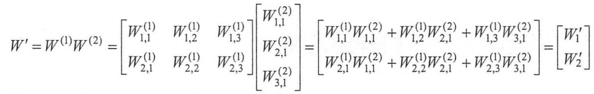
这样输入和输出关系就可以表示为：
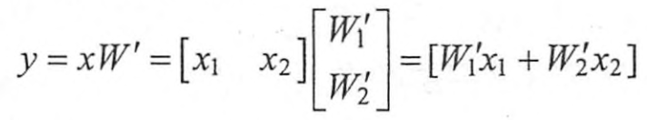
其中$W'$是新的参数，这个前向传播算法完全符合线性模型的定义。所以，只要通过 **线性变换**，任意层的 **全连接神经网络**和单层神经网络模型的表达能力没有区别，而且他们都是 **线性模型** 。然而线性模式能够解决的问题是有限的，下面验证其局限性。
http://playground.tensorflow.org
训练数据分布如下：
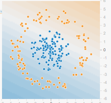
采用的训练方式如下，激活函数(**Activation**)选择 线性(**Linear**),
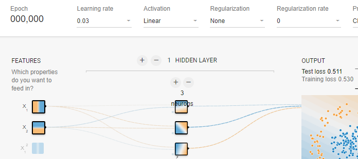
可以看见，这个模型只能通过 **直线** 来划分平面，
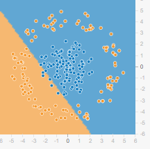
如果使用 **RELU** 激活函数，或者其他非线性激活函数也可以得到很好的非线性分类效果。
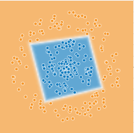

## 激活函数实现去线性化
在上面介绍的神经元结构的 **输出** 为所有 **输入** 的 **加权和**，这导致整个 **神经网络** 是一个 **线性模型**。如果将每一个神经元（就是神经网络的节点）的 **输出**通过一个 **非线性函数**，那么整个神经网络的模型不在是线性的了，这个非线性函数就是 **激活函数**。下图显示了加入 **激活函数** 和 **偏置项** 之后的神经元结构。
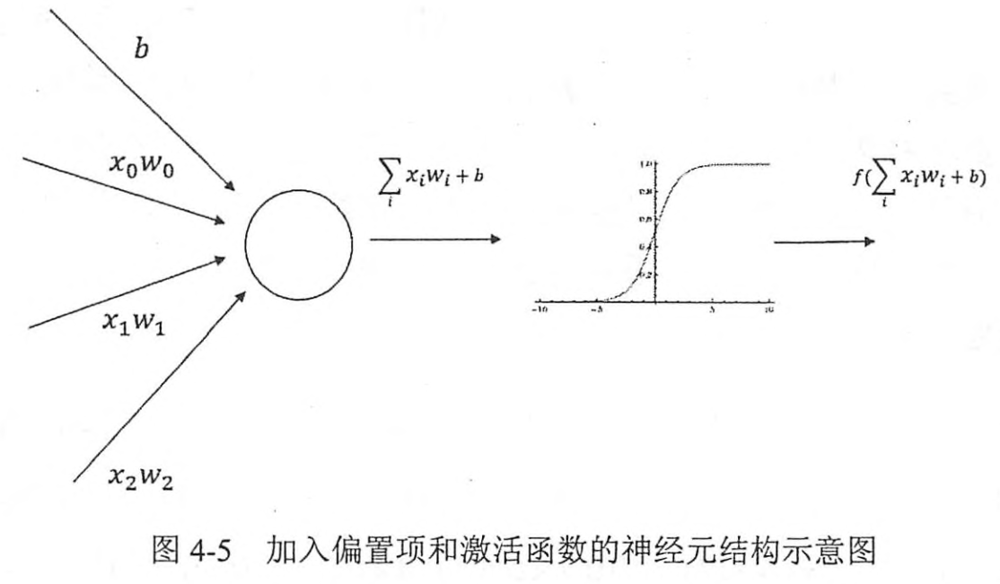
下面是添加激活函数以及偏置项后的前向传播算法：
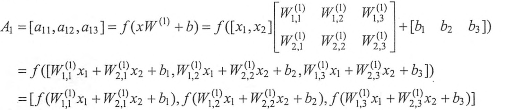
以下是几种常用的 **非线性激活函数** 的图像：
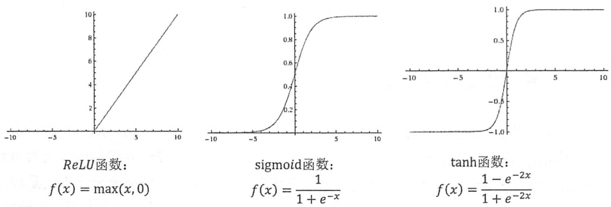
这些函数的图像都不是一条直线，所以通过这些激活函数，每一个节点不再是线性变换，整个神经网络模型也就不再是线性的了。
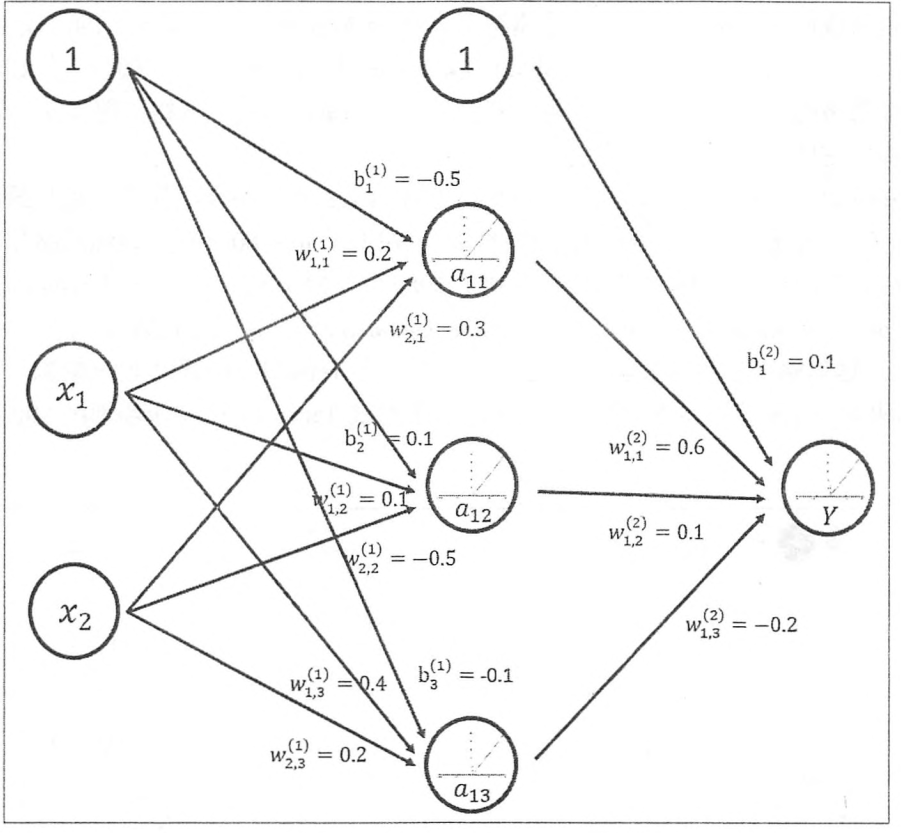
从图中可以看出，**偏置项** 可以被表达为一个 **输出永远为1** 的节点，隐藏层推导公式：
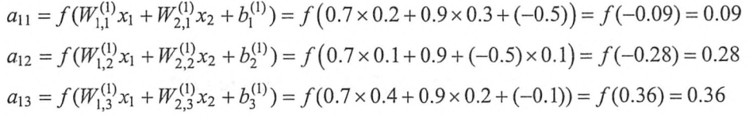
输出层推导公式：
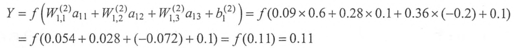
目前，TF提供7种不同的 $非线性激活函数$，tf.nn.relu、tf.sigmod和tf.tanh.以下代码实现上图的前向传播算法。
```python
a = tf.nn.relu(tf.matmul(x,w1) + biases1)
y = tf.nn.relu(tf.matmul(a,w2) + biases2)
```
## 多层网络解决异或运算
图种通过TF游乐场训练500轮之后的情况。图中使用了一个能够模拟 **异或运算**的数据集，在隐藏层的四个节点中，每个节点都有一个角是黑色的，这四个隐藏节点被认为代表了从输入特征中抽取的更高维的特征。比如第一个节点可以大致表示两个输入的逻辑与操作。可以看出，深层神经网络实际上有组合特征提取的功能。
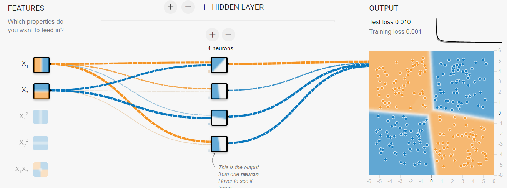

## 损失函数
神经网络模型的效果以及优化的目标是通过损失函数(loss function)来定义的。
**分类问题** 和 **回归问题** 是监督学习的两个大类，

### 分类问题

**分类问题** 希望解决的是将不同的样本分到事先定义好的类别中。在判别二分类问题时，定义一个有单个输出节点的神经网络，当这个节点的输出越接近0时，这个样本越有可能是不合格的；为了给出具体的分类结果，可以取0.5作为阈值，凡是输出大于0.5的样本被认为是合格的。但是这个不能直接推广到多分类问题。
通过神经网络解决多分类问题最常用的方法是设置n个输出节点，其中n为类别的个数，对于每一个样例，神经网络可以得到可以得到一个n维数组作为输出结果。数组中的每一个维度(也就是每一个输出节点)对应一个类别，在理想情况下，如果一个样本属于类别K，那么这个类别所对应的输出节点的输出值应该为1，而其他的节点输出都为0，以识别数字1为例，神经网络的输出结果越接近[0,1,0,0,0,0,0,0,0]越发，那么如何判断  **向量** 和 **期望的向量** 有多接近呢？**交叉熵**(cross entropy)是最常用的评判方法之一。 **交叉熵** 刻画了两个 **概率分布** 之间的 **距离**，它是分类问题中使用比较广的一种损失函数。
**交叉熵**是一个信息论中的概念，它原本是用来估算 **平均编码长度** 的。在本书中，通过它的公式以及具体的样例来讲解它 **对于评估分类效果** 的意义。给定两个概率分布p和q，通过q来表示p的交叉熵为：
$$ H(p,q) = - \sum_xp(x)log q(x) $$
注意交叉熵刻画的是 **两个概率分布之间的距离**，然而神经网络的输出却不一定是一个概率分布。概率分布刻画了不同事件发生的概率。当事件总数是有限的情况下，概率分布函数 $p(X=x)$满足：
$$ \forall p(X=x) \in [0,1] 且 \sum_xp(X=x) = 1 $$
如果将分类问题“一个样例属于某一个类别”看成一个概率事件，那么训练数据的正确答案就符合一个概率分布，因为事件“一个样例属于不正确的类别”的概率为0，而“一个样例属于正确的类别”的概率为1.如何将神经网络前向传播得到的结果也变成 概率分布呢？Softmax回归就是一个非常常用的方法。
Softmax回归本身可以作为一个学习算法来优化分类结果，但在TF中，Softmax回归的参数被去掉了，它只是一层额外的处理层，将神经网络变成了一个概率分布。
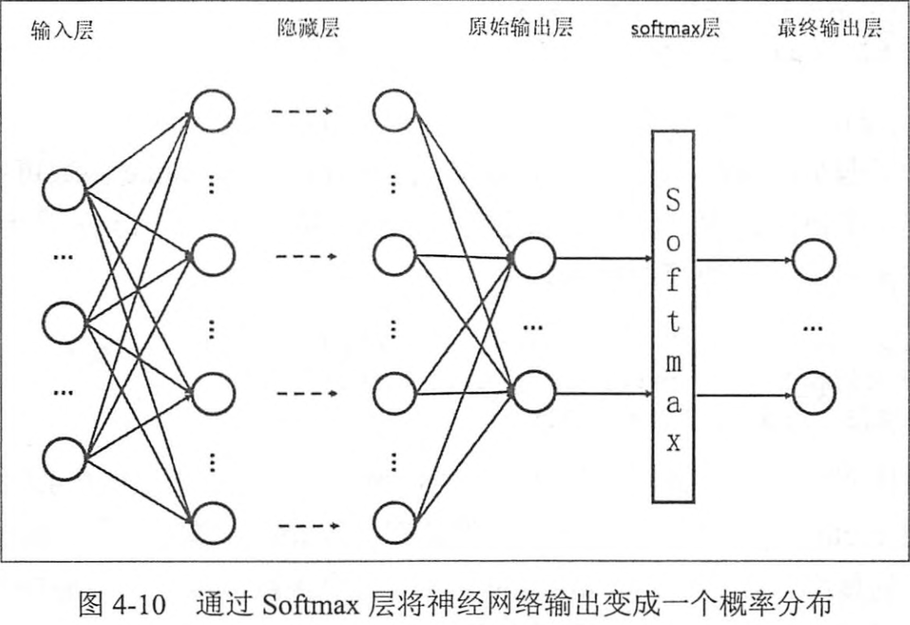
假设原始的神经网络输出为$y_1,y_2,...,y_n$，那么经过Softmax回归处理之后的输出为：
$$ softmax(y)_i = y_i' = \frac{e^{yi}}{\sum^n_{j=1}e^{yj}} $$
从以上公式中可以看出，原始神经网络的输出被用作 **置信度** 来生成新的输出，而新的输出满足概率分布的所有要求。这个新的输出可以理解为：经过神经网络的推导，一个样例为不同类别的概率分别是多大。这样就把神经网络的输出也变成了一个概率分布，从而可以通过 **交叉熵** 来计算预测的概率分布和真实答案的概率分布之间的距离了。
从交叉熵的公式中可以看到交叉熵函数不是对称的$(H(p,q) \not = H(q,p))$,它刻画的是 **通过概率分布q来表达概率分布p的困难程度**。因为正确答案是希望得到的，所以当交叉函数作为神经网络的 **损失函数**时，p代表的是正确答案，q代表的是预测值。交叉熵刻画的是两个概率分布的距离，也就是说交叉熵越小，两个概率分布 越接近。
假设有一个三分类问题，某个样例的正确答案是(1,0,0)。某模型经过Sofrmax回归之后的预测答案是(0.5,0.4,0.1),那么这个正确预测和正确答案之间的交叉熵为：
$$ H((1,0,0),(0.5,0.4,0.1)) = -(1*log0.5+0*log0.4+0*log0.1) = 0.3 $$
如果另外一个模型的预测是(0.8,0.1,0.1)，那么cross entropy是：
$$ H((1,0,0,),(0.8,0.1,0.1)) = -(log0.8+0+0)=0.1$$
第二个交叉熵更小，刻画越容易。第二个预测答案更好。代码实现：
```python
cross_entropy = -tf.reduce_mean(
    y_ * tf.log(tf.clip_by_value(y, 1e-10, 1.0))
)
```
其中y_表示 正确结果，y表示预测结果。这一行代码中包含了四个不同的TF运算，通过**tf.clip_by_value**函数可以将一个张量中的数值限制在一个范围之内，这样可以避免一些运算的错误(比如 log0 是无效的)。如下：
```python
import tensorflow as tf
v = tf.constant([[1.0,2.0,3.0],[4.0,5.0,6.0]])
#交互模式下通过设置默认会话的方式来获取张量更为方便
sess = tf.InteractiveSession() 

print(tf.clip_by_value(v,2.5,4.5).eval())
#OutPut: [[2.5 2.5 3. ],[4.  4.5 4.5]]
```
可以看见，小于2.5的数都被换成了2.5，而大于4.5的数都被换成了4.5.这样通过 tf.clip_by_value 函数可以保证在进行log运算的时候，不会出现log0这样的错误，或者大于1的概率。
第二个运算是 **tf.log**函数，这个函数完成了对张量中所有元素依次求对数的功能，如下：
```python
import tensorflow as tf
s = tf.constant([1.0,2.0,3.0])
sess = tf.InteractiveSession() 
print(tf.log(s).eval())
#Output:[0.        0.6931472 1.0986123]
```
第三个运算是 **乘法**，在实现交叉熵的代码中直接将两个矩阵通过“*”操作相乘。这个操作 **不是**矩阵乘法，而是元素之间直接相乘。矩阵乘法需要使用 tf.matmul 函数来完成。
```python
v1 = tf.constant([[1.0,2.0],[3.0,4.0]])
v2 = tf.constant([[5.0,6.0],[7.0,8.0]])
sess = tf.InteractiveSession()

print((v1 * v2).eval())
#[[ 5. 12.],[21. 32.]]
print(tf.matmul(v1,v2).eval())
#[[19. 22.],[43. 50.]]
```
通过以上三个运算完成了对每个样例中的每一个类别交叉熵$p(x)logq(x)$的计算，这个计算的得到的是一个 **n\*m** 的二维矩阵，其中 n为 **一个batch中样例的数量**，m为 **分类的类别数量**。根据交叉熵的公式，应该将每行中的m个结果相加得到所有样例的交叉熵（x代表的是每一个分类问题），然后再对这n行平均得到一个batch的平均交叉熵。但是因为分类问题的类别数量是不变的，所以可以 直接对整个矩阵做平均而并不改变计算结果的意义。如下 **tf.reduce_mean**:
**tf.reduce_mean** 函数的作用是求平均值，第一个参数是一个集合，可以是列表、二维数组和多维数组。第二个参数指定在哪个维度上面求平均值。默认对所有的元素求平均值。
```python
v3 = tf.constant([[1.0,2.0,3.0],[4.0,5.0,6.0]])
tf.InteractiveSession()
print(tf.reduce_mean(v3).eval())
# 3.5
```
因为交叉熵一般与 softmax回归一起使用，所以TF对这两个功能统一封装，提供了 **tf.nn.softmax_cross_entropy_with_logits** 函数。
```python
corss_entropy = tf.nn.softmax_cross_entropy_edge_with_logits(y,y_)
```
其中 **y**代表了原始神经网络的输出结果，而 **y_**给了标准答案。这样通过一个命令就可以得到使用了 Sofrmax 回归之后的交叉熵。在只有一个正确答案的分类问题中，TF提供了 **tf.nn.sparse_softmax_cross_entropy_with_logits**

### 回归问题

与分类问题不同，**回归问题解决的是对具体数值的预测**。比如房价预测，销量预测等都是回归问题。这些问题需要预测的不是一个事先定义好的类别，而是一个任意的实数。解决回归问题的神经网络一般只有一个输出节点，这个节点的输出值就是预测值。对于回归问题，最常用的损失函数就是 均方误差(MSE, mean squard error)。它的定义如下：
$$ MSE(y,y') = \frac{\sum^n_{i=1}(y_i-y_i')^2}{n
} $$
其中$y_i$为一个bathch中第i个数据的正确答案，而 $y_i'$为神经网络给出的预测值。以下代码展示了如何通过TF实现 **均方差误差损失函数**：
> mse = tf.reduce_mean(tf.suqare(y_ - y))
> MSE也是分类问题中常用的一种损失函数

## 自定义损失函数
TF不仅支持经典的损失函数，还可以优化任意的自定义损失函数。如下，通过自定义损失函数：
在预测商品销售时，如果预测多了(预测值比真实销量大)，商家损失的是生产商品的成本，而如果预测小了(预测值比真实销量小)，损失的是商品的利润。因为一般商品的成本和商品的利润不会严格相等，所以使用MSE就不能很好的最大化销售理利润。比如如果一个商品的成本是1元，但是利润是10元，那么少预测一个就少挣10元，多预测一个才少挣1元。为了最大化利润，需要将损失函数和利润直接联系起来，注意损失函数定义的是损失，所以要将理论最大化，定义的损失函数应该刻画 **成本或代价** 。下面公式给出了一个当预测多于真实值和预测少于真实值时有不同损失系数的损失函数：

$$  Loss(y,y') = \sum^n_{i=1}f(y_i,y_i'), f(x-y) = \begin{cases}
   a(x-y) & x>y \\
b(y-x) & x<y
\end{cases}
$$
其中$y_i$为一个batch中的第i个数据的正确答案，$y_i'$为神经网络得到的预测值，a和b是常量，比如在上面介绍的销量预测问题中，a就等于10(正确答案多于预测答案，少卖一个了少赚10块钱)，而b等于1(正确答案少于预测答案的代价，卖的剩余一个亏1块钱)。通过这个自定义损失函数的优化，模型提供的预测值可以最大化收益。在TF中：
>loss = tf.reduce_sum(tf.where(tf.grater(v1,v2), (v1-v2)*a, (v2-v1)*b))

上面的代码用到了 *tf.greater* 和 *tf.where* 来实现选择操作。**tf.greater** 的输入是两个张量,此函数会比较这两个输入张量中的每一个元素的大小，并返回比较结果。当tf.greater的输入两个张量维度不一样时，TF会进行类似Numpy广播操作(broadcasting)的处理，
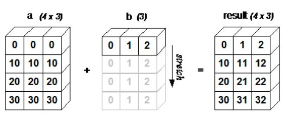

**tf.where** 函数有三个参数。第一个为选择条件根据，当选择条件为**True**时，tf.select函数会选择第二个参数的值，否者使用第三个参数中的值。注意tf.where函数会判断和选择都是在 **元素级别**，如下：
```python
v1 = tf.constant([[1.0,2.0],[3.0,4.0]])
v2 = tf.constant([[4.0,3.0],[2.0,1.0]])
sess = tf.InteractiveSession()
print(tf.greater(v1,v2).evalal())
# Output: [[False False] [ True  True]]
print(tf.where(tf.greater(v1,v2),v1,v2).eval())
# [[4. 3.] [3. 4.]]
sess.close()
```
在定义了 **损失函数** 之后，下面将通过一个简单的神经网络来讲解损失函数对模型训练结果的影响。在下面的程序中，实现了一个拥有两个输入节点，一个输出节点，没有隐藏层的神经网络。
```python

```