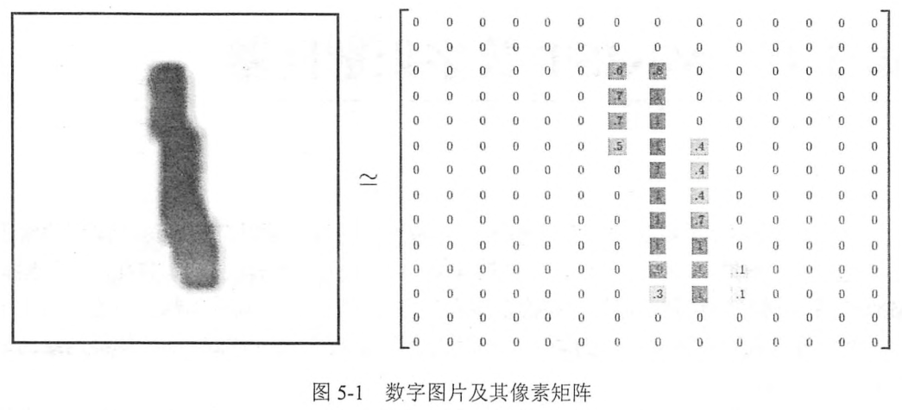
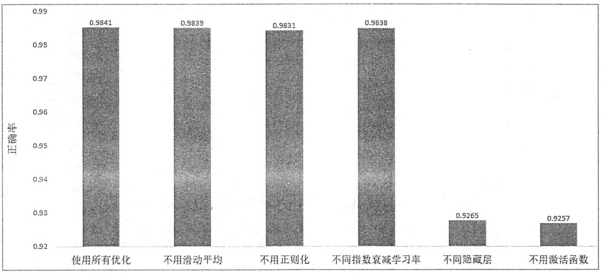
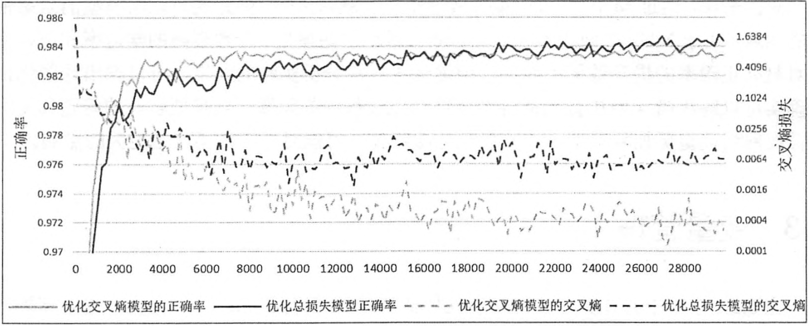

# Chapter4 MNIST数字识别问题
使用的数据集是 MNIST 手写数字识别数据集，

## 4.1 MNIST 数据处理
MNIST数据集是 NIST数据集的一个子集，内部包含60000张图片作为训练数据，10000张图片作为测试数据，每张图片的大小为 28 * 28.数字会出现在图片正中间。

在TF中，TF提供了一个类来处理MNIST数据。这个类会自动下载并转换MNIST数据个格式，将数据从原始的数据包中解析成训练和测试神经网络使用的格式：
```python
from tensorflow.examples.tutorials.mnist import input_data

mnist = input_data.read_data_sets("path/to/MNIST_data",one_hot = True)

# 打印Traning data size: 55000
print("Traning data size: ",mnist.train.num_examples)

# 打印Validating data size: 5000
print("Validating data size: ", mnist.validation.num_examples)

# 打印Testing data size: 10000
print("Testing data size: ",mnist.test.num_examples)

# 打印Example trainging data label:[0. 0. 0. 0. 0. 0. 0. 1. 0. 0.]
print("Example training data label: ", mnist.train.labels[0])
```
通过 **input-data.read_data_sets** 函数生成的类会自动将 MNIST 数据集划分为 train,validation,test三个数据集，处理后，每张图片长度为 784(28*28)的一维数组，像素矩阵中元素取值范围为 [0,1]，代表了颜色的深浅。其中0表示白色背景，1表示黑色背景。为了方便的使用 **input-data.read_data_sets** 函数生成的类提供 **mnist.train.next_batch**函数，可以从所有的训练数据中读取一小部分作为一个训练batch.
```python
batch_size = 100
xs,ys = mnist.train.next_batch(batch_size)
#从train的集合中选取batch_size个训练数据

print("X shape: ",xs.shape)
#(100,784)

print("Y shape: ",ys.shape)
#(100,10)
```

## 4.2 神经网络模型训练及其不同模型结果对比
* 4.2.1在给出完整的TF来解决MNIST问题，整合了所有的优化方法
* 4.2.2介绍验证数据集的作用，可以近似的作为评价不同神经网络模型的标准或者决定迭代轮数的依据。
* 4.2.3通过MNIST数据集验证每一个优化方法


### 4.2.1 TF训练神经网络
```python
import tensorflow as tf
from tensorflow.examples.tutorials.mnist import input_data

# MNIST数据集相关的常数
# 输入层的节点数，对于MNIST数据集，这个就等于图片的像素
INPUT_NODE = 784

# 输出层的节点数，这个等于类别的数目。在这个区分0~9这10个数字
OUTPUT_NODE = 10

# 配置神经网络的参数
LAYER1_NODE = 500  # 隐藏层节点数，这里使用只有一个隐藏层的网络结构作为样例
# 这个隐藏层有500个节点
BATCH_SIZE = 100  # 一个训练batch中的训练数据个数，数字越小，训练过程越接近
# 随机梯度下降；数字越大时，训练越接近梯度下降

LEARNING_RATE_BASE = 0.8  # 基础的学习率
LEARNING_RATE_DECAY = 0.99  # 学习率的衰减率

REGULARIZATION_RATE = 0.0001  # 描述模型复杂度的正则化项在损失函数中的系数
TRAINING_STEPS = 30000  # 训练轮数
MOVING_AVERAGE_DEVAY = 0.99  # 滑动平均衰减率

# 一个辅助函数，给定神经网络的输入和所有参数，计算神经网络的前向传播结果。在这里
# 定义了一个使用RELU激活函数的三层全连接神经网络(输入层，一层隐藏层，输出层)，
# 通过加入隐藏层实现了多层网络结构，
# 通过RELU激活函数实现了去线性化。在这个函数中也支持传入用于计算参数平均值的类
# 这样方便在测试时使用 滑动平均模型


def interence(input_tensor, avg_class, weights1, biases1, weights2, biases2):
    # 当没有提供滑动平均类时，直接使用参数当前的取值
    if avg_class == None:
        layer1 = tf.nn.relu(tf.matmul(input_tensor, weights1) + biases1 )

        # 计算输出层的前向传播结果，因为在计算损失函数时会一并计算 softmax 函数
        # 所以这里不用加入激活函数，而且不加入 softmax 不会影响预测结果。因为在
        # 预测时使用的是不同类别对应节点输出值的相对大小，有没有softmax层对最后分类结果
        # 的计算没有影响，于是在计算整个神经网络的前向传播时可以不加入最后的 softmax 层

        return (tf.matmul(layer1, weights2) + biases2)

    else:
        # 首先使用 avg_class.average函数来计算得出变量的滑动平均值
        # 然后再计算相应的神经网络前向传播结果
        layer1 = tf.nn.relu(
            tf.matmul(input_tensor, avg_class.average(weights1)) + avg_class.average(biases1)
        )
        return (
            tf.matmul(layer1, avg_class.average(weights2)) + avg_class.average(biases2)
        )
#############################################################################
# 模型训练的过程


def train(mnist):
    x = tf.placeholder(tf.float32, [None, INPUT_NODE], name='x-input')
    y_ = tf.placeholder(tf.float32, [None, OUTPUT_NODE], name='y-input')

    # 生成隐藏层的参数 正态分布，但如果随机出来的值偏离平均值超过2个标准差，
    # 那么这个数将会被重新随机
    weights1 = tf.Variable(
        tf.truncated_normal([INPUT_NODE, LAYER1_NODE], stddev=0.1)
    )
    biases1 = tf.Variable(
        tf.constant(0.1, shape=[LAYER1_NODE])
    )

    # 生成输出层的参数
    weights2 = tf.Variable(
        tf.truncated_normal([LAYER1_NODE, OUTPUT_NODE], stddev=0.1)
    )
    biases2 = tf.Variable(tf.constant(0.1, shape=[OUTPUT_NODE]))

    # 计算在当前参数下神经网络前向传播的结果，这里给出的用于计算滑动平均的类为 None,
    # 所以函数不会使用参数的 滑动平均值
    y = interence(x, None, weights1, biases1, weights2, biases2)

    # 定义存储训练轮数的变量，这个变量不需要计算滑动平均值，所以这里指定这个变量为
    # 不可训练的变量(trainable = False).在使用TF训练神经网络时，
    # 一般会将代表训练轮数的变量指定为 不可训练的 参数
    global_step = tf.Variable(0, trainable=False)

    # 给定 滑动平均衰减率 和 训练轮数的变量，初始化滑动平均类，设定滑动平均衰减率，和
    variable_averages = tf.train.ExponentialMovingAverage(
        MOVING_AVERAGE_DEVAY, global_step
    )

    # 在所以代表神经网络参数的变量上使用 滑动平均。其他辅助变量(比如 global_step)就不
    # 需要了，tf.trainable_variables 返回的就是图上集合
    # tf.GraphKeys.TRAINABLE_VARIABLES中的元素。这个集合的元素就是所有没有指定
    # trainable = False的参数
    variables_averages_op = variable_averages.apply(
        tf.trainable_variables()
    )

    '''
    计算使用了滑动平均之后的前向传播结果，滑动平均不会改变变量本身的取值，
    而是会维护一个影子变量来记录其滑动平均值。所以当需要使用这个滑动平均值时，
    需要明确调用 average 函数
    '''
    average_y = interence(
        x, variable_averages, weights1, biases1, weights2, biases2
    )

    '''
    计算交叉熵作为刻画预测值和真实值之间差距的函数，这里使用了TF中提供的 
    sparse_softmax_cross_entropy_with_logits 函数来计算交叉熵，当分类问题
    只有一个正确答案时，可以使用这个函数来加速交叉熵的计算。MNIST问题的图片中
    只包含了0~9中的一个数字，所以可以使用这个函数来计算交叉熵损失。这个函数的
    第一个参数是 神经网络不包括 softmax层的前向传播结果，第二个是训练数据的正确答案。
    因为标准答案是一个长度为10的一维数组，而该函数需要提供的是一个正确的答案数字，所以
    需要使用 tf.argmax 函数来得到正确答案对应的类别编号(返回最大值的那个数值的下标)。
    通过 np.argmax 实现 tf.argmax(y_,1) 和 tf.argmax(y_,0) 区别：
    '''
    #test = np.array([[1, 2, 3], [2, 3, 4], [5, 4, 3], [8, 7, 2]])
    # np.argmax(test, 0)　　　＃输出：array([3, 3, 1]
   # np.argmax(test, 1)　　　＃输出：array([2, 2, 0, 0]
   # axis=0:是最大的范围，所有的数组都要进行比较，只是比较的是这些数组相同位置上的数：
   # axis=1:等于1的时候，比较范围缩小了，只会比较每个数组内的数的大小，结果也会根据有几个数组，产生几个结果。

    cross_entropy = tf.nn.sparse_softmax_cross_entropy_with_logits(
        logits=y, labels=tf.argmax(y_, 1)
    )

    # 计算在当前batch中所有样例的交叉熵平均值
    cross_entropy_mean = tf.reduce_mean(cross_entropy)

    # 计算L2正则化损失函数
    regularizer = tf.contrib.layers.l2_regularizer(REGULARIZATION_RATE)

    # 计算模型的正则化损失，一般只计算神经网络边上权重的正则化损失，而不是用偏置项
    regularization = regularizer(weights1) + regularizer(weights2)

    # 总的损失等于交叉熵损失和正则化 损失的和
    loss = cross_entropy_mean + regularization

    # 设置指数衰减的学习率
    learning_rate = tf.train.exponential_decay(
        LEARNING_RATE_BASE,  # 基础的学习率，随着迭代的进行，更新变量时使用的
        # 学习率在这基础上递减
        global_step,  # 当前的迭代轮数
        mnist.train.num_examples / BATCH_SIZE,  # 过完所有的训练数据需要的迭代次数
        LEARNING_RATE_DECAY  # 学习率衰减速度
    )

    # 使用 tf.train.GradientDescentOptimizer 优化算法来优化损失函数，注意这里损失函数
    # 包含了交叉熵损失和 L2正则化损失
    # global_step=global_step 这样写以后 通过 minize可以实现 global_step自动加1
    # global_step: Optional `Variable` to increment by one after the
    # variables have been updated
    train_step = tf.train.GradientDescentOptimizer(learning_rate).minimize(
        loss, global_step=global_step
    )

    # 在训练神经网络模型时，每过一遍数据既需要通过反向传播来更新 神经网络中的参数，
    # 又要更新每一个参数的 滑动平均值，为了一次完成多个操作，TF提供了两种机制
    # tf.control_dependencies  和  tf.group  下面两行程序等价
    # train_op = tf.group(train_step,variables_averages_op) 将多个操作合并成一个操作

    # def control_dependencies(control_inputs):control_dependencies是用于控制计算流图的先后顺序的。
    # 必需先完成control_input的计算，才能执行之后定义的context。
    # 但是，tensorflow是顺序执行的，为什么还需control_dependecies呢?
    # 原因在实际训练中，大多是以一个BATCH_SIZE大小来训练。因此需循环地去刷新前面所定义的变量。
    # 而采用control_dependencies可以确保control_input在被刷新之后,在执行定义的内容，从而保证计算顺序的正确性。

    with tf.control_dependencies([train_step, variables_averages_op]):
        train_op = tf.no_op(name='train')

    # 检验使用了滑动平均模型的神经网络前向传播结果是否正确。tf.argmax(average_y,1)
    # 计算每一个样例的预测答案，其中 average_y 是一个 batch_size*10的二维数组，每一行
    # 表示一个样例的前向传播结果，tf.argmax的第二个参数“1”表示选取最大值的操作仅在第一个
    # 维度中进行，也就是说，只在每一行选取最大值对应的下标。于是得到的结果是一个长度为
    # batch的一维数组，这个一维数组中的值就表示了每一个样例对应的数字识别结果。
    # tf.equal判断两个张量的每一维是否相等，如果相等返回 True, 否者返回 False

    correct_prediction = tf.equal(
        tf.argmax(average_y, 1), tf.argmax(y_, 1))

    # 这个运算首先将一个布尔型的数值转化为实数型，然后计算平均值，这个平均值
    # 就是模型在这一组数据上的正确率

    accuracy = tf.reduce_mean(tf.cast(correct_prediction, tf.float32))

    # 初始化会话并开始训练
    with tf.Session() as sess:
        tf.global_variables_initializer().run()

        # 准备验证数据。一般在神经网络的训练过程中会通过验证数据大致判断停止的
        # 条件和判断训练的结果

        validate_feed = {x: mnist.validation.images,
                         y_: mnist.validation.labels}

        # 准备测试数据
        test_feed = {x: mnist.test.images, y_: mnist.test.labels}

        # 迭代地训练神经网络
        for i in range(TRAINING_STEPS):
            if i % 1000 == 0:
                # 计算滑动平均模型在验证数据上的结果，因为MNIST数据集比较下，所以
                # 一次放入内存中
                validate_acc = sess.run(
                    accuracy, feed_dict=validate_feed)
                print("After %d training step(s), validation accuracy，using average model is %g" % (
                    i, validate_acc))

            # 产生这一轮使用的一个 batch 的训练数据，并运行训练过程
            xs, ys = mnist.train.next_batch(BATCH_SIZE)
            sess.run([train_op, global_step], feed_dict={x: xs, y_: ys})

        # 在训练结束之后，在测试数据上检测神经网络模型的最终正确率
        test_acc = sess.run(accuracy, feed_dict=test_feed)
        print("After %d training step(s), test accuracy using average,model is %g" % (
            TRAINING_STEPS, test_acc))

# 主程序入口


def main(argv=None):
    # 声明处理MNIST数据集的类，这个类在初始化时会自动下载数据集
    mnist = input_data.read_data_sets('path/to/MNIST_data', one_hot=True)
    train(mnist)


# TF提供的一个主程序入口，tf.app.run会调用上面定义的main函数
if __name__ == "__main__":
    tf.app.run()

```

### 4.2.2 使用验证数据集判断模型效果
在以上小节中，给出了使用神经网络解决MNIST问题的完整程序，在这个程序的开始设置了 **初始学习率**，**学习率衰减率**，**隐藏层节点数量**，**迭代轮数**等7种不同的参数，那么如何设置这些参数的取值呢？在大部分情况下，配置神经网络的这些参数都是需要通过实验来调整的。虽然一个神经网络模型的效果最终是通过测试数据来判定的。但是我们不能直接通过模型在测试数据上的效果来选择参数。使用测试数据来选取参数可能会导致神经网络 **过度拟合测试数据**，从而失去对未知数据的判断能力。因为一个神经网络模型的最终目标是对未知数据提供判断，所以为了估计模型在未知数据上的效果，需要保证 **测试数据** 在训练过程中是 **不可见的**。只有这样才能保证通过测试数据评估出来的效果和在真实应用场景下模型对未知数据的判断效果是接近的。使用验证数据集，还可使用交叉验证(cross validation)的方式来验证模型效果。但是因为神经网络训练时间本身就比较长，采用 **交叉验证**会花很多时间。
在本小节中，为了说明验证数据在一定程度上可以作为模型效果的评判标准，我们将对比在 **不同迭代轮数** 的情况下，模型在验证数据集和测试数据上的正确率。为了同时得到一个模型在验证数据和测试数据上的正确率，可以在 **每1000轮**的输出中加入在测试数据集上的正确率。
```python

# 在训练结束之后，在测试数据上检测神经网络模型的最终正确率
test_acc = sess.run(accuracy, feed_dict=test_feed)

print("After %d training step(s), test accuracy using average,model is %g" % (
    TRAINING_STEPS, test_acc))
```

### 4.2.3 不同模型效果比较
在神经网络结构的设计上，需要使用 **激活函数** 和 **多层隐藏层** ，在神经网络优化时，可以使用 **指数衰减的学习率**，**加入正则化的损失函数** 以及 滑动平均模型。

没有隐藏层和激活函数时，对正确率很大的影响。
一个模型 **只优化交叉熵** 模型的模型优化函数：
```python
train_step = tf.train.GradientDescentOptimizer(learning_rate).minimizie(
    cross_entropy_mean,global_step=global_step
)
```
另一个模型优化的是 **交叉熵和L2正则化损失的和**，
```python
loss = cross_entropy_mean + regularization
train_step = tf.train.GradientDescentOptimizer(learning_rate).minimize(
    cross_entropy_mean,global_step=global_step
)
```

可以看出，只优化交叉熵的模型在训练数据上的交叉熵损失比优化总损失的模型更小，然而在测试数据上，优化总损失的模型比只优化交叉熵的模型好。这个原因是 **过拟合**，只优化交叉熵的模型可以更好的拟合训练数据(交叉熵损失更小)，但是却不能很好的挖掘数据中潜在的规律来判断未知的测试数据，在测试数据上的正确率低。

## 4.3 变量管理
在上节中，将计算神经网络前向传播结果的过程抽象成了一个函数，通过这种方式，在训练和测试的过程中可以统一调用同一个函数来得到模型的 **前向传播结果**，
```python
def interence(input_tensor, avg_class, weights1, biases1, weights2, biases2):
    # 当没有提供滑动平均类时，直接使用参数当前的取值
    if avg_class == None:
        layer1 = tf.nn.relu(tf.matmul(input_tensor, weights1) + biases1 )

        # 计算输出层的前向传播结果，因为在计算损失函数时会一并计算 softmax 函数
        # 所以这里不用加入激活函数，而且不加入 softmax 不会影响预测结果。因为在
        # 预测时使用的是不同类别对应节点输出值的相对大小，有没有softmax层对最后分类结果
        # 的计算没有影响，于是在计算整个神经网络的前向传播时可以不加入最后的 softmax 层

        return (tf.matmul(layer1, weights2) + biases2)

    else:
        # 首先使用 avg_class.average函数来计算得出变量的滑动平均值
        # 然后再计算相应的神经网络前向传播结果
        layer1 = tf.nn.relu(
            tf.matmul(input_tensor, avg_class.average(weights1)) + avg_class.average(biases1)
        )
        return (
            tf.matmul(layer1, avg_class.average(weights2)) + avg_class.average(biases2)
        )
```
从定义中可以看到，这个函数的参数包括了神经网络的所有参数。然而，当神经网络的结构更加复杂，参数更多时，就需要一个更好的方式来说传递和管理神经网络的参数了。TF提供了通过 **变量名称** 来创建和获取一个 **变量** 的机制，通过这个机制，**在不同的函数中可以直接通过变量的名字来使用变量。 而不需要将变量通过参数的形式到处传递**。TF中通过变量名称获取变量的机制主要是通过 *tf.get_variable* 和 *tf.variable_scope* 函数实现的。
通过 *tf.Variable* 函数来创建一个变量，除了 *tf.Variable*，TF还有 tf.getvariable 函数来创建或者获取变量。
```python
#下面两个定义是等价的
v=tf.get_variable(
    "v",shape=[1],initializer = tf.constant_initialize(1,0))
v = tf.Variable(tf.constant(1.0,shape=[1]),name="v)
```
从上面代码中可以看出，通过 *tf.Variable* 和 *tf.get_variable* 函数创建变量的过程基本是一样的。*tf.Variable*函数调用时提供的维度(shape)信息以及初始化方法(initializer)参数和 tf.Variable函数调用时提供的初始化过程中的参数也类似。TF提供的initializer函数和之前介绍的随机数以及常量生成函数大部分是一一对应的。
|初始化函数|功能|主要参数|
:-: | :-:| :-:| 
tf.constant_initializer|将变量初始化为给定的常量|常量的取值范围
tf.random_normal_initializer|将变量初始化为满足正态分布的随机值|正态分布的均值和标准差
tf.truncated_normal_initializer|将变量初始化为满足正态分布的随机值，但如果随机出来的值偏离平均值超过2个标准差，那么这个数将会被重新随机|正态分布的均值和标准差
tf.random_uniform_initializer|将变量初始化为满足平均分布的随机值|最大、最小值
tf.uniform_unit_scaling_initializer|将变量初始化为满足平均分布但不影响输出数量级的随机值 | factor(产生随机值时乘以的系数)
tf.zeros_initializer|将变量设置为全0|变量维度
tf.ones_initializer|将变量设置为全1|变量维度
tf.get_variable函数与tf.Variable函数最大的区别在于 **指定变量名称的参数**。对于 tf.Variable 函数，变量名称是一个可选的参数，通过name="v"的形式给出。但是对于 tf.get_variable函数，变量名称是一个必填的参数，tf.get_variable会根据这个名字去创建或者获取变量，tf.get_variable首先会试图去创建一个名字为v的参数，如果创建失败(比如已经有同名的参数)，那么这个程序就会报错/这是为了避免无意识的变量复用造成的错误。比如在定义神经网络参数时，第一层网络的权重已经叫 weights了，那么在创建第二层神经网络时，如果参数名仍然叫 weights,会触发 变量重用的错误。如果需要通过tf.get_variable获取一个已经创建的变量，需要通过 **tf.variable_scope** 函数来生成一个上下文管理器，并明确指定在这个上下文管理器中，tf.get_variable将直接获取已经生成的变量。
```python
import tensorflow as tf 

with tf.variable_scope("foo"):
    v = tf.get_variable(
        "v",[1],initializer=tf.constant_initializer(1.0))

#因为在命名空间foo中已经存在名字为v的变量，所有下面的代码将会报错：
# with tf.variable_scope("foo"):
#     v = tf.get_variable(
#         "v",[1]
#     )

#在生成上下文管理器时，将参数reuse设置为True,这样 tf.get_variable
#函数将直接获取已经声明的变量。
with tf.variable_scope("foo", reuse=True):
    v1 = tf.get_variable("v",[1])
    print (v == v1) #输出为True,代表v，v1代表的时相同的TF变量

#将参数reuse 设置为True时，tf.variable_scope
#将只能获取已经创建过的变量，因为在命名空间bar中还没有创建
#变量v，所以下面的代码将会报错
# with tf.variable_scope("bar",reuse=True):
#     v= tf.get_variable("v",[1])

```
上面的案例简单的说明了通过 **tf.variable_scope** 函数可以控制 tf.get_variable函数的语义，当tf.variable_scope函数使用参数  **resue=True** 生成上下文管理器时，这个上下文管理器内所有的tf.get_variable函数或 **直接获取已经创建** 的变量，如果变量 **不存在**，则tf.get_variable将会 **报错**；相反，如果使用 tf.variable_scope函数使用参数 **reuse=None** 或则 **reuse=False** 创建上下文管理器，tf.variable_scop操作将创建新的变量。如果 **同名的变量已经存在**，则 tf.variable_scop 将 **报错**，TF中 tf.variable_scope函数是可以嵌套的，
```python
#嵌套
with tf.variable_scope("root"):
    #可以通过tf.get_variable_scope().reuse函数来获取当前上下文
    #管理器中reuse参数的取值
    print(tf.get_variable_scope().reuse)#输出False,即最外层reuse是Fasle

    with tf.variable_scope("foo",reuse=True):
        print(tf.get_variable_scope().reuse)#True
        
        #新建嵌套的上下文管理器，不指定reuse，reuse取值会和外面一层一致
        with tf.variable_scope("bar"):
            print(tf.get_variable_scope().reuse)#True
```
tf.variable_scope函数生成的上下文管理器也会创建一个TF中的 **命名空间** ，在命名空间内创建的变量名都会带上这个 **命名空间作为前缀**。所以，tf.variable_scope函数除了可以控制tf.get_variable执行的功能之外，这个函数也提供了一个管理 **变量命名空间的方式**。
```python
#嵌套
with tf.variable_scope("root"):
    #可以通过tf.get_variable_scope().reuse函数来获取当前上下文
    #管理器中reuse参数的取值
    print(tf.get_variable_scope().reuse)#输出False,即最外层reuse是Fasle

    with tf.variable_scope("foo",reuse=True):
        print(tf.get_variable_scope().reuse)#True
        
        #新建嵌套的上下文管理器，不指定reuse，reuse取值会和外面一层一致
        with tf.variable_scope("bar"):
            print(tf.get_variable_scope().reuse)#True

v1 = tf.get_variable("v",[1])
print(v1.name) #输出v:0,“v”为变量的名称，“0”表示这个变量是生成变量这个
#运算的第一个结果

v2 = tf.get_variable("v1",[1])
print(v2.name)#输出v1:0,“v”为变量的名称，“0”表示这个变量是生成变量这个
#运算的第一个结果

with tf.variable_scope("new"):
    v2 = tf.get_variable("v",[1])
    print(v2.name)#输出new/v:0.在tf.variable_scope中创建的变量，名称
    #前面会加入命名空间的名称，并通过/来分隔命名空间的名称和变量的名称

with tf.variable_scope("new"):
    with tf.variable_scope("bar"):
        v3 = tf.get_variable("v",[1])
        print(v3.name)#输出new/bar/v:0.

    v4 = tf.get_variable("v1",[1])
    print(v4.name)#new/v1:0

#创建一个名称为空的命名空间。并设置 reuse=True
with tf.variable_scope("",reuse=True):
    v5 = tf.get_variable("new/bar/v",[1])
    print(v5==v3)#True

    v6= tf.get_variable("new/v1",[1])
    print(v6==v4)#True
``` 
通过tf.variable_scope 和 tf.get_variable函数。对前向传播结果的函数做出改进
```python
#采用tf.variable_scope进行改进
def inference(input_tensor,reuse=False):
    with tf.variable_scope("layer1",reuse=reuse):
        #根据传进来的reuse来判断是创建新变量还是使用已经创建
        #好的。在第一次构造网络时需要创建新的变量，以后每次调用
        #这个函数都直接使用reuse=True就不需要每次将变量传进来了
        weights = tf.get_variable(
            "weights",[INPUT_NODE,LAYER1_NODE],initializer=tf.truncated_normal_initializer(stddev=0.1))

        biases = tf.get_variable(
            "biases",[LAYER1_NODE],initializer=tf.constant_initializer(0.0))
        
        layer1 = tf.nn.relu(tf.matmul(input_tensor,weights)+biases)

        #类似的定义第二层神经网络的变量和前向传播结果
    with tf.variable_scope("layer2",reuse=reuse):
        weights = tf.get_variable(
            "weights",[LAYER1_NODE,OUTPUT_NODE],initializer=tf.truncated_normal_initializer(stddev=0.1))

        biases = tf.get_variable("biases",[OUTPUT_NODE],initializer=tf.constant_initializer(0.0))

        layer2 = tf.matmul(layer1,weights)+biases
        
        #返回最后的前向传播结果
        return layer2
    
x = tf.placeholder(tf.float32,[None,INPUT_NODE],name='x-input')
y = inference(x)
```
## 4.4 TF模型持久化
在上文中，模型训练完成之后就直接退出了，并没有将训练得到的模型保存下来方便下次直接使用，

### 4.4.1持久化代码实现
TF提供了 tf.train.Saver类
```python
import tensorflow as tf 

#声明两个变量并计算它们的和
v1 = tf.get_variable(
    "v1",[1],initializer=tf.constant_initializer(1.0))

v2 = tf.get_variable(
    "v2",[1],initializer=tf.constant_initializer(2.0))

result = v1 + v2 

saver = tf.train.Saver()

with tf.Session() as sess:
    tf.global_variables_initializer().run()
    saver.save(sess,"./test_Saver/model.ckpt")
```
上面的代码实现了持久化一个简单的TF模型的功能，在这段代码中，通过 *saver.save* 将TF模型保存到了./test_Saver/model.ckpt文件中，TF模型一般会存在后缀为 **.ckpt**的文件中，虽然上面的程序只指定了一个文件路径，但是会出现三个文件。这个是因为TF会将 **计算图的结构**和 **图上的参数取值** 分开保存。
上面的代码会生成的第一个文件为 
*model.ckpt.meta*，Meta图是一个协议缓冲区（protocol buffer），它保存了完整的Tensorflow图；比如所有的变量、运算、集合等。这个文件的扩展名是.meta

*Checkpoint*由两个文件 *.data*和 *.index*组成，它保存了权重、偏置项、梯度以及其他所有的变量的取值，
```python
import tensorflow as tf 

#声明两个变量并计算它们的和
v1 = tf.get_variable(
    "v1_tf",[1],initializer=tf.constant_initializer(1.0))

v2 = tf.get_variable(
    "v2_tf",[1],initializer=tf.constant_initializer(2.0))

result = v1 + v2 

saver = tf.train.Saver()

# with tf.Session() as sess:
#     tf.global_variables_initializer().run()
#     saver.save(sess,"./test_Saver/model.ckpt")

with tf.Session() as sess:
    saver.restore(sess,"./test_Saver/model.ckpt")
    print(sess.run(result))# 3
```
这段加载模型的代码基本上和保存模型的代码是一样的，在加载模型的程序中也是先定义了TF计算图上的所有运算，并声明了一个tf.train.Saver类，两段代码唯一不同的是，在加载模型的代码中没有 **运行变量初始化过程**，而是将变量的值通过已经保存的模型加载进来，如果 **不希望重复定义图上的运算**，也可以直接加载 **已经持久化的图**。
```python
import tensorflow as tf 
saver = tf.train.import_meta_graph(
    "./test_Saver/model.ckpt.meta"
)

with tf.Session() as sess:
    saver.restore(sess,"./test_Saver/model.ckpt")
    #通过张量名称获取张量
    print(sess.run(
        tf.get_default_graph().get_tensor_by_name("add:0")))
        #输出3
```
在上面给出的程序中，**默认保存和加载了**TF计算图上定义的 **全部变量**。但有时可能只需要保存或者加载部分变量。比如，可能有一个之前训练好的五层神经网络模型，但现在想尝试一个六层的神经网络，那么可以将前面五层神经网络中的参数直接加载到新的模型，而仅仅将最后一层神经网络重新训练。
为了 **保存和加载部分变量**，在声明 tf.train.Saver 类时可以提供一个 **列表** 来指定需要保存或者加载的变量。比如在加载模型的代码中使用 *saver=tf.train.Saver([v1])* 命令来构建 *tf.train.Saver*类，那么只有变量v1会被加载进来，如果运行修改后只加载了v1的代码会得到 **变量未初始化的错误**。
>FailedPreconditionError (see above for traceback): Attempting to use uninitialized value v2

因为v2没有被加载，所以v2在运行初始化之前是没有值的。
除了可以选取需要被加载的变量，tf.train.Saver类也支持在保存或者加载时给变量 **重命名**。
```python
import tensorflow as tf
# 这里声明的变量名称和已经保存的变量的名称不同
v1 = tf.get_variable(
    "other-v1", [1], initializer=tf.constant_initializer(1.0))
v2 = tf.get_variable(
    "other-v2", [1], initializer=tf.constant_initializer(2.0)
)

result = v1+v2
# 如果直接使用tf.train.Saver()来加载模型会报找不到的错误
# Key other-v1 not found in checkpoint

save = tf.train.Saver({"v1_tf": v1, "v2_tf": v2})
with tf.Session() as sess:
    save.restore(sess, "./test_Saver/model.ckpt")
    print(sess.run(result))

```
在这个程序中，对变量v1和v2的名称进行了修改，通过字典将模型保存时的变量名和需要加载的变量联系起来。
这样做的 **目的之一** 是方便使用变量的 **滑动平均值**。在TF中，每一个变量的滑动平均值是通过 **影子变量维护的**，所以要获取变量的滑动平均值实际上就是获取这个 **影子变量的取值**，如果在加载模型时直接将**影子变量映射到变量自身**，那么在使用**训练好的模型**时就不需要再调用函数来获取变量的 **滑动平均值** 了。这样大大方便了滑动平均模型的使用。
```python
import tensorflow as tf 

v = tf.get_variable("v",dtype=tf.float32,initializer=0.0)
#再没有申明滑动平均模型时只有一个变量v，所以下面的语句只会
#输出“v:0”

for variables in tf.global_variables():
    print(variables.name)

ema = tf.train.ExponentialMovingAverage(decay = 0.99)

maintain_averages_op = ema.apply(tf.global_variables())

#在声明话哦的那个平均模型之后，TF会自动生成一个 影子变量
#输出：v:0
# v/ExponentialMovingAverage:0
for variables in tf.global_variables():
    print(variables.name)

saver = tf.train.Saver()
with tf.Session() as sess:
    tf.global_variables_initializer().run()
    sess.run(tf.assign(v,10))
    sess.run(maintain_averages_op)
    #保存时，TF会将v:0 v/ExponentialMovingAverage:0两个变量都存下来
    saver.save(sess,"./ExponentialMovingAverage_Saver/model.ckpt")
    print(sess.run([v,ema.average(v)]))#[10.0, 0.099999905]
```
以下代码给出了如何通过变量重命名直接读取变量的 **滑动平均值**，读取的变量v的值
实际上是上面代码中 变量v的滑动平均值。可以使用完全一样的代码来计算 滑动平均模型 
前向传播的结果.
```python
#v = tf.get_variable("v",dtype=tf.float32,initializer=0.0)
saver = tf.train.Saver({"v/ExponentialMovingAverage":v})
with tf.Session() as sess:
    saver.restore(sess,"./ExponentialMovingAverage_Saver/model.ckpt")
    print(sess.run(v))#0.099999905
```
为了方便加载时 **重命名滑动平均变量**，*tf.train.ExponentialMovingAverage* 类 提供了 **variables_to_restore** 函数来生成 tf.train.Saver 类所需要的变量的重命名词典。
```python
print(ema.variables_to_restore())
#{'v/ExponentialMovingAverage': <tf.Variable 'v:0' shape=() dtype=float32_ref>}

saver = tf.train.Saver(ema.variables_to_restore())
with tf.Session() as sess:
    saver.restore(sess,"./ExponentialMovingAverage_Saver/model.ckpt")
    print(sess.run(v))#0.099999905
```
使用tf.train.Saver会保存运行TF程序所需要的 **全部信息**，然而有时并不需要某些信息。比如在测试或者离线预测时，只需要知道如何从神经网络的输入层经过前向传播得到输出层即可，而不需要类似于 **变量初始化**，**模型保存**等辅助节点的信息。而且将变量取值和计算图结构分成不同文件存储也不方便，于是TF提供了 covert_variables_to_constants函数。将计算图中的变量及其取值通过常量的方式保存，这样整个TF计算图可以统一存放在一个文件中。
```python
import tensorflow as tf 
from tensorflow.python.framework import graph_util

v1 = tf.get_variable(
    "v1",[1],initializer=tf.constant_initializer(1.0))
v2 = tf.get_variable(
    "v2",[1],initializer=tf.constant_initializer(2.0)
)
result = v1+v2

with tf.Session() as sess:
    tf.global_variables_initializer().run()

    #导出当前计算图的GraphDef部分，只需要这一部分就可以完成从输入层
    #到输出层的计算过程
    graph_def = tf.get_default_graph().as_graph_def()

    #将图中的变量及其取值转化为常量，同时将图中不必要的节点去掉。一些系统运算
    #也会被转化为计算图中的节点(比如变量初始化操作)，如果只关系程序中定义的
    #某些计算时，和这些计算无关的节点就没有必要导出并保存了。在下面的代码中，
    #最后一个参数['add']给出了需要保存的节点名称，add节点时上面定义的两个
    #变量相加的操作。这一这里给出的是计算节点的名称，所以没有后面的：0
    #有：0，表示的是某个计算节点的第一个输出。而计算节点本身的名称后是没有：0的

    output_graph_def = graph_util.convert_variables_to_constants(
        sess,graph_def,['add']
    )
    #将导出的模型存入文件
    with tf.gfile.GFile("./combined_model.pb","wb") as f:
        f.write(output_graph_def.SerializeToString())
```
通过下面的程序可以直接计算定义的加法运算的结果，当只需要得到 **计算图中某个节点的取值时** ，这提供了一个更加方便的方法。
```python
import tensorflow as tf 
from tensorflow.python.framework import graph_util

v1 = tf.get_variable(
    "v1",[1],initializer=tf.constant_initializer(1.0))
v2 = tf.get_variable(
    "v2",[1],initializer=tf.constant_initializer(2.0)
)
result = v1+v2

with tf.Session() as sess:
    tf.global_variables_initializer().run()

    #导出当前计算图的GraphDef部分，只需要这一部分就可以完成从输入层
    #到输出层的计算过程
    graph_def = tf.get_default_graph().as_graph_def()

    #将图中的变量及其取值转化为常量，同时将图中不必要的节点去掉。一些系统运算
    #也会被转化为计算图中的节点(比如变量初始化操作)，如果只关系程序中定义的
    #某些计算时，和这些计算无关的节点就没有必要导出并保存了。在下面的代码中，
    #最后一个参数['add']给出了需要保存的节点名称，add节点时上面定义的两个
    #变量相加的操作。这一这里给出的是计算节点的名称，所以没有后面的：0
    #有：0，表示的是某个计算节点的第一个输出。而计算节点本身的名称后是没有：0的

    output_graph_def = graph_util.convert_variables_to_constants(
        sess,graph_def,['add']
    )
    #将导出的模型存入文件
    with tf.gfile.GFile("./combined_model.pb","wb") as f:
        f.write(output_graph_def.SerializeToString())


#####################################################################


with tf.Session() as sess:
    model_filename = "./combined_model.pb"
    #读取保存的模型文件，并将文件解析成对应得 GraphDef Prorocol Buffer
    with tf.gfile.GFile(model_filename,'rb') as f:
        graph_def = tf.GraphDef()
        graph_def.ParseFromString(f.read())
    
    #将graph_def中保存得图加载到当前的图中，return_elements=['add:0']给出了
    #返回的张量的名称，在保存时给出的是 计算节点的名称，所以为 add.在加载的时候
    #给出的是张量的名称，所以是add:0
    result = tf.import_graph_def(graph_def,return_elements=["add:0"])
    print(sess.run(result))
```
### 4.4.2 持久化原理及数据格式
当调用saver.save函数时，TF会自动生成4个文件。TF是一个通过图的形式来表述计算的编程系统，TF中程序所有计算都会被表达 **为计算图上** 的**节点**，TF通过元图(MetaGraph)来记录计算图中节点的信息以及运行计算图中节点所需要的元数据。TF中元图是由 **MetaGraphDef Protocol Buffer** 定义的。**MetaGraphDef** 中的内容就构成了TF持久化时的第一个文件。以下代码给出了 **MetaGraphDef** 类型的定义。
```json
message MetaGraphDef{
    MetaInfoDef meta_info_def =1;
    GraphDef graph_def =2;
    SaverdDef saver_def =3;
    map<string,Collections> collection_def =4;
    map<string,SignatureDef> signature_def=5;
}
```
从上面的代码中可以看到，**元图**中主要记录了5类信息，下面的篇幅将结合上节中变量相加样例的持久化结果，逐一介绍 **MetaGraphDef** 类型的 **每一个属性** 中存储的信息。保存 MetaGraphDef 信息的文件默认以 **.meata**为后缀名，文件 **model.ckpt.meta** 存储的就是 **元图** 的数据。直接运行上节样例得到的是一个 **二进制文件**，无法查看。为了方便调试，TF提供了 **export_meta_graph** 函数，这个 **json**格式导出 MetaGraphDef Protocol Buffer。
```python
import tensorflow as tf 
v1 = tf.get_variable("v1",[1],initializer=tf.constant_initializer(1.0))
v2 = tf.get_variable("v2",[1],initializer=tf.constant_initializer(2.0))
result1 = v1 + v2

saver = tf.train.Saver()
#通过export_meta_graph函数导出TF计算图的 元图，并保存为 json格式
saver.export_meta_graph("./save_2json_meta/model.ckpt.meda.json",as_text=True)
``` 
下文结合model.ckpt.meta.json文件介绍TF元图中存储的信息。
#### 1. **meata_info_def属性**
meta_info_def属性是通过 **MetaInfoDef** 定义的，记录了TF计算图中的 **元数据**以及 TF中所有使用到的 **运算方法** 的信息。
```json
message MetaInfoDef{
    string meta_graph_version = 1;
    opList stripped_op_list = 2;
    google.protobuf.Any any_info= 3;
    repeated string tags = 4;
}
```
TF计算图的 **元数据**包括了计算图的版本号，(meta_graph_version属性)以及用户指定的一些标签(tags属性)。如果没有在saver中特殊指定，那么这些属性都默认为空。在model.ckpt.meta.json文件中，meta_info_def属性里只有 **stripped_op_list** 属性是不为空的，stripped_op_list属性记录了TF计算图上使用到的所有的 **运算方法**的信息，所以如果某一个运算在TF中出现了 **多次**，那么在 stripped_op_list也只会出现 **一次**。
比如在 model.ckpt.meta.json 文件中的 stripped_op_list属性中只有一个 VariableV2，但是这个运算在程序中使用了两次。stripped_op_list的属性的类型是 **OpList**. OpList类型是一个OpDef类型的列表，下面是OpDef类型的定义：
```json
message OpDef
{
    string name  =1;
    repeated ArgDef input_arg = 2;
    repeated ArgDef output_arg =3;
    repeated AttrDef attr = 4;

    string summary =5;
    string description =6;
    opDeprecation deprecation =8;

    bool is_commutative =18;
    bool is_aggregate =16;
    bool is_stateful = 17;
    bool allows_uninitialized_input =19;
}
```
**OpDef**类型中前四个属性定义了一个运算最核心的信息。OpDef中的第一个属性 **name** 定义了运算的名称，这也是 **一个运算的唯一标识符**。在TF计算图元图的其他属性中，比如 **GraphDef** 属性，**将通过运算名称来引用不同的计算**。 OpDef的第二个和第三个属性为input_arg和output_arg，它们定义了运算的输入和输出。因为输入输出都可以有多个，所以这两个属性都是 **列表**(repeated). 第四个属性 attr给出了其他的运算参数信息。在 model.ckpt.meta.json文件中总共定义了7个运算，下面将给出比较有代表性的一个运算来辅助说明OpDef的数据结构。
```json
 stripped_op_list {
    op {
      name: "Add"
      input_arg {
        name: "x"
        type_attr: "T"
      }
      input_arg {
        name: "y"
        type_attr: "T"
      }
      output_arg {
        name: "z"
        type_attr: "T"
      }
      attr {
        name: "T"
        type: "type"
        allowed_values {
          list {
            type: DT_BFLOAT16
            type: DT_HALF
            type: DT_FLOAT
            type: DT_DOUBLE
            type: DT_UINT8
            type: DT_INT8
            type: DT_INT16
            type: DT_INT32
            type: DT_INT64
            type: DT_COMPLEX64
            type: DT_COMPLEX128
            type: DT_STRING
            ........
```
上面给出了名称为Add的运算，这个运算有2个输入和1个输出，输入输出属性都指定了属性 type_attr,并且这个属性的值为T,在OpDef的attr属性中，必须要出现名称(name)为T的属性，以上样例中，这个属性指定了运算输入输出允许的参数类型。(allowed_values)

#### 2.**graph_def属性**
graph_def属性主要 **记录了TF计算图上的节点信息**，TF计算图的每一个节点对应了 TF程序中的一个运算。因为在  **meta_info_def** 属性中已经包含了所有运算的具体信息，所以 graph_def 属性只关注 **运算的连接结构**。graph_def属性是通过 GrapgDef Protocol Buffer定义的，GraphDef主要包含了一个 **NodeDef** 类型的列表：
```json
message GraphDef{
    repeated NodeDef node =1;
    VersionDef versions =4;
};

message NodeDef{
    string name =1;
    string op =2;
    repeated string input =3;
    string device =4;
    map<string,AttrValue> attr =5;
};
```
GraphDef的version属性比较简单，它主要存储了TF的版本号。GraphDef的主要信息都存在node属性中，它记录了TF计算图上所有的节点信息。和其他属性类似，NodeDef类型中有一个名称属性 name,它是一个 **节点的唯一标识符**。在TF程序中，可以通过节点的名称来获取相应的节点，NodeDef类型中的 **op属性** 给出了该节点使用的 **TF运算方法的名称**，通过这个名称可以在TF计算图 元图的 meta_info_def属性中找到该运算的具体信息。
```json
 node {
    name: "v1"
    op: "VariableV2"
    attr {
      key: "_class"
      value {
        list {
          s: "loc:@v1"
        }
      }
    }
    node {
    name: "v2"
    op: "VariableV2"
    attr {
      key: "_class"
      value {
        list {
          s: "loc:@v2"
        }
      }
       op {
      name: "VariableV2"
      output_arg {
        name: "ref"
        type_attr: "dtype"
        is_ref: true
      }
```
NodeDef类型中的inout属性是 **一个字符串列表**，它定义了运算的出入。input属性中的每一个字符串的取值格式为 **node:src_output**,其中node部分给出了一个节点的名称，src_output部分表明了这个输入时指定节点的第几个输出。当 src_output为0时，可以省略：src_output这个部分，比如 node:0表示名称为node的节点的第一个输出，它也可以被记为node.
```json
 node {
    name: "v1/Assign"
    op: "Assign"
    input: "v1"
    input: "v1/Initializer/Const"
    attr {
      key: "T"
      value {
        type: DT_FLOAT
      }
    }
```
Nodef类型中的device属性 **指定了处理这个运算的设备**。当device属性为空时，TF在运行时会自动选取一个最合适的设备来运行这个运算。
#### 3. **saver_def属性**
saver_def 属性中记录了持久化模型时需要用到的一些参数，比如保存到文件的文件名、保存操作和加载操作的名称、保存频率、清理历史记录等。saver_def属性的类型为 SaverDef,其定义如下：
```json
message SaverDef{
    string filename_tensor_name =1;
    string save_tensor_name = 2;
    string restore_op_name =3;
    int32 max_to_keep =4;
    bool sharded =5;
    float kepp_checkpoint_every_n_hours =6;

    emcum CheckpointFormatVersion{
        LEGACY =0;
        V1 =1;
        V2 =2;
    }
    CheckpointFormatVersion version =7;
}
```
```json
saver_def {
  filename_tensor_name: "save/Const:0"
  save_tensor_name: "save/control_dependency:0"
  restore_op_name: "save/restore_all"
  max_to_keep: 5
  keep_checkpoint_every_n_hours: 10000.0
  version: V2
}
```
**filename_tensor_name** 属性给出了保存文件名的常量名称，这个张量就是节点 save/Const的第一个输出。 **save_tensor_name** 属性给出了持久化TF模型的运算所对应的节点名称。从上面的文件中可以看出，这个节点就是在 **graph_def** 属性中给出的 "save/control_dependency:0"节点。和 **持久化** TF模型运算对应的是 **加载** TF模型，这个运算的名称由 **restore_op_name**属性指定。 **max_to_keep**和 **keep_checkpoint_every_n_hours**属性设定了 tf.train.Saver 类清理之前保存的模型的策略。比如如果max_to_keep=5，第六次调用 saver.save时，第一次保存的模型就会被自动删除。通过设置 keep_checkpoint_every_n_hours，每n小时可以在 max_to_keep的基础上多保存一个模型。

### 4. **collection_def属性**
在TF的计算图中可以维护不同集合，而维护这些集合的底层实现就是通过 **collection_def** 这个属性，collection_def属性时一个从 **集合名称** 到 **集合内容** 的映射，其中集合名称为 **字符串**，内容：**CollectionDef Protocol Buffer**:
```json
message collectionDef{
    message NodeList{
        repeated string value =1;
    }
    message BytesList{
        repeated bytes value =1;
    }
    message Int64List{
        repeated int64 value =1 [packed =true];
    }
    message FloatList{
        repeated float value =1 [packed =true];
    }
    message AnyList{
        repeated google.protobuf.Any value =1;
    }

    oneof kind{
        NodeList node_list =1;
        BytesList bytes_lsit =2;
        Int64List bytes_list =3;
        FloatList float_list =4;
        AnyList ant_list =5;
    }
}
```
通过上面的定义可以看出，TF计算图主要可以维护4类不同的集合，**NodeList**用于维护计算图上节点的集合， **BytesList** 可以维护字符串或者系列化之后的 Procotol Buffer 的集合，比如张量是通过 Protocol Buffer表示的，而张量的集合是通过 BytesList维护的，**Int64List**用于维护整数集合，**FloatList**用于维护实数集合。
```json
collection_def {
  key: "trainable_variables"
  value {
    bytes_list {
      value: "\n\004v1:0\022\tv1/Assign\032\tv1/read:02\026v1/Initializer/Const:08\001"
      value: "\n\004v2:0\022\tv2/Assign\032\tv2/read:02\026v2/Initializer/Const:08\001"
    }
  }
}
collection_def {
  key: "variables"
  value {
    bytes_list {
      value: "\n\004v1:0\022\tv1/Assign\032\tv1/read:02\026v1/Initializer/Const:08\001"
      value: "\n\004v2:0\022\tv2/Assign\032\tv2/read:02\026v2/Initializer/Const:08\001"
    }
  }
}
```
以上维护了两个集合，一个是所有变量的集合，这个集合的名称为 **variables**,另外一个是可训练变量的集合，名为 **trainable_variables**。在样例程序中，这两个集合中的元素是一样的，都是变量v1和v2.都是系统自动维护的。
使用 tf.train.NewCheckpointReader类
```python
import tensorflow as tf 

#tf.train.NewCheckpointReader可以读取checkpoint文件中保存的所有变量
reader = tf.train.NewCheckpointReader("./test_Saver/model.ckpt")

#获取变量名列表，，这个是一个从变量名到变量维度的字典
all_variables = reader.get_variable_to_shape_map()
for variables_name in all_variables:
    #variables_name 为变量名称，all_variables[variables_name]为变量的维度
    print(variables_name,all_variables[variables_name])

#获取名称为 v1的变量的取值
print("Value for variables v1 is ",reader.get_tensor("v1_tf"))

'''
v1_tf [1]
v2_tf [1]
Value for variables v1 is  [1.]
'''
```
当某个保存的TF模型文件被删除时，这个模型所对应的文件名也会从checkpoint文件中删除，checkpoint 中内容的格式为 CheckpointState Protocol Buffer
#### 4.checkpoint
```json
message CheckpointState{
    string model_checkpoint_path =1;
    repeated string all_model_checkpoint_paths =2;
}
```
## 4.5 TF最佳实践样例程序
在4.2节中给出了完整的TF程序来解决MNIST问题，然而这个程序的可扩展性不好，计算前向传播的函数需要将所有变量都传入，有大量冗余代码，可读性差。本节，介绍一个TF训练的神经网络模型，将训练和测试分成两个独立的程序，将前向传播抽象成一个独立的库函数，因为神经网络的前向传播过程在训练和测试的过程中都会用到，所以通过库函数的方式使用。
本节提供重构之后的程序来解决MNIST问题，重构之后的代码将会被拆成3个程序，第一个是 mnist_inference.py,定义了前向传播过程以及神经网络中的参数。第二个 mnist_trian.py,定义了神经网络训练过程。第三个 mnsit_eval.py。定义了测试过程。
```python
import tensorflow as tf 
#定义神经网络结构的相关参数
INPUT_NODE = 784
OUTPUT_NODE = 10
LAYER1_NODE = 500

'''
通过tf.get_variable函数来获取变量。在训练神经网络时会创建这些变量；在测试时会通过
保存的模型加载这些变量的取值，而且更加方便的是，因为可以在变量加载时将滑动平均变量
重命名，所以可以直接通过同样的名字在训练时使用变量自身，而在测试时使用变量的滑动平均值。
在这个函数中也会将变量的正则化损失加入损失集合。
'''
def get_weight_variable(shape,regularizer):
    weights = tf.get_variable(
        "weights",shape,initializer=tf.truncated_normal_initializer(stddev=0.1))

    #当给出了正则化生成函数时，将当前变量的正则化损失加入名字为losses的集合，在这里
    #使用了 add_to_collection函数将一个张量加入一个集合，而这个集合的名称为 losses
    #这是自定义的集合，不再TF自动管理的集合列表中。
    if regularizer !=None:
        tf.add_to_collection("losses",regularizer(weights))
    return weights

def inference(input_tensor,regularizer):
    #声明第一层神经网络的变量并完成前向传播结果
    with tf.variable_scope("layer1"):
        #这里在训练和测试过程中没有同一个程序多次调用这个函数，如果在同一个程序中多次调用，
        #在第一次调用之后需要将reuse参数设置为True
        weithts = get_weight_variable(
            [INPUT_NODE,LAYER1_NODE],regularizer)
        biases = tf.get_variable("biases",[LAYER1_NODE],initializer=tf.constant_initializer(0.0))
        layer1 = tf.nn.relu(tf.matmul(input_tensor,weithts) + biases)

    with tf.variable_scope("layer2"):
        weithts = get_weight_variable(
            [LAYER1_NODE,OUTPUT_NODE],regularizer)
        biases = tf.get_variable("biases",[OUTPUT_NODE],initializer=tf.constant_initializer(0.0))
        layer2 = tf.matmul(layer1,weithts) + biases

    return layer2
```
```python
import os
import sys
import tensorflow as tf
from tensorflow.examples.tutorials.mnist import input_data

import mnist_inference

import cv2

# 配置神经网络参数
BATCH_SIZE = 100
LEARNING_RATE_BASE = 0.8
LEARNINT_RATE_DECAY = 0.99
REGULARAZTION_RATE = 0.0001
TRAINING_STEPS = 30000
MOVING_AVERAGE_DECAY = 0.99
# 模型保存的路径和文件名
MODEL_SAVE_PATH = ".\model"
MODEL_NAME = "model.ckpt"


def train(mnist):
    x = tf.placeholder(
        tf.float32, [None, mnist_inference.INPUT_NODE], name="x-input"
    )
    y_ = tf.placeholder(
        tf.float32, [None, mnist_inference.OUTPUT_NODE], name="y-input"
    )

    regularizer = tf.contrib.layers.l2_regularizer(REGULARAZTION_RATE)
    y = mnist_inference.inference(x, regularizer)
    global_step = tf.get_variable(
        "global_step",initializer=0, trainable=False)

    # 和之前一样类似的定义损失函数、学习率、滑动平均操作以及训练过程
    variable_averages = tf.train.ExponentialMovingAverage(
        MOVING_AVERAGE_DECAY, global_step)
    variables_averages_op = variable_averages.apply(tf.trainable_variables())
    cross_entropy = tf.nn.sparse_softmax_cross_entropy_with_logits(
       logits = y, labels = tf.argmax(y_, 1))
    cross_entropy_mean = tf.reduce_mean(cross_entropy)
    loss = cross_entropy_mean + tf.add_n(tf.get_collection('losses'))

    learning_rate = tf.train.exponential_decay(
        LEARNING_RATE_BASE,
        global_step,
        mnist.train.num_examples / BATCH_SIZE,
        LEARNINT_RATE_DECAY
    )

    train_step = tf.train.GradientDescentOptimizer(learning_rate).minimize(
        loss, global_step=global_step
    )
    with tf.control_dependencies([train_step,variables_averages_op]):
        train_op = tf.no_op(name='train')

    # 初始化TF持久化类
    saver = tf.train.Saver()
    with tf.Session() as sess:
        tf.global_variables_initializer().run()

        # 在训练过程中不在测试模型在验证数据上的表现，验证和测试的过程将会有一个
        # 独立的程序来完成
        # _,对应的是3个返回值
        for i in range(TRAINING_STEPS):
            xs,ys = mnist.train.next_batch(BATCH_SIZE)
            _,loss_value,step = sess.run(
                [train_op,loss,global_step],feed_dict={x:xs,y_:ys})
            
            if i%100 == 0:
                # 输出当前的训练情况。这里只输出了模型在当前batch上的损失函数大小。
                # 通过损失函数的大小可以大概了解训练的情况，在验证数据集上的正确率信息会有
                # 一个单独的程序来生成
                print("After %d training step(s),loss on training batch is %g."%(step,loss_value))
                # os.path.join路径拼接
                saver.save(sess,os.path.join(MODEL_SAVE_PATH,MODEL_NAME),global_step=global_step)

def main(argv = None):
    mnist = input_data.read_data_sets('path/to/MNIST_data',one_hot = True)
    train(mnist)
if __name__ == '__main__':
    tf.app.run()
```
```python
import time
import tensorflow as tf 
from tensorflow.examples.tutorials.mnist import input_data

#加载mnist_inference.py和mnist_train.py中定义的常量和函数
import mnist_inference
import mnist_train

#每10秒加载一次最新的模型，并在测试数据上测试最新模型的正确率
EVAL_INTERVAL_SECS =10

def evaluate(mnist):
    with tf.Graph().as_default() as g:
        x = tf.placeholder(
            tf.float32,[None,mnist_inference.INPUT_NODE],name = 'x-input'
        )
        y_ = tf.placeholder(
            tf.float32,[None,mnist_inference.OUTPUT_NODE],name = 'y-input'
        )
        validate_feed = {x:mnist.validation.images, y_:mnist.validation.labels}

        #直接通过调用封装好的函数计算前向传播的结果，因为测试时不关心正则化损失的值
        #所以这里用于计算正则化损失的函数被设置为 None
        y = mnist_inference.inference(x,None)

        correction_prediction = tf.equal(tf.argmax(y,1),tf.argmax(y_,1))
        accuracy = tf.reduce_mean(tf.cast(correction_prediction,tf.float32))

        #通过变量重命名的方式来加载模型，这样在前向传播的过程中就不需要调用 滑动平均函数来
        #获取平均值了，这样就可以完全共用mnsit_inference.py中定义的前向传播过程
        variable_averages = tf.train.ExponentialMovingAverage(mnist_train.MOVING_AVERAGE_DECAY)
        #{'v/ExponentialMovingAverage': <tf.Variable 'v:0' shape=() dtype=float32_ref>}
        varialbles_to_restore = variable_averages.variables_to_restore()
        saver = tf.train.Saver(varialbles_to_restore)

        #每个EVAL_INTERVAL_SECS 秒调用一次计算正确率的过程以检查训练过程中正确率的
        #变化
        while True:
            with tf.Session() as sess:
                #tf.train.get_checkpoint_state函数会通过checkpoint文件自动
                #找到目录中最新模型的文件名
                ckpt = tf.train.get_checkpoint_state(
                    mnist_train.MODEL_SAVE_PATH
                )
                if ckpt and ckpt.model_checkpoint_path:
                    #加载模型
                    saver.restore(sess,ckpt.model_checkpoint_path)
                    #通过文件名得到模型保存时迭代的轮数
                    global_step = ckpt.model_checkpoint_path.split('/')[-1].split('-')[-1]
                    accuracy_score = sess.run(accuracy,feed_dict = validate_feed)
                    print("After %s training step(s),validation accuracy = %g"%(global_step,accuracy_score))

                else:
                    print('No check point file found')
                    return
                time.sleep(EVAL_INTERVAL_SECS)
                
def main(argv = None):
    mnist = input_data.read_data_sets('path/to/MNIST_data',one_hot = True)
    evaluate(mnist)

if __name__ == '__main__':
    tf.app.run()
```
