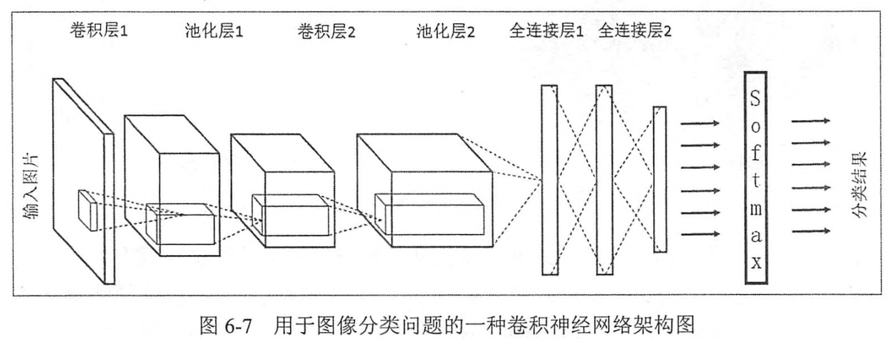
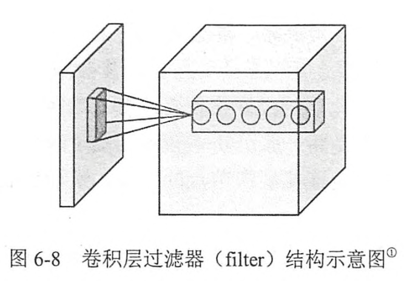
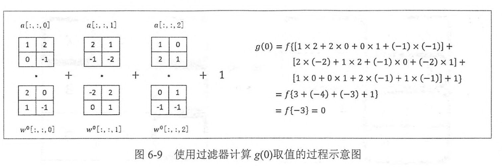
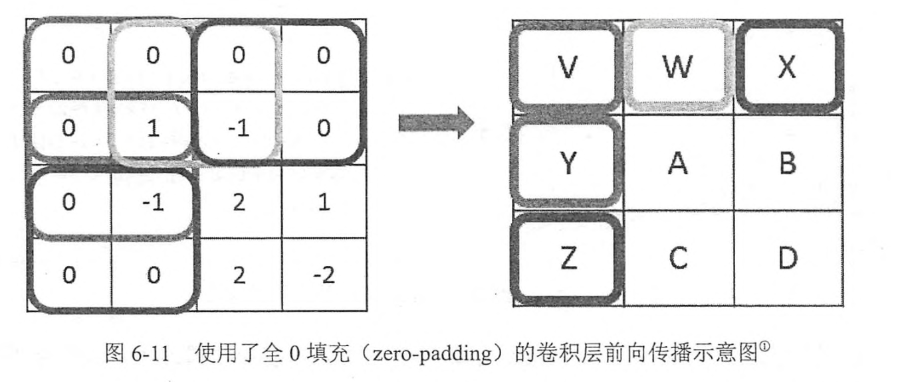
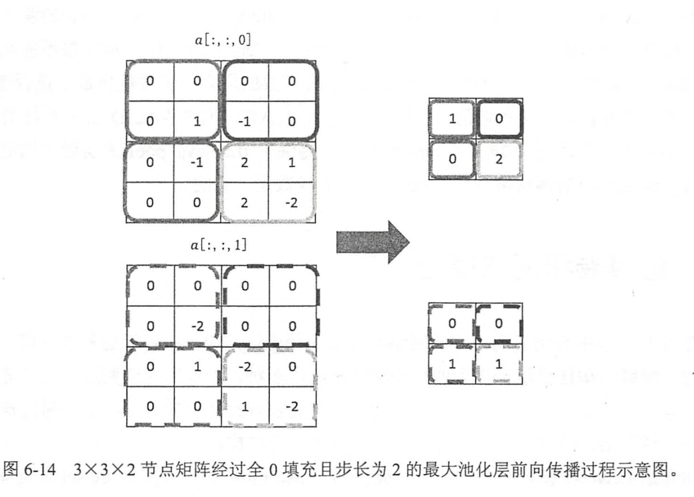
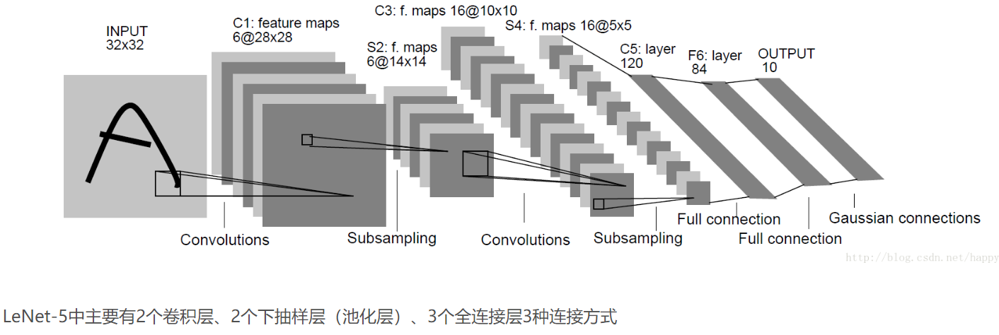
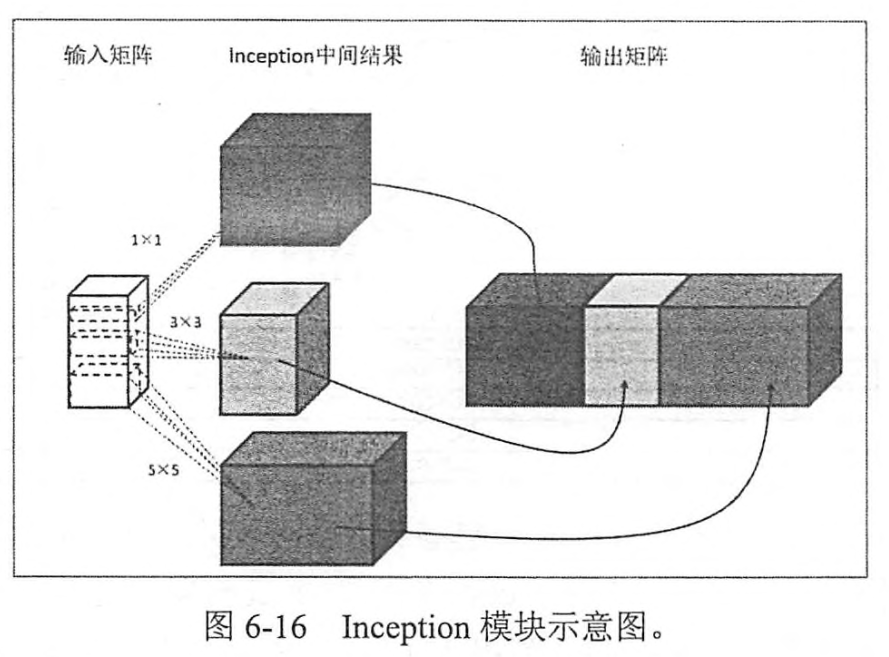
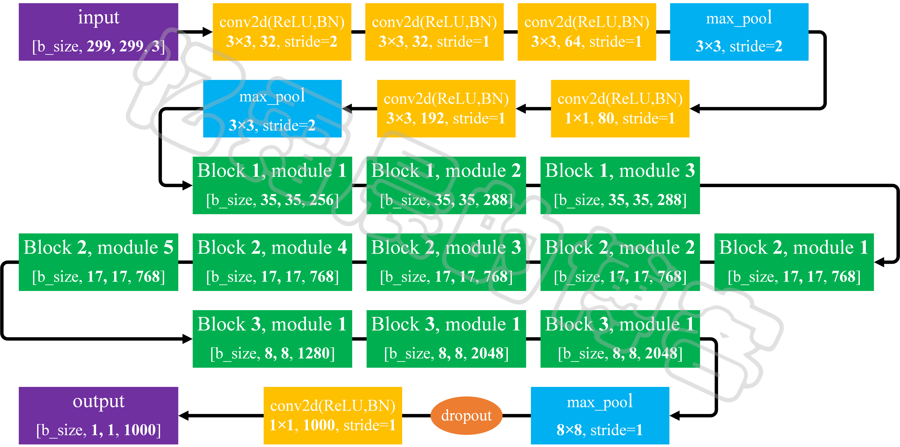
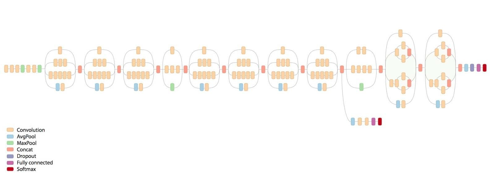

# Chapter5 图像识别与卷积神经网络
卷积神经网络(Convolutional Neural Network,CNN).卷积神经网络的引用非常广泛。
top-N正确率指的是图像识别算法给出前N个答案中有一个是正确的概率。很多学术论文都将前N个答案的正确率作为比较的方法，其中N的取值一般为3或5.

## 5.1 卷积神经网络简介
只包含全连接层的神经网络称之为 **全连接神经网络**。在之前中介绍的网络都为全连接网络。

使用全连接神经网络处理图像的最大的问题在于全连接层的参数太多。对于MNIST数据，每张图片大小28\*28\*1，隐藏层节点500个，那么一个全连接层的神经网络将会有 28\*28\*500+500 = 392500个参数。
具体的卷积神经网络架构图。

1. 输入层。输入层是整个神经网络的输入，在处理图像的卷积神经网络中，代表了 **一张图片的像素矩阵**，上图中，
2. 卷积层，卷积层的每一个节点的输入只是上一层神经网络的一小块，整个小块常用的大小为3\*3,5\*5.卷积层识图将神经网络的每一小块进行更加深入地分析，从而得到抽象程度更高的特征。一般来说，通过卷积层处理过的 **节点矩阵**会变得更 **深**。
3. 池化层，池化层不会改变三维矩阵的深度，但是可以缩小**矩阵的大小**，池化操作可以认为是将一张分辨率较高的图片转化为分辨率较低的图片，通过池化层，可以京一部缩小全连接层的节点个数，从而达到减小整个神经网络中参数的目的。
4. 全连接层，完成分类
5. Sofemax层

## 5.2 卷积神经网络常用结构
### 5.2.1 卷积层

这个部分被称为过滤器(filter)或者内核(kernel)，过滤器可以将 **当前神经网络上的一个子节点矩阵** 转化为 **下一层神经网络上的一个单位节点矩阵**。单位节点矩阵指的 **是一个长和宽都为1**，**但深度不限的节点矩阵**。
节点矩阵的尺寸也被称之为过滤器的尺寸。常用过滤器尺寸由3\*3,5\*5，因为 **过滤器处理的矩阵深度和当前层神经网络节点矩阵的深度是一致的**。所以虽然节点矩阵式三维的，但是只用指定两个维度。过滤器中另外一个需要人工指定的设置是处理得到的 **单位节点矩阵的深度**，这个设置称之为 **过滤器的深度**。
下面这个样例展示如何通过过滤器将一个 2\*2\*3的节点矩阵变化为一个1\*1\*5的单位节点矩阵。一个过滤器的前向传播过程和全连接层相似，总共需要$2*2*3*5*5 + 5 = 65$个参数。假设使用 $w_{x,y,z}^i$来表示对于输出单位矩阵中的第i个节点，过滤器输入节点$(x,y,z)$的权重，使用$b^i$表示第i个输出节点对应的偏置项参数，那么单位矩阵中的第i个节点的取值$g(i)$为：
$$ 
g(i)=f\left(\sum_{x=1}^{2} \sum_{y=1}^{2} \sum_{z=1}^{3} a_{x, y, z} \times w_{x, y, z}^{i} )+b^{i}\right. $$


当过滤器的大小不为 $1*1$时，卷积层前向传播得到的矩阵的尺寸要 **小于**当前层矩阵的尺寸。为了避免尺寸的变化，可以在 **当前层矩阵的边界加入全0填充**。


在卷积神经网络中，每一个卷积层中使用的过滤器的参数都是一样的。这是卷积神经网络的重要性质。**共享过滤器的参数**可以使得图像上的内容不受未知的影响。同时可以巨幅减少神经网络上的参数。
下面实现一个卷积层前向传播过程。
```python
import tensorflow as tf 
# 通过tf.get_variable的方式创建过滤器的权重变量和偏置项变量，上面介绍了卷积层的
#参数个数只和过滤器的尺寸、深度、以及当前层节点矩阵的深度有关，所以这里声明的参数变量
#是一个四维矩阵，前面两个维度代表了过滤器的尺寸，第三个维度表示当前层的深度，第四个维度表示
#过滤器的深度。
filter_weight = tf.get_variable(
    "weigths",[5,5,3,16],initializer=tf.truncated_normal_initializer(stddev=0.1)
)

#和卷积的权重类似，当前层矩阵上不同位置的偏置项也是共享的，所以总共有下一程深度个不同的偏置
#项。本代码中16为过滤器的深度，也是神经网络中下一层节点矩阵的深度
biases = tf.get_variable(
    "biases",[16],initializer=tf.constant_initializer(0.1)
)

#tf.nn.conv2d提供了一个非常方便的函数来实现卷积层前向传播的算法，这个函数的第一个输入为
#当前层的节点矩阵，注意这个矩阵是一个四维矩阵，后面三个维度对应一个节点矩阵，第一维对应一个
#输入batch,比如在输入层，input[0,:,:,:]表示第一张图片，input[1,:,:,:]表示第二张图片，以此类推
# [训练时一个batch的图片数量, 图片高度, 图片宽度, 图像通道数]。

#tf.nn.conv2d第二个参数提供了卷积层的权重，[filter_height, filter_width, in_channels, out_channels]
# 第三维in_channels，就是参数input的第四维

# 第三个参数维不同维度上的步长，第三个参数提供的是一个长度为4的数组，但是第一维和最后一维的数值要求一定是1.
# 这是因为卷积层的步长只对矩阵的长和宽有效，最后一个参数
#是填充(padding)的方法，TF提供SAME或VALID两种选择。SAME表示添加全0，VALID表示不添加
conv = tf.nn.conv2d(
    input,filter_weight,strides=[1,1,1,1],padding="SAME"
)

#tf.nn.bias_add 提供了一个方便的函数给每一个节点加上偏置项，注意这里不能直接使用加法，因为矩阵上不同位置上的节点都需要加上
#同样的偏置项。
bias = tf.nn.bias_add(conv,biases)

#将结算结果通过Relu激活函数完成去线性化
actived_conv = tf.nn.relu(bias)
```

### 5.2.2 池化层
卷积层直接加入一个池化层，可以非常有效的缩小矩阵的尺寸。从而减小最后全连接层中的参数。使用池化层既可以加快计算速度，也有防止过拟合问题的作用。
和卷积层类似，池化层前向传播的过程也是通过移动一个类似过滤器的结构完成的。不过池化层过滤器中的计算不是节点的加权和，而是采用更加简单的 **最大值或者平均值运算**。
池化层的过滤器也需要人工设定过滤器的尺寸，是否使用全0填充，以及过滤器移动的步长等设置。唯一的区别是 **卷积层使用的过滤器是横跨整个深度的**，而 **池化层使用的过滤器只影响一个深度上的节点**。所以，池化层的过滤器除了在长和宽两个维度移动之外，它还需要在 **深度** 这个维度移动。

```python
#tf.nn.maxpool实现了最大池化层的前向传播过程，它的参数和tf.nn.conv2d函数类似。ksize提供了过滤器的尺寸，strides提供了步长信息，padding提供了是否使用全0填充
#一般是[1, height, width, 1]，因为我们不想在batch和channels上做池化，所以这两个维度设为了1
pool = tf.nn.max_pool(
    actived_conv,ksize=[1,3,3,1],strides=[1,2,2,1],padding="SAME"
)
```
首先传入的是当前层的节点矩阵，这个矩阵是一个四维矩阵，格式和tf.nn.conv2d函数中的第一个参数一致，第二个参数为过滤器尺寸，虽然给出的是一个长度为4的一维数组，但是这个数组的 **第一个和最后一个数必须为1**，这意味着在Tf中，**池化层不能减少节点矩阵的深度或者输入样例的个数**。

## 5.3 LeNet-5 模型

LeNet-5模型共有7层，
### 5.3.1 第一层卷积层
输入层大小为 $32*32*1$，第一个卷积层过滤器的尺寸为 $5*5$，深度为6，不使用全0填充，步长为1，因为没有使用全0填充，这一层的输出尺寸为 $32-5+1=28$，深度为6.这一个卷积层共有参数$5*5*1*6+6=156$其中6个偏置项。因为下一层的节点矩阵由 $28*28*6=4704$个节点，每个节点和 $5*5=25$个当前层节点相连，所以本层卷积层共有 $4704*（25+1）=122304$个连接。

### 5.3.2 第二层 池化层
这一层的输入为第一层的输出，是一个 $28*28*6$的节点矩阵。本层采用的过滤器大小为 $2*2$，长和宽的步长均为2，本层的输出矩阵大小为 $14*14*6$，

### 5.3.3 第三层 卷积层
本层输入的矩阵大小为 $14*14*6$,使用的过滤器大小为 $5*5$，深度为16，不适用全0填充，步长为1.输出矩阵大小 $10*10*16$，本层参数个数$5*5*6*16+16=2416$，连接个数$10*10*16*(25+1)=41600$.

### 5.3.4 第四层 池化层
本层输入$10*10*16$，过滤器$2*2$，步长$2$，输出$5*5*16$

### 5.3.5 第五层 全连接层
输入大小$5*5*16$，也可称为卷积层，但是过滤器大小为 $5*5$，所以和全连接层没有区别。如果将 $5*5*16$矩阵中的节点拉成一个向量，那么这一层和在之前介绍的全连接层输入就一样了。本层输出的节点个数为 120.总共参数为 $5*5*16*120+120 = 48120$

### 5.3.5 第六层 全连接层
本层输入节点个数120，输出84，参数$120*84+84=10164$

### 5.3.5 第七层 全连接层
本层输入节点个数84，输出节点个数10，总共参数$84*10+10=850$

## 5.4 卷积神经网络架构
>输入层->(卷积层+->池化层？)+->全连接层+

*卷积层+* 表示一层或多层卷积层，大部分卷积神经网络中一般最多连续使用三层卷积层，*池化层？* 表示没有或者一层。池化层虽然可以起到减小参数防止过拟合问题，但是在部分论文中也发现可以直接通过 **调整卷积层步长来完成**。

## 5.5 Inception-v3模型
Inception结构式一种和LeNet-5结构完全不同的卷积神经网络结构，在LeNet-5模型中，不同卷积层通过 **串联**的方式连接在一起，而在Inception-v3模型中的Inception结构是将不同的 **卷积层**通过并联的方式结合在一起。下面通过tensorflow-slim工具来实现Inception-v3模块。
在上米娜上面提到了一个卷积层可以使用边长为1、3、5的过滤器，那么如何在这些边长中选呢？Inception模块 **同时使用所有不同的尺寸的过滤器**，**然后再将得到的矩阵拼接起来**。

Inception模块会首先使用不同尺寸的过滤器处理输入矩阵，虽然过滤器的大小不同，但如果所有的过滤器都使用全0填充且步长为1，那么前向传播得到的结果矩阵的 **长和宽都与输入矩阵一致**。这样经过不同过滤器处理的结果矩阵可以拼接成一个 **更深的矩阵**。可以将它们在深度这个维度上组合起来。


Inception-v3模型总共有46层，由11个Inception模块组成，在Inception-v3模型中有96个卷积层，如果像以前那么实现，一个卷积层需要5行代码，总共需要480行代码，可读性非常差。应该使用tF-Slim实现。

## 5.6 python __init__实验
python导入头文件的顺序：
1. 首先会在当前目录查找
2. 然后是在环境变量 PYTHONPATH 中查找
3. 会在与python的安装设置相关的默认路径下查找，在UNIX下，通常是 /usr/local/lib/python

## 5.7 卷积神经网络迁移学习
### 5.7.1 迁移学习介绍
可以保留训练好的Inception-V3模型种所有卷积层的参数，只是替换最后一层 **全连接层**，在这最后一层全连接层值之前的网络层称之为 **瓶颈层**(bottleneck).
将新的图像通过训练好的神经网络直到瓶颈层的过程可以看成是对图像进行特征提取的过程，在训练好的Inception0v3模型中，因为将瓶颈层的输出再通过一个单层的全连接层神经网络可以很好的区分1000种类别的图像。


