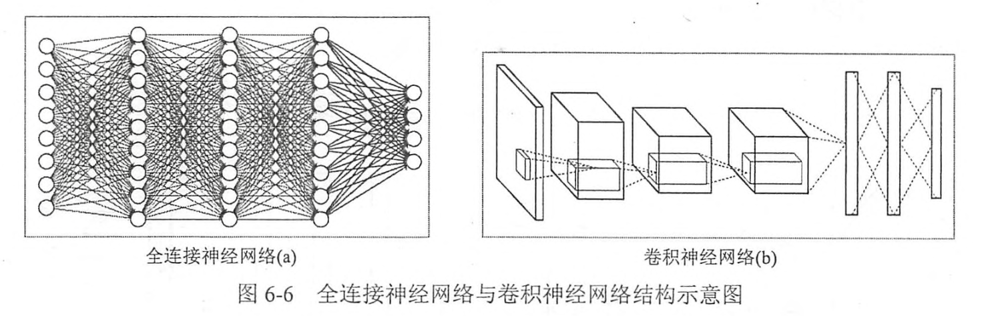

# Chapter5 图像识别与卷积神经网络
卷积神经网络(Convolutional Neural Network,CNN).卷积神经网络的引用非常广泛。
top-N正确率指的是图像识别算法给出前N个答案中有一个是正确的概率。很多学术论文都将前N个答案的正确率作为比较的方法，其中N的取值一般为3或5.

## 5.1 卷积神经网络简介
只包含全连接层的神经网络称之为 **全连接神经网络**。在之前中介绍的网络都为全连接网络。

