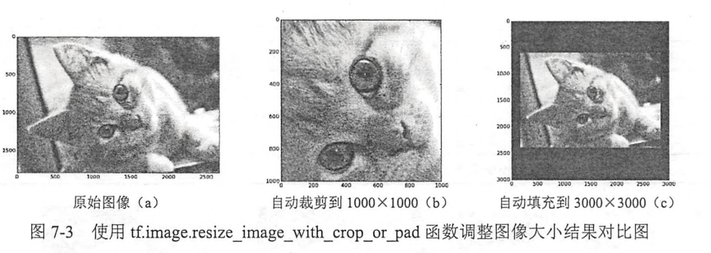
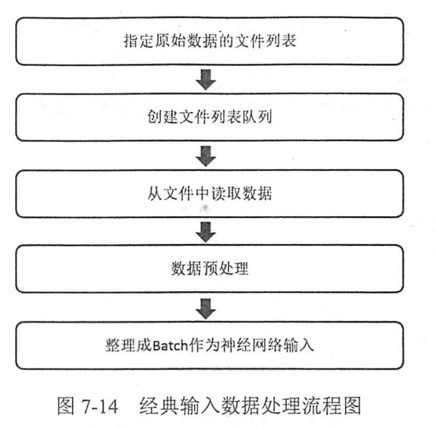

# Chapter6 图像数据处理
本章节详细地介绍TF中多线程处理输入数据的解决方案。首先介绍的TFRecord格式可以统一不同的原始数据格式，并更加有效地管理不同的属性。然后介绍如何对图像数据进行预处理，这一节将列举TF支持的图像处理函数，并介绍如何使用这些处理方式来弱化与图像识别无关的因素。复杂的图像处理函数有可能降低训练的速度，为了加速数据预处理过程，后面讲完整地介绍TF多线程数据预处理流程。这一节介绍TF多线程和队列的概念，这是TF多线程数据预处理的基本组成部分。然后讲具体介绍数据预处理流程中的每个部分。最后给出一个完整的多线程数据预处理流程图和程序框架。

## 6.1 TFRecord输入数据格式
TF提供了一种统一的格式来储存数据，这个格式就是TFRecord,TFRecord文件中的数据都是通过 tf.train.Example Protocol Buffer的格式存储的。下面的代码给出了 tf.train.Example的定义。
```
message Example {
    Features features =1;
}

message Features {
    map<string,Feature> feature=1;
}

message Feature{
    oneof kinf{
        BytesList bytes_list =1;
        FloatList folat_list =2;
        Int64List int64_list =3;
    }
}
```
从以上代码可以看出 tf.train.Example的数据结构是比较简洁的。tf.traian.Example中包含了 **一个从属性名称到取值的字典**。其中属性名称为一个字符串，属性的取值可以为字符串(BytesList),实数列表(FloatList)或者整数列表(Int64List).比如讲一张解码前的图像存为一个字符串，图像所对应的类别编号存为整数列表。

## 6.2 TFRecord样例程序
本小节讲给出具体的样例程序来读写TFRecord文件，：
```python
import tensorflow as tf 
from tensorflow.examples.tutorials.mnist import input_data
import numpy as np 
import matplotlib.pyplot as plt

#生成整数型的属性
def _int64_feature(value):
    return tf.train.Feature(int64_List=tf.train.Int64List(value=[value]))

#生成字符串型的属性
def _bytes_feature(value):
    return tf.train.Feature(bytes_List = tf.train.BytesList(value = [value]))

mnist = input_data.read_data_sets("/path/to/MNIST_data/",dtype = tf.uint8,one_hot = True)

images = mnist.train.images

#训练数据所对应的正确答案，可以作为一个属性保存在TFRecord中
labels = mnist.train.labels

#训练数据的图像分辨率，这可以作为Example中的一个属性
pixels = images.shape[1]
num_example = mnist.train.num_example

#输出TFRecord文件的地址
filename = "path/to/output.tf.records"

#创建一个writer来写TFRecord文件
writer = tf.python_io.TFRecordWriter(filename)

for index in range(num_example):
    #将图像矩阵转化为一个字符串
    image_raw = images[index].tostring()

    #将一个样例转化为 Examole Protocol Buffer,并将所有的信息写入这个数据结构
    example = tf.trian.Examole(features = tf.train.Features(feature  = {
        'pixels':_int64_feature(pixels),
        'label': _int64_feature(np.argmax(labels[index])),
        'image_raw': _bytes_feature(image_raw)

    }))

    #将一个Example写入TFRecord文件
    writer.write(example.SerializerToString())
writer.close()
```
```python
import tensorflow as tf 

#创建一个reader来读取TFRecord文件中的样例
reader = tf.TFRecordReader()

#创建一个队列来维护输入文件列表。
filename_queue = tf.train.string_input_producer(
    ["/path/to/output.tfrecords"]
)

#从文件中读取一个样例。也可以使用 read_up_to 函数一次性读取多个样例
_,serialized_example = reader.read(filename_queue)
#解析读入的一个样例，如果需要解析多个样例，可以用 parse_example函数
features = tf.parse_single_example(
    serialized_example,
    features = {
        #TF提供两种不同的属性解析方法，一种方法是 tf.FixedLenFeature,这种方法
        #解析的结果是一个 Tensor.另外一种方法是 tf.VarLenFeature.这种方法得到的
        #解析结果为SparseTensor.用于处理稀疏数据。这里解析数据的格式需要和上面程序写入数据
        #的格式一致
        'image_raw':tf.FixedLenFeature([],tf.string),
        'pixels': tf.FixedLenFeature([],tf.int64),
        'label': tf.FixedLenFeature([],tf.int64)
    }
)

#tf.decode_raw可以将字符串解析成图像对应的像素数组
images = tf.decode_raw(features['image_raw'],tf.uint8)
labels = tf.cast(features['label'],tf.int32)
pixels = tf.cast(features['pixels'],tf.int32)

sess = tf.Session()

#启动多线程处理输入数据，7.3节将更加详细地介绍TF多线程处理
coord = tf.train.Coordinator()
threads = tf.train.start_queue_runners(sess=sess,coord=coord)

#每次运行可以去读TFRecord文件中的一个样例，当所有样例都读完之后，在此样例中
#程序会在重头读取
for i in range(10):
    image,label,pixel = sess.run([images,labels,pixels])
```
## 6.3 图像数据处理


### 6.3.1 TF图像处理函数

##### 6.3.1.1 图像编码处理
一张RGB色彩模式的图像可以看成一个三维矩阵，矩阵中的每一个数表示了图像上的不同位置，不同颜色的亮度。然而图像在存储时并不是直接
记录这些矩阵的数字，而是记录经过压缩编码之后的结果。所以要将一张图像还原成一个三维矩阵，需要 **解码**的过程。TF提供了对jpeg和png格式图像的编码/解码函数。：
```python
import tensorflow as tf 
import matplotlib.pyplot as plt 

#读取原生图像的数据
image_raw_data = tf.gfile.FastGFile("./Images/Abyssinian_9.jpg",'rb').read()

with tf.Session() as sess:
    #将图像使用jpeg的格式解码从而得到图像对应的三维矩阵。TF还提供了
    #tf.image.decode_png函数对png格式的图像进行解码，解码之后的结果为
    #张量，在使用它的取值之前需要明确调用运行的过程
    img_data = tf.image.decode_jpeg(image_raw_data,3,1)

    print(img_data.eval())

    #使用pyplot工具可视化得到的图像。
    plt.imshow(img_data.eval())
    plt.show()

    # 将数据的类型转化为实数方便下面的样例程序对图像进行处理
    img_data = tf.image.convert_image_dtype(image=img_data,dtype=tf.float32)

    #将表示一张图像的三维矩阵重新按照jpeg格式编码并存入文件中，打开这张图像，
    #可以得到和原始图像一样的图像
    encod_image = tf.image.encode_jpeg(img_data)
    with tf.gfile.GFile("./Images/9.jpg","wb") as f:
        f.write(encod_image.eval())
```

##### 6.3.1.2 图像大小调整
一般来说，网络上获取的图像大小是不固定的，但是神经网络输入节点的个数是固定的。所以在将图像的像素作为输入提供给神经网络之前，需要将图像的大小统一。这就是图像大小调整需要完成的任务。图像大小调整有两种方式，第一种是通过算法使得新的图像尽量保存原始图像上的所有信息。TF提供了四种不同的方法，并且将它们封装到了 tf.image.resize_images 函数。
```python
    # 将数据的类型转化为实数方便下面的样例程序对图像进行处理
    # img_data = tf.image.convert_image_dtype(image=img_data,dtype=tf.float32)

    #将表示一张图像的三维矩阵重新按照jpeg格式编码并存入文件中，打开这张图像，
    #可以得到和原始图像一样的图像
    encod_image = tf.image.encode_jpeg(img_data)
    with tf.gfile.GFile("./Images/9.jpg","wb") as f:
        f.write(encod_image.eval())

    #通过tf.image.resize_images函数调整图像的大小，这个函数第一个参数为原始图像
    #第二个和第三个参数为调整后的图像的大小，method参数给出了调整图像大小的方法
    resized = tf.image.resize_images(img_data,[300,300],method=0)

    #输出调整后图像的大小，此处的结果为(300,300,?),图像深度在未明确设定之前是问号
    
    print(resized.get_shape())
    resized = np.asarray(resized.eval(),dtype = 'uint8')
    plt.imshow(resized)
    plt.show()
```
除了将整张图像信息完整保存起来，TF还提供了API对图像进行裁剪或者填充，：
```python
    #通过tf.image.resize_image_with_crop_or_pad 函数调整图像的大小，这个函数的
    #第一个参数为原始图像，后面的两个参数是调整后的目标图像大小。如果原始图像的尺寸
    #大于目标图像，那么这个函数会自动在原始图像的四周填充全0背景。
    croped = tf.image.resize_image_with_crop_or_pad(img_data,300,300)
    padded = tf.image.resize_image_with_crop_or_pad(img_data,700,700)
    print(croped.get_shape())
    print(padded.get_shape())
    croped = np.asarray(croped.eval(),dtype='uint8')
    padded = np.asarray(padded.eval(),dtype='uint8')

    plt.imshow(croped)
    plt.show()
    plt.imshow(padded)
    plt.show()
```

TF还支持通过比例调整图像大小，
```python
    #图像通过比例调整图像大小,
    central_cropped = tf.image.central_crop(img_data,0.5)
    plt.imshow(central_cropped.eval())
    plt.show()

    #图像翻转
    #上下翻转
    flipped = tf.image.flip_up_down(img_data)
    plt.imshow(flipped.eval())
    plt.show()

    #左右
    filpped_LR = tf.image.flip_left_right(img_data)
    plt.imshow(filpped_LR.eval())
    plt.show()

    #对角线
    transposed = tf.image.transpose_image(img_data)
    plt.imshow(transposed.eval())
    plt.show()

    #以一定的概率上下翻转图像
    flipped = tf.image.random_flip_left_right(img_data)
    #以一定概率左右反转图像
    flipped_LR = tf.image.random_flip_left_right(img_data)

    plt.imshow(flipped.eval())
    plt.show()
    plt.imshow(flipped_LR.eval())
    plt.show()

    #调整图像的色彩
    adjusted = tf.image.adjust_brightness(img_data,-0.5)
    plt.imshow(adjusted.eval())
    plt.show()

    adjusted = tf.image.adjust_brightness(img_data,0.5)
    plt.imshow(adjusted.eval())
    plt.show()

    #在[-max_delta,max_delta]的范围内随机调整图像的亮度
    adjusted = tf.image.random_brightness(img_data,max_delta=1)
    plt.imshow(adjusted.eval())
    plt.show()

    #调整图像的对比度
    adjusted = tf.image.adjust_contrast(img_data,-5)
    plt.imshow(adjusted.eval())
    plt.show()
```
##### 6.3.1.3 处理标注框
TF提供了一些工具来处理标注框，下面展示了通过 tf.image.draw_bouding_boxes 函数在图像中加入标注框
```python
import tensorflow as tf 
import numpy as np 
import matplotlib.pyplot as plt

image_raw_data = tf.gfile.FastGFile("./Images/Abyssinian_9.jpg",'rb').read()


with tf.Session() as sess:
    img_data = tf.image.decode_jpeg(image_raw_data)

    #tf.image.draw_bouding_boxes函数要求图像矩阵中的数字为实数，所以需先将图像矩阵转化为
    #实数类型。tf.image.draw_bouding_boxes函数图像的输入是一个 batch的数据，也就是多张图像
    #组成的 四维矩阵，所以需要将解码后的图像矩阵加一维。
    batched = tf.expand_dims(
        tf.image.convert_image_dtype(img_data,tf.float32),0
    )

    #给出每一张图像的所有标注框，一个标注框有四个数字，分别代表[ymin,xmin,ymax,xmax]
    #注意这里给出的数字都是图像的相对位置，比如在 180*267的图像中
    #[0.35,0.47,0.5,0.56]-->[63,125]到[90,150]的图像
    boxes = tf.constant([[[0.05,0.05,0.9,0.7],[0.35,0.47,0.5,0.56]]])
    result = tf.image.draw_bounding_boxes(batched,boxes)
    result = tf.image.convert_image_dtype(result,tf.uint8)
    result = sess.run(result)
    bat,h,w,c = result.shape
    result = result.reshape(h,w,3)
    plt.imshow(result)
    plt.show()
```
和随机翻转图像、随机调整颜色类似，随机截取图像上有信息含量的部分也是一个提高模型健壮性(robustness)的一种方式。可以使训练得到的模型不受被识别物体大小的影响。通过 tf.image.sample_distorted_bounding_box完成
```python
    begin,size,bbox_for_draw = tf.image.sample_distorted_bounding_box(
        tf.shape(img_data),bounding_boxes=boxes
    )
    batched = tf.expand_dims(
        tf.image.convert_image_dtype(img_data,tf.float32),0
    )

    result = tf.image.draw_bounding_boxes(batched,bbox_for_draw)
    result = tf.image.convert_image_dtype(result,tf.uint8)
    result = sess.run(result)
    bat,h,w,c = result.shape
    result = result.reshape(h,w,3)
    plt.imshow(result)
    plt.show()


    #截取随机出来的图像。
    distorted_image = tf.slice(img_data,begin,size)
    print(distorted_image)
    distorted_image = sess.run(distorted_image)
    print(distorted_image)
    plt.imshow(distorted_image)
    plt.show()
```

### 6.3.2 图像预处理完整案例
```python
import tensorflow as tf 
import numpy as np 
import matplotlib.pyplot as plt 

#给定一张图像，随机调整图像的色彩，因为调整亮度、对比度、饱和度和色相的顺序会影响
#最后得到的记过，所以可以定义多种不同的顺序。具体使用哪一种顺序可以在训练数据预处理时
#随机的选择一种，这样可以进一步降低无关因素对模型的影响

def distort_color(image,color_ordering=0):
    if color_ordering==0:
        image = tf.image.random_brightness(image,max_delta=32./255.)
        image = tf.image.random_saturation(image,lower=0.5,upper=1.5)
        image = tf.image.random_hue(image,max_delta=0.2)
        image = tf.image.random_contrast(image,lower=0.5,upper=1.5)
    elif color_ordering ==1:
        image = tf.image.random_saturation(image,lower=0.5,upper=1.5)
        image = tf.image.random_brightness(image,max_delta=32./255.)
        image = tf.image.random_contrast(image,lower=0.5,upper=1.5)
        image = tf.image.random_hue(image,max_delta=0.2)
    elif color_ordering ==2:
        #这里还可以定义其他的排列，
        pass
    return tf.clip_by_value(image,0.0,1.0)#将张量裁剪的指定的最大值和最小值之间

#给定一张解码后的图像、目标图像的尺寸以及图像上的标注框，此函数可以对给出的图像进行预处理。
#这个函数的输入图像是图像识别问题中原始的训练图像，而输出则是神经网络模型的输入层，足以这里只
#处理模型的训练数据，对于预测的数据，一般不需要使用随机变换的步骤

def preprocess_for_train(image,height,width,bbox):
    #如果没有提供标注框，则认为整个图现象就是需要关注的部分
    if bbox is None:
        bbox = tf.constant([0.0,0.0,1.0,1.0],dtype=tf.float32,shape=[1,1,4])
    
    #转换图像张量的类型
    if image.dtype != tf.float32:
        image = tf.image.convert_image_dtype(image,dtype=tf.float32)

    #随机截取图像，减小需要关注的物体大小对图像识别算法的影响
    bbox_begin,bbox_size,_ = tf.image.sample_distorted_bounding_box(
        tf.shape(image),bounding_boxes=bbox
    )
    distorted_image = tf.slice(image,bbox_begin,bbox_size)
    #将随机截取的图像调整为神经网络输入层的大小。大小调整的算法是随机选择的。
    distorted_image = tf.image.resize_images(distorted_image,[height,width],method=np.random.randint(4))
    #随机左右翻转图像
    distorted_image = tf.image.random_flip_left_right(distorted_image)
    #使用一种随机的顺序调整图像色彩
    distorted_image = distort_color(distorted_image,np.random.randint(2))
    return distorted_image

image_raw_data = tf.gfile.GFile("./Images/Abyssinian_9.jpg",'rb').read()

with tf.Session() as sess:
    img_data = tf.image.decode_jpeg(image_raw_data)
    boxes = tf.constant([[[0.05,0.05,0.9,0.7],[0.35,0.47,0.5,0.56]]])
    for i in range(6):
        #将图像的尺寸调整为299*299
        result = preprocess_for_train(img_data,299,299,boxes)
        # result = tf.image.convert_image_dtype(result,dtype=tf.uint8)
        print(result)
        result = sess.run(result)
        print(result)
        # plt.imshow(sess.run(result))
        # plt.show()
```
## 6.4 多线程输入数据处理框架
### 6.4.1 python的多线程研究
多任务可以由 **多进程**完成，也可以由一个进程内的 **多线程**完成。进程由若干线程组成的，一个进程至少有一个线程。
由于线程是操作系统直接支持的执行单元，因此，高级语言都内置多线程的支持，python也不例外，并且，python的线程是真正的Posix Thread,而不是模拟出来的线程。
启动一个线程就是把一个函数传入并创建Thread实例，然后调用start()开始执行。
```python
import time,threading

#新线程执行的代码
def loop():
    print("thread %s is runing..."%threading.current_thread().name)
    n=0
    while n<5:
        n=n+1
        print("thread %s >>> %s"%(threading.current_thread().name,n))
        time.sleep(1)
    print("thread %s ended"%threading.current_thread().name)

print("thread %s is running..."%threading.current_thread().name)
t = threading.Thread(target = loop,name='LoopThread')
t.start()
t.join()
print("thread %s ended"%threading.current_thread().name)
'''
thread MainThread is running...
thread LoopThread is runing...
thread LoopThread >>> 1
thread LoopThread >>> 2
thread LoopThread >>> 3
thread LoopThread >>> 4
thread LoopThread >>> 5
thread LoopThread ended
thread MainThread ended
'''
```
由于任何进程默认会启动一个线程，我们把该线程称之为 **主线程**，主线程又可以启动新的线程，python的threading模块有current_thread()函数，它永远返回当前线程的实例，主线程的实例的名字叫做 MainThread,子线程的名字在创建时指定，我们用 LoopThread命名子线程，名字仅仅在打印时用来显示，完全没有其他意义，如果不起名字pyhton就自动给线程命名为 Thread-1,Thread-2.....

> LOCK

多线程和多进程最大的不同在于，多进程中，同一个变量，各自有一份拷贝存在于每个进程中，互不影响，而多线程中，所有变量都由所有线程共享，所以，任何一个变量都可以被任何一个线程修改，因此，线程之间共享数据最大的危险在于多个线程同时改一个变量，把内容给改乱了。
```python
import time,threading

#假定这个是你的银行存款
balance = 0

def change_it(n):
    #先存后取,结果为0
    global balance
    balance = balance +n
    balance = balance -n

def run_thread(n):
    for i in range(10000000):
        change_it(n)

t1 = threading.Thread(target=run_thread,args = (5,))
t2 = threading.Thread(target = run_thread,args=(8,))
t1.start()
t2.start()
t1.join()
t2.join()
print(balance)#???
```
```python
import time
import threading

# 假定这个是你的银行存款
balance = 0
lock = threading.Lock()


def change_it(n):
    # 先存后取,结果为0
    global balance
    balance = balance + n
    balance = balance - n


def run_thread(n):
    for i in range(10000000):
        lock.acquire()
        try:
            change_it(n)
        finally:
            lock.release()
            
t1 = threading.Thread(target=run_thread, args=(5,))
t2 = threading.Thread(target=run_thread, args=(8,))
t1.start()
t2.start()
t1.join()
t2.join()
print(balance)

```
当多个线程同时执行lock.acquire()时，只有一个线程能成功地获取锁，然后继续执行代码，其他线程就继续等待直到获取锁为止。获取锁的线程用完后一定释放锁，否者会卡死其他线程。
由于python的GIL锁的存在，导致多核cpu不能有效的利用起来，因此需要采用多 **进程**运行。
```python
            p.apply_async(action,args=(outname,inname,num))

    p.close()
    p.join()
```

### 6.4.2 TF
在上节介绍了使用TF对图像数据进行预处理的方法。虽然使用这些图像数据预处理的方法可以减小无关因素对图像识别模型效果的影响，但这些复杂的预处理过程也会减慢整个训练过程。为了避免图像预处理成为神经网络模型的训练效率的瓶颈，tF提供了一套 **多线程**处理输入数据的框架。

在TF中，队列不仅是一种数据结构，它更提供可多线程机制，队列也是TF多线程输入数据处理框架的基础。

### 6.4.3 队列和多线程
在TF中，队列和变量类似，都是计算图上有状态的节点。其他的计算节点可以修改它们的状态，对于 **变量**，可以通过赋值操作修改变量的取值。对于 **队列**，修改队列状态的操作主要有Enqueuq、EnqueueMant和Dequeue，以下程序展示了如何使用这些函数来操作一个队列。
```python
import tensorflow as tf 

# #创建一个先进先出的队列，指定队列中最多可以保存两个元素，并指定
# #类型为整数
# q = tf.FIFOQueue(capacity=2,dtypes=tf.int32)

# #使用enqueue_many 函数初始化队列中的元素，和变量初始化类似，在使用队列之前
# #需要明确的调用这个初始化过程
# init = q.enqueue_many(([0,10],))

# #使用 Dequeue 函数将队列中的第一个元素出队列，这个函数的值将被存在变量x中。
# x = q.dequeue()
# #将得到的值加1
# y = x+1
# #将加1 的值再重新加入队列中
# q_inc = q.enqueue([y])

# with tf.Session() as sess:
#     #运行处死花花队列的操作
#     init.run()
#     for _ in range(7):
#         # 运行q_inc将执行数据出队列，出队的元素+1，重新加入队列的整个过程。
#         v,_=sess.run([x,q_inc])
#         #打印出队元素的取值
#         print(v) #0  10  1  11  2

##############################################################
'''
input_data = [ [3.,2.,1.],[11.,22.,33.],[111.,222.,333.]]
q = tf.FIFOQueue(3,dtypes=[tf.float32])
# init = q.enqueue_many(input_data) #3.0 2.0 1.0
init = q.enqueue(input_data)
out_data = q.dequeue()

with tf.Session() as sess:
    sess.run(init)
    sess.run(init)
    sess.run(init)

    print("1: ",sess.run(out_data))
    print("2: ",sess.run(out_data))
    print("3: ",sess.run(out_data))
    sess.run(q.close(cancel_pending_enqueues=False))
    print(sess.run(q.is_closed()))
# 1:  [3. 2. 1.]
# 2:  [3. 2. 1.]
# 3:  [3. 2. 1.]
# True
'''
###############################################################
'''
input_data = [ [3.,2.,1.],[11.,22.,33.],[111.,222.,333.]]
input_data1 = [ [33.,22.,11.],[11.,22.,33.],[111.,222.,333.]]
q = tf.FIFOQueue(3,dtypes=[tf.float32])
init = q.enqueue(input_data)
init1 = q.enqueue(input_data1)

output_data = q.dequeue()
with tf.Session() as sess:
    init.run()
    init1.run()
    init1.run()

    print('1：',sess.run(output_data))
    print('2：',sess.run(output_data))
    print('3：',sess.run(output_data))
    sess.run(q.close(cancel_pending_enqueues=True))
    print(sess.run(q.is_closed()))
# 1： [3. 2. 1.]
# 2： [33. 22. 11.]
# 3： [33. 22. 11.]
# True
'''
#####################################################
'''
# enqueue()每次入列一个元素，对于同一个输入数据，多次入列会重复入列相同的元素
input_data = [ [3.,2.,1.],[11.,22.,33.],[111.,222.,333.]]
# q = tf.FIFOQueue(3,dtypes=[tf.float32,tf.float32],shapes=[[],[]])
# 1:  [3.0, 11.0]
# 2:  [2.0, 22.0]
# 3:  [1.0, 33.0]
# True

q = tf.FIFOQueue(3,dtypes = [tf.float32],shapes = [[]])
# 1:  3.0
# 2:  2.0
# 3:  1.0
# True

init = q.enqueue_many(input_data) #3.0 2.0 1.0
# init = q.enqueue(input_data)
out_data = q.dequeue()

with tf.Session() as sess:
    sess.run(init)
    # sess.run(init)
    # sess.run(init)

    print("1: ",sess.run(out_data))
    print("2: ",sess.run(out_data))
    print("3: ",sess.run(out_data))
    sess.run(q.close(cancel_pending_enqueues=False))
    print(sess.run(q.is_closed()))
'''
#################################################################
'''
# enqueue()每次入列一个元素，对于同一个输入数据，多次入列会重复入列相同的元素
input_data = [ [3.,2.,1.],[11.,22.,33.],[111.,222.,333.]]
q = tf.FIFOQueue(3,dtypes=[tf.float32,tf.float32],shapes=[[],[]])
init = q.enqueue_many(input_data) 

out_data = q.dequeue_many(2)

with tf.Session() as sess:
    sess.run(init)
    # sess.run(init)
    # sess.run(init)

    print("1: ",sess.run(out_data))
    # print("2: ",sess.run(out_data))
    # print("3: ",sess.run(out_data))
    sess.run(q.close(cancel_pending_enqueues=False))
    print(sess.run(q.is_closed()))

# 如上例队列的元素为 [3.0, 11.0]，[2.0, 22.0]，[1.0, 33.0]，
# dequeue_many(2)将队列元素的第0维3.，2.，1.中取2个数据组成[3., 2.]，然后11.，22.，33.变为第0维，
# 再取2个数据组成[11., 22.]，所以出列的数据为[[3., 2.],[11., 22.],]
'''
#####################################################################

import tensorflow as tf

input_data=[[[3.,2.,1.],[11.,22.,33.],[111.,222.,333.]],[[23.,22.,21.],[211.,222.,233.],[2111.,2222.,2333.]]]
print(tf.shape(input_data))
q=tf.FIFOQueue(3,tf.float32)
init=q.enqueue_many(input_data)
output_data=q.dequeue()
with tf.Session() as sess:
    init.run()
    print('1：',sess.run(output_data))
    print('2：',sess.run(output_data))
    print('3：',sess.run(output_data))
    sess.run(q.close(cancel_pending_enqueues=True))
    print(sess.run(q.is_closed()))

'''
1： [3. 2. 1.]
2： [11. 22. 33.]
3： [111. 222. 333.]
True
输入数据input_data=[[[3.,2.,1.],[11.,22.,33.],[111.,222.,333.]],[[23.,22.,21.],[211.,222.,233.],[2111.,2222.,2333.]]]
为三维，所有第0维的张量为[3. 2. 1.]，[11. 22. 33.]， [111. 222. 333.]，enqueue_many会将他们组合在一起输入队列，
所以队列的元素为[3. 2. 1.]，[11. 22. 33.]， [111. 222. 333.]
'''
```
TF中提供了 **FIFOQueue** 和 **RandomShuffleQueue** 两种队列。后者会将队列中的元素打乱，每次出队列操作得到的是从当前队列元素中随机选择的一个。在训练神经网络时夕阳每次使用的训练数据尽量随机，RandomShuffleQueue提供了这样的功能。
在TF中，队列不仅仅是一种数据结构，还是 **异步计算**张量取值的一个重要的机制，比如多个线程可以同时向同一个队列中写元素，或者同时读取一个队列中的元素。
TF提供了 tf.Coordinator 和 tf.QueueRunnner 两个类来完成多线程协同的功能。tf.Coordinator主要协同多个线程一起停止，提供了 should_stop，request_stop join三个函数，在启动线程前，需要先声明一个 tf.Coordinator类，并将这个类传入每一个创建的线程中，启动的线程需要一直查询 tf.Coordinator类中提供的 should_stop函数，当这个函数的返回值为True时，则当前线程也需要退出。每一个启动的线程都可以通过调用requese_stop函数来通知其他线程退出：
```python
'''
import tensorflow as tf 
import numpy as np 
import threading
import time

#线程中运行的程序，这个程序每隔1秒判断是否需要停止并打印自己的ID
def Loop(coord,worker_id):
    #使用tf.Coordinator 类提供的协同工具判断线程是否需要停止
    while not coord.should_stop():
        #随机停止所有的线程
        if np.random.rand() < 0.1:
            print("stoping id: %d"%worker_id)
            #调用coord.request_stop()函数来通知其他线程停止
            coord.request_stop()
        else:
            #打印当前id
            print("working on id: %d"%worker_id)
        time.sleep(1)

coord = tf.train.Coordinator()

threads = [threading.Thread(target=Loop,args=(coord,i)) for i in range(5)]

for t in threads:t.start()
coord.join(threads)
'''
###########################################################################################
import tensorflow as tf 

#声明一个先进先出的队列，最多100个元素
queue = tf.FIFOQueue(100,"float")
#定义队列的入队操作
enqueue_op = queue.enqueue([tf.random_normal([1])])

#使用 tf.train.QueueRunner来创建多个线程运行队列的入队操作
# tf.train.QueueRunner的第一个参数给出了倍操作的列表 [enqueue_op]*5
#表示了需要启动5个线程，每个线程中运行的是enqueue_op操作
qr = tf.train.QueueRunner(queue,[enqueue_op]*5)

#将定义过的 QueueRunner加入TF计算图上指定的集合
# tf.train.add_queue_runner函数没有指定集合，
# 则加入默认集合 tf.GraphKeys.QUEUE_RUNNERS.下面的函数就是刚刚定义的qr加入
tf.train.add_queue_runner(qr)

#定义出队操作
out_tensor= queue.dequeue()

with tf.Session() as sess:
    # 使用 tf.train.Coordinator来协同启动的进程
    coord = tf.train.Coordinator()
    #使用 tf.train.QueueRunner时，需要明确调用 tf.train.start_queue_runners
    #来启动所有线程，否者因为没有线程运行入队操作，当调用出队操作时，程序会一直等待入队
    #操作被执行。tf.train.start_queue_runners函数会默认启动 tf.GraphKeys.QUEUE_RUNNERS集合中
    #的所有 QueueRunner. 因为这个函数支支持启动集合中的 QueueRunner，所以一般来说 tf.train.add_queue_runner
    # 函数和 tf.train.start_queue_runners 函数会指向同一个集合
    threads = tf.train.start_queue_runners(sess=sess,coord=coord)

    #获取队列中的取值
    for _ in range(3):print(sess.run(out_tensor)[0])

    #使用tf.train.Coordinator来停止所有的线程
    coord.request_stop()
    coord.join(threads)
    '''
    上面的程序将启动五个线程来执行队列入队的操作，每个线程都是将随机数写入队列，
0.7624912
-0.8749699
-1.698716
'''
```
### 6.4.2 输入文件队列
https://zhuanlan.zhihu.com/p/27238630
本小节将介绍如何使用TF中的队列管理输入文件列表。TF可以将数据分为多个 TFRecord文件来提高处理频率。TF提供了tf.train.match_filenames_once函数来获取符合一个正则表达式的所有文件，得到的文件列表可以通过 tf.train.string_input_prodecer函数进行有效管理。


