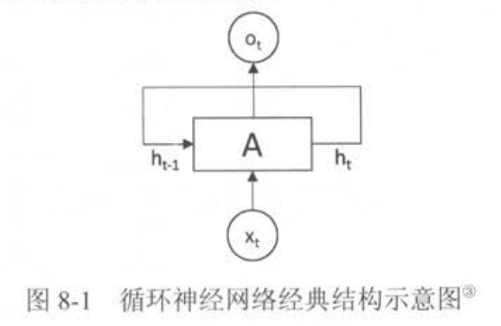
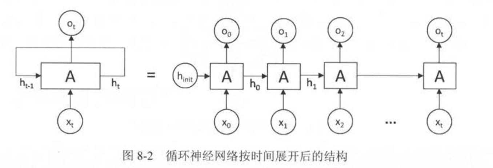
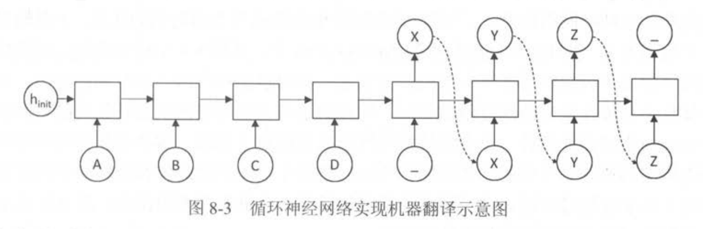
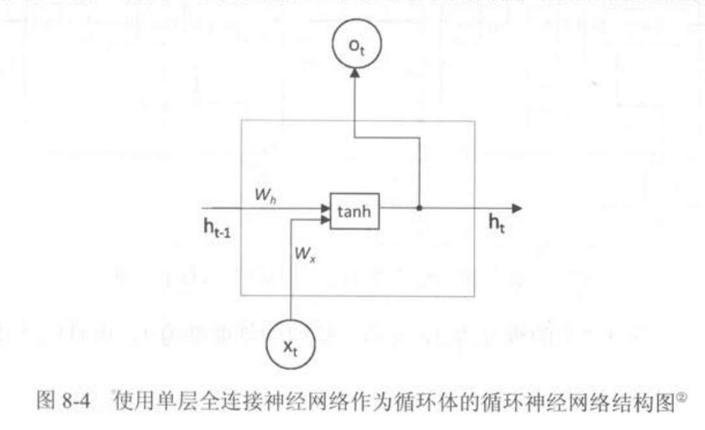
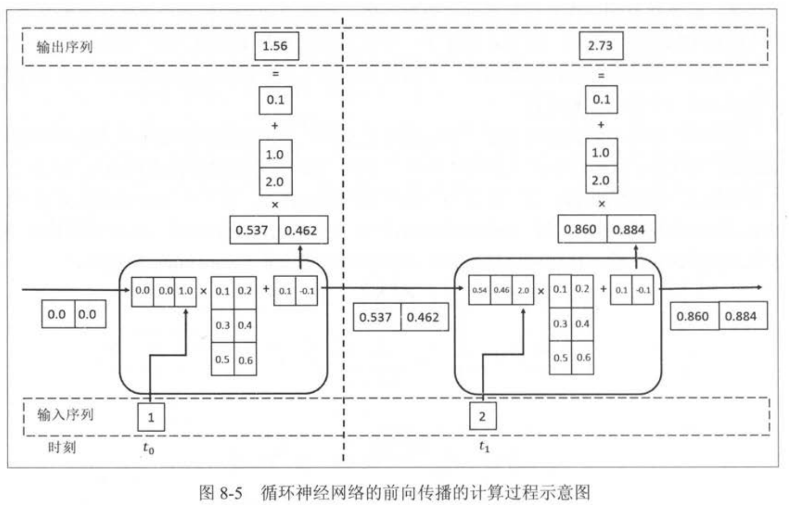
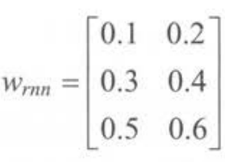
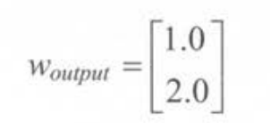
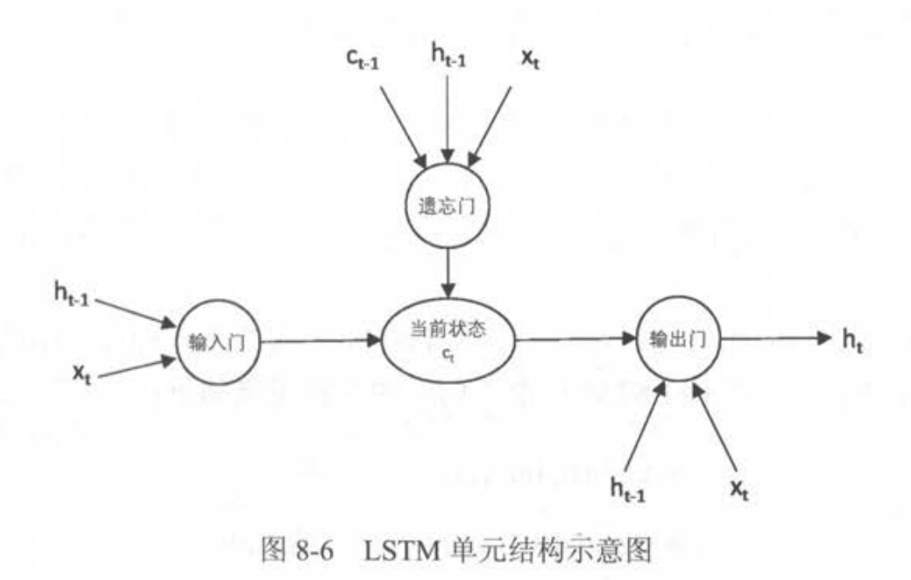
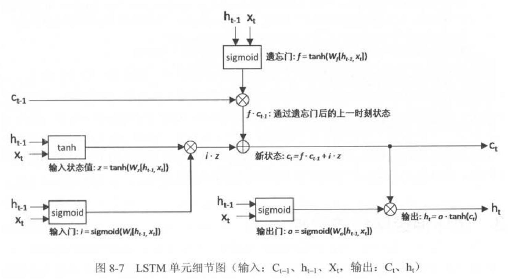

# Chapter7 循环神经网络

循环神经网络(recurrent neural network,RNN)以及循环神经网络中的一个重要结构--长短时记忆网络(long shot-term memory,LSTM)。

## 7.1 循环神经网络简介
循环神经网络(recurrent neural network,RNN)源自霍普菲尔德网络，该网络实现困难，再1986年后被 **全连接神经网络**以及一些 传统的 机器学习算法所取代。然而，传统的机器学习算法非常依赖于人工提取的特征，使得基于传统机器学习的图像识别、语音识别以及自然语言处理等问题存在 **特征提取** 的瓶颈。而基于全连接神经网络的方法也存在 参数太多，无法利用数据中时间序列信息的问题。**循环神经网络**挖掘数据中的时序信息以及语义信息的深度表达能力被充分利用。
循环神经网络的主要用途是 **处理和预测序列数据**。在之前介绍的全连接神经网络或卷积神经网络模型中，网络结构都是从输入层到隐含层再到输出层，层与层之间是 全连接或部分连接，但每层之间的节点是 **无连接的**。从网络结构上，循环神经网络会记忆之前的信息，隐藏层之间的节点是有连接的。隐藏层的输入不仅包括输入层的输出，还包括上一时刻隐藏层的输出。



循环网络的展开在模型训练中有重要意义，循环神经网络对长度为N序列你展开后，可以视为一个已有N个中间层的前馈神经网络。


循环神经网络可以看作是同一神经网络结构在 **时间序列上**被复制多次的结果。这个被复制多次的结构称为 **循环体**。

循环神经网络中的状态是通过一个向量来表示的，这个向量的维度也称之为 **循环神经网络隐藏层的大小**，假设为n。假设输入向量的维度为x，隐藏状态的维度为n，那么循环体的全连接层神经网络的输入大小为 n+x.也就是将上一时刻的状态和当前时刻的输入拼接成一个大的向量作为循环体中神经网络的输入。因为该全连接层的输出为当前时刻的状态，于是输出层的节点个数为n,循环体中的参数个数为 (n+x)*n+n个。

状态的维度为2，输入输出的维度为1，循环体的全连接层中权重为：

偏置项大小为 $b_rnn = [0.1,-0.1]$
输出的全连接层权重为：

```python
import numpy as np 

X = [1,2]
state = [0.,0.]

#分开定义不同输入部分的权重以方便操作
w_cell_state = np.asarray([[0.1,0.2],[0.3,0.4]])
w_cell_input = np.asarray([0.5,0.6])
b_cell = np.asarray([0.1,-0.1])

#定义用于输出的全连接层参数
w_output = np.asarray([[1.0],[2.0]])
b_output = 0.1

#按照时间顺序执行循环神经网络的前向传播
for i in range(len(X)):
    #计算循环体中的全连接神经网络
    before_activation = np.dot(state,w_cell_state) +\
    X[i]* w_cell_input +b_cell

    state = np.tanh(before_activation)

    #根据当前时刻状态计算最终输出
    final_output = np.dot(state,w_output) + b_output

    #输出每个时刻的信息
    print("before activation: ",before_activation)
    print("state",state)
    print("output",final_output)

'''
before activation:  [0.6 0.5]
state [0.53704957 0.46211716]
output [1.56128388]
before activation:  [1.2923401  1.39225678]
state [0.85973818 0.88366641]
output [2.72707101]
'''
```
和其他神经网络类似，在定义完损失函数之后，可以完成自动的模型训练过程。

## 7.2 长短时记忆网络(LSTM)结构
循环神经网络通过保存历史信息来帮助当前的决策，在复杂的语言场景中，有用的信息间隔有大有小，长度不一。
长短时记忆网络(long shot-term memory,LSTM)的设计就是为了解决这个问题。

LSTM靠一些“门”的结构让信息有选择性地影响循环神经网络中每个时刻的状态，所谓“门”的结构就是一个使用 sigmoid神经网络和一个按位做乘法的操作。之所以叫做”门“,是因为使用 sigmoid作为激活函数的全连接神经网络会输出一个 0到1之间的数值，描述当前输入有多少信息量可以通过这个结构，当门打开时(sigmoid神经网络层输出位1)，信息都可以通过；当门关上时(sigmoid神经网络层输出为0),任何信息都无法通过。
为了使 循环神经网络有效的保存长期记忆，“遗忘门”和“输入门”是LSTM的核心。“遗忘门”的作用是让循环神经网络“忘记”之前没有用的信息。“遗忘门”会根据当前的输入$x_t$和上一时刻输出$h_{t-1}$决定那一部分记忆需要被遗忘。假设状态c的维度为n。“遗忘门”会根据当前的输入$x_t$和上一时刻输出$h_{t-1}$计算一个维度为n的向量$f=sigmoid(W_1x+W_2h)$,它在每个维度上的值都在(0,1)范围内，再将上一时刻的状态 $c_{t-1}$与f向量按位相乘，那么f取值接近0的维度上的信息会被“忘记”，而f取值接近1的维度上的信息会被保留。
在循环神经网络“忘记”了部分之前的状态后，它还需要从当前的输入补充最新的记忆，这个过程就是“输入门”完成的。“输入门”会根据$x_t$和$h_{t-1}$决定哪些信息加入到状态$c_{t-1}$中生成新的状态，这时“输入门”和需要写入的新状态都从$x_t$和$h_{t-1}$计算产生。
LSTM结构在计算得到新的状态$c_t$后需要产生当前时刻的输出，这个过程是通过“输出们”完成的，
LSTM每个门的公式定义：
$$
z=\tanh \left(W_{z}\left[h_{t-1}, x_{t}\right]\right)
  (输入值)$$ 
  $$
i=\operatorname{sigmoid}\left(W_{i}\left[h_{t-1}, x_{t}\right]\right)(输入门)
$$
$$
f=\operatorname{sigmoid}\left(W_{f}\left[h_{t-1}, x_{t}\right]\right)(遗忘门)
$$
$$
o=\operatorname{sigmoid}\left(W_{o}\left[h_{t-1}, x_{t}\right]\right)(输出门)
$$
$$
c_{t}=f \cdot c_{t-1}+i \cdot z(新状态)
$$
$$
h_{t}=o \cdot \tanh c_{t}(输出)
$$

LSTM在TF中的实现：
```python

```