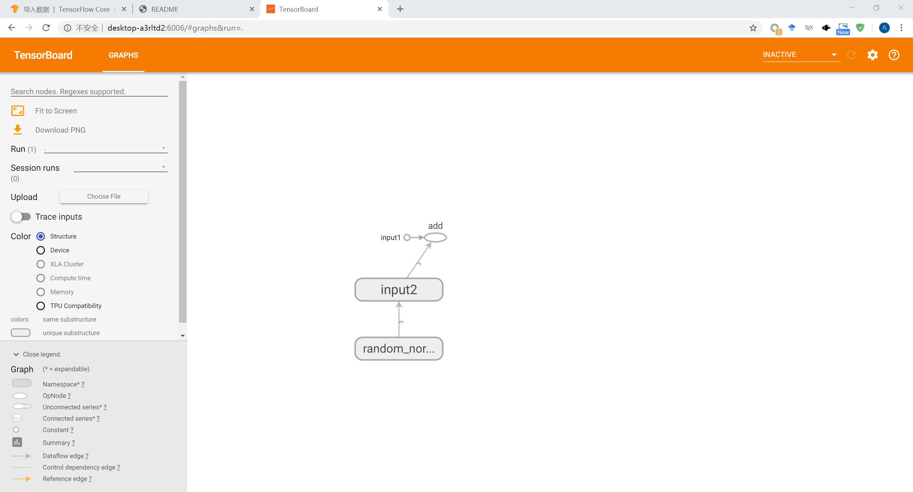
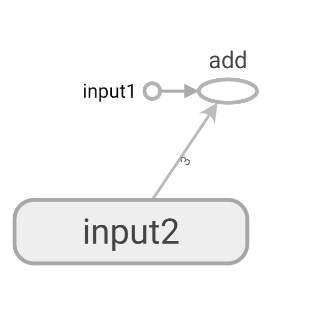

# Chapter8 TensorBoard可视化
## 8.1 TensorBoard简介
TensorBoard是Tensorflow的可视化工具，它可以通过TF程序运行过程中输出的日志文件可视化TF程序的运行状态。TB和TF程序跑在不同的进程中，TF会自动读取最新的TF日志文件，并呈现当前TF程序运行的最新状态。
```python
import tensorflow as tf 

#定义一个简单的计算图，实现向量加法的操作
input1 = tf.constant([1.0,2.0,3.0],name="input1")
input2 = tf.get_variable(name="input2",initializer=tf.random_normal([3]))
output = tf.add_n([input1,input2],name="add")

#生成一个写日志的writer，并将当前的TF计算图写入日志。TF提供了多种写
#日志文件的API，
writer = tf.summary.FileWriter("./path/to/log",tf.get_default_graph())
writer.close()
```
以上程序输出了TF计算图的信息，所以运行TB时，可以看到这个向量相加程序计算图可视化之后的结果。TB不需要额外的安装过程。
>#运行TB，并将日志的地址指向上面程序输出的地址
>tensorboard --logdir=/path/to/log

运行以后启动一个服务，这个服务的端口默认为6006，

在界面的上方，展示的内容是“**GRAPHS**”,表示图中可视化的内容是TF的**计算图**。右上方有“**INACTIVATE**”选项，点开这个选项可以看到TB能够可视化的其他内容，**INACTIVATE**选项中列出的是当前没有可视化数据的项目。除了可视化Tensorflow的计算图之外，TB还提供了 SCALARS、IMAGES、AUDIO、DISTRIBUTIONS，HISTOGRAMS、PROJECTOP、TEXT和PROFILE


## 8.2 TF计算图可视化
Tensorboard可视化得到的图不仅 **是将TF计算图中的节点和边直接可视化**，**它会根据每个TF计算节点的命名空间来整理可视化得到的效果图**，使得神经网络的整体结构不会被过多的细节所淹没。除了显示TF的计算图的结构，TB还可以展示TF计算节点上的其他信息。

## 8.2.1 命名空间与TB图上节点
在程序中只定义了一个有两个加数的加法操作。然而从图中可以看到里面总共有4个节点。多出来的一个节点就是 **变量的初始化过程中系统生成的**。更重要的是，这些节点的排列可能会比较乱，这导致主要的计算节点可能会被埋没在大量信息量不大的节点中，使得可视化得到的效果图很难理解。
为了更好地组织可视化效果图中的节点，TB支持通过TF命名空间来整理可视化效果图上的节点。在TB的默认视图中，TF计算图中 **同一个命名空间下的所有节点会被缩略成一个节点**，**只有顶层命名空间中的节点才会被显示在TB可视化效果图上**。可以通过**tf.variable_scope**函数管理变量的命名空间，**tf.name_scope**函数也提供了命名空间管理的功能。这两个函数在大部分情况下是等价的。唯一的区别是在使用 **tf.get_variable**函数时，以下代码简单的说明了这两个函数的区别。
```python
import tensorflow as tf 

with tf.variable_scope("foo"):
    #在命名空间foo下获取变量bar，于是得到的变量名称为“foo/bar”
    a = tf.get_variable("bar",shape=[1])
    print(a.name)   #输出：foo/bar:0

with tf.variable_scope("bar"):
    #在命名空间bar下获取变量"bar",于是得到的变量名称为“bar/bar”。此时变量
    #"bar/bar"和变量“foo/bar”并不冲突，于是可以正常运行
    b = tf.get_variable("bar",shape=[1])
    print(b.name)   #bar/bar:0

with tf.name_scope("a"):
    #使用tf.variable函数生成的变量会受tf.name_scope影响，于是这个变量的名称为
    #“a/Variable"
    a = tf.Variable([1])
    b = tf.Variable([1])
    print(a.name,b.name)   #a/Variable:0,a/Variable_1:0

    #tf.get_variable函数不受tf.name_scope函数的影响
    #于是变量并不在a这个命名空间里面
    b = tf.get_variable("b",shape=[1])
    print(b.name)   #b:0

with tf.name_scope("b"):
    #因为tf.get_variable不受tf.name_scope影响，所以这里将试图获取
    #名称为“a”的变量。然而这个变量已经被声明了，于是这里会报错
    tf.get_variable("b",[1])# Variable b already exists, disallowed. 
```
通过对命名空间管理，可以改进向量相加的样例代码，使得可视化得到的效果图更加清晰。以下代码展示了改进的方法。
```python
import tensorflow as tf 

#将输入定义放入各自的命名空间中，
#从而使得TB可以根据命名空间来整理可视化效果图上的节点
with tf.variable_scope("input1"):
    input1 = tf.constant([1.0,2.,3.],name = "input1")
with tf.variable_scope("input2"):
    input2 = tf.get_variable("input2",
    initializer=tf.random_uniform([3]))
output = tf.add_n([input1,input2],name="add")

writer = tf.summary.FileWriter("./path/to/log",tf.get_default_graph())
writer.close()
```

图中用于初始化的节点已经被缩略起来了，这样TF程序中定义的加法运算被清晰的展示了出来，需要查看input2节点中包含哪些运算，点击加号。
可视化真实的神经网络结构图。
```python
import tensorflow as tf 
import os
from tensorflow.examples.tutorials.mnist import input_data
#mnist_inference中定义的常量和前向传播的函数不需要改变，因为前向传播已经通过
#tf.variable_scope实现了计算节点按照网络结构的划分
BATCH_SIZE = 100
LEARNING_RATE_BASE = 0.8
LEARNINT_RATE_DECAY = 0.99
REGULARAZTION_RATE = 0.0001
TRAINING_STEPS = 30000
MOVING_AVERAGE_DECAY = 0.99
# 模型保存的路径和文件名
MODEL_SAVE_PATH = ".\model"
MODEL_NAME = "model.ckpt"

import mnist_inference

def train(mnist):
    #将处理输入数据的计算都放在名字为“input1”的命名空间下
    with tf.variable_scope("input"):
        x = tf.placeholder(
        tf.float32, [None, mnist_inference.INPUT_NODE], name="x-input"
    )
        y_ = tf.placeholder(
        tf.float32, [None, mnist_inference.OUTPUT_NODE], name="y-input"
    )
        regularizer = tf.contrib.layers.l2_regularizer(REGULARAZTION_RATE)
        y = mnist_inference.inference(x, regularizer)
        global_step = tf.get_variable(
        "global_step",initializer=0, trainable=False)
    
    #将处理滑动平均相关的计算都放在名为 moving_average的命名空间下
    with tf.variable_scope("moving_average"):
        variable_averages = tf.train.ExponentialMovingAverage(
        MOVING_AVERAGE_DECAY, global_step)
        variables_averages_op = variable_averages.apply(tf.trainable_variables())
    
    #将计算损失函数相关的计算都放在名为 loss_function的命名空间下
    with tf.variable_scope("loss_function"):
        cross_entropy = tf.nn.sparse_softmax_cross_entropy_with_logits(
       logits = y, labels = tf.argmax(y_, 1))
        cross_entropy_mean = tf.reduce_mean(cross_entropy)
        loss = cross_entropy_mean + tf.add_n(tf.get_collection('losses'))

    #将定义学习率，优化方法，以及每一轮训练需要执行的操作都放在名字为“train_step”
    #的命名空间下
    with tf.variable_scope("train_step"):
        learning_rate = tf.train.exponential_decay(
        LEARNING_RATE_BASE,
        global_step,
        mnist.train.num_examples / BATCH_SIZE,
        LEARNINT_RATE_DECAY
    )

        train_step = tf.train.GradientDescentOptimizer(learning_rate).minimize(
        loss, global_step=global_step
    )
        with tf.control_dependencies([train_step,variables_averages_op]):
            train_op = tf.no_op(name='train')

    # 初始化TF持久化类
    saver = tf.train.Saver()
    # with tf.Session() as sess:
    #     tf.global_variables_initializer().run()

    #     # 在训练过程中不在测试模型在验证数据上的表现，验证和测试的过程将会有一个
    #     # 独立的程序来完成
    #     # _,对应的是3个返回值
    #     for i in range(TRAINING_STEPS):
    #         xs,ys = mnist.train.next_batch(BATCH_SIZE)
    #         _,loss_value,step = sess.run(
    #             [train_op,loss,global_step],feed_dict={x:xs,y_:ys})
            
    #         if i%100 == 0:
    #             # 输出当前的训练情况。这里只输出了模型在当前batch上的损失函数大小。
    #             # 通过损失函数的大小可以大概了解训练的情况，在验证数据集上的正确率信息会有
    #             # 一个单独的程序来生成
    #             print("After %d training step(s),loss on training batch is %g."%(step,loss_value))
    #             # os.path.join路径拼接
    #             saver.save(sess,os.path.join(MODEL_SAVE_PATH,MODEL_NAME),global_step=global_step)
    
    #将当前的计算图输出到 TB的日志文件
    writer = tf.summary.FileWriter("./path/to/loga",tf.get_default_graph())
    writer.close()

def main(argv = None):
    mnist = input_data.read_data_sets('path/to/MNIST_data',one_hot = True)
    train(mnist)
if __name__ == '__main__':
    tf.app.run()
```
以上程序将完成类似功能的计算放到了由 tf.variable_scope函数生成的上下文管理器中，这样TB就可以将这些节点有效地合并，从而突出神经网络的整体结构。

## 8.2.2 节点信息
除了展示TF计算图的结构，TB还可以展示TF计算图上每个节点的基本信息以及 **运行时消耗的时间和空间**。本节将进一步讲解如何通过TB展现TF计算图节点上的这些信息，TF计算节点的运行时间都是非常有用的信息，它可以帮助更加有正对性的优化TF程序，将如下代码加入mnist_train.py神经网络训练部分，可以将不同迭代轮数的每个TF计算节点的运行时间和消耗的内存写入TB的日志文件中。
```python
with tf.Session() as sess:
        tf.global_variables_initializer().run()

        # 在训练过程中不在测试模型在验证数据上的表现，验证和测试的过程将会有一个
        # 独立的程序来完成
        # _,对应的是3个返回值
        for i in range(TRAINING_STEPS):
            xs,ys = mnist.train.next_batch(BATCH_SIZE)
            # _,loss_value,step = sess.run(
            #     [train_op,loss,global_step],feed_dict={x:xs,y_:ys})
            
            if i%1000 == 0:
                #配置运行时需要记录的信息
                run_options = tf.RunOptions(
                    trace_level = tf.RunOptions.FULL_TRACE
                )
                #运行时需要记录信息的proto
                run_metadata = tf.RunMetadata()
                #将配置信息和记录运行信息的proto传入运行的过程，从而记录运行时每一个节点
                #的时间，空间开销信息
                _,loss_value,step = sess.run(
                    [train_op,loss,global_step],feed_dict = {x:xs,y_:ys},
                    options=run_options,run_metadata=run_metadata
                )
                #将节点在运行时的信息写入日志文件
                writer = tf.summary.FileWriter("./path/to/loga",tf.get_default_graph())
                writer.add_run_metadata(run_metadata,"step%03d"%i)
                # 输出当前的训练情况。这里只输出了模型在当前batch上的损失函数大小。
                # 通过损失函数的大小可以大概了解训练的情况，在验证数据集上的正确率信息会有
                # 一个单独的程序来生成
                print("After %d training step(s),loss on training batch is %g."%(step,loss_value))
                # os.path.join路径拼接
                saver.save(sess,os.path.join(MODEL_SAVE_PATH,MODEL_NAME),global_step=global_step)
            else:
                _,loss_value,step = sess.run(
                [train_op,loss,global_step],feed_dict={x:xs,y_:ys})
    
    #将当前的计算图输出到 TB的日志文件
    writer.close()
```

## 8.3 监控指标可视化
除了 **GRAPHS**之外，TB界面中还提供了 SCALARS,IMAGES,AUDIO,DISTRIBUTIONS,HISTOGRAMS,TEXT来监控其他指标。下面层序展示了如何将TF程序运行时的信息输出到TB的日志文件，因为需要在变量定义加上日志输出，所以这里先不公用mnist_inference.py的代码。
```python
import tensorflow as tf 
from tensorflow.examples.tutorials.mnist import input_data

SUMMARY_DIR = "./path/to/logB"
BATCH_SIZE = 100
TRAIN_STEPS = 3000

#生成变量监控信息并定义生成监控信息日志的操作。其中var给出了需要记录的变量，name给出了
#再可视化结果中显示的图表名称，这个名称一般与变量名一致
def variable_summaries(var,name):
    # 将生成监控信息的操作放到同一个命名空间下
    with tf.variable_scope("summaries"):
        #通过tf.summary.hsitogram函数记录张量中元素的取值分布。对于给出的图标名称和张量
        #tf.summary.histogram 函数会生成一个 Summary protocol buffer。将Summary写入
        #TensorBoard日志文件后，在HSITOGRAMS栏和DISTRIBUTION栏下都会出现对应名称的图标。和
        #TF其他的操作类似，tf.summary.histogram函数不会立刻被执行，只有当 sess.run函数明确调用
        #这个操作时，TF才会真正生成并输出SUmmary protocol buffer
        tf.summary.histogram(name,var)

        #计算变量的平均值，并定义生成平均值信息日志的操作，记录变量平均值信息的日志标签名为'mean/'+name
        #其中的mean为命名空间，/时命名空间的分隔栏，在相同的命名空间的监控指标会被整合到同一栏中，name则给出了
        #当前监控指标属于哪一个变量
        mean = tf.reduce_mean(var)
        tf.summary.scalar('mean/'+name,mean)

        #计算变量的标准差，并定义生成其他日志的操作
        stddev = tf.sqrt(tf.reduce_mean(tf.square(var-mean)))
        tf.summary.scalar('stddev/'+name,stddev)
    

#生成一层全连接层神经网络
def nn_layer(input_tensor,input_dim,output_dim,layer_name,act=tf.nn.relu):
    #将同一层神经网络放在一个同一的命名空间下
    with tf.variable_scope(layer_name):
        #声明神经网络边上的权重，并调用生成权重监控信息日志的函数
        with tf.variable_scope('weights'):
            weights = tf.get_variable(name='weights',shape=[input_dim,output_dim],initializer=tf.truncated_normal_initializer(stddev=0.1
            ))
            variable_summaries(weights,layer_name+'/weights')
        
        #声明神经网络的偏置项，调用生成偏置项监控信息日志的函数
        with tf.variable_scope("biases"):
            biases = tf.get_variable(initializer=tf.constant(0.0,shape=[output_dim]),name='biases')
            variable_summaries(biases,layer_name+'/biases')
        
        with tf.variable_scope('Wx_plus_b'):
            preactivate = tf.matmul(input_tensor,weights) + biases
            #记录神经网络输出节点在经过激活函数之前的分布
            tf.summary.histogram(layer_name+'/pre_activations',preactivate)
        
        activations = act(preactivate,name='activation')

        #记录神经网络输出节点在经过激活函数之后的分布。对于layer1,因为使用了ReLU函数作为激活函数
        #所以所有小于0的值都被设为了0.于是在激活后的layer1/activations图上所有的值都是大于0的。而对于layer2，
        #因为没有使用激活函数，所以lay2/activations和lay2/pre_activations是一样的
        tf.summary.histogram(layer_name+'/activations',activations)
        return activations


def main(_):
    mnist=input_data.read_data_sets("/path/to/MNIST_data",one_hot=True)
    #定义输入
    with tf.variable_scope('input'):
        x =tf.placeholder(tf.float32,[None,784],name="x-input")
        y_=tf.placeholder(tf.float32,[None,10],name="y-input")

    # 将输入向量还原成图片的像素矩阵，并且通过 tf.summary.image函数定义将当前的
    #图片信息写入日志的操作
    with tf.variable_scope('input_reshape'):
        image_shape_input = tf.reshape(x,[-1,28,28,1])
        tf.summary.image('input',image_shape_input)
    
    hidden1 = nn_layer(x,784,500,'layer1')
    y = nn_layer(hidden1,500,10,'layer2',act = tf.identity)

    #计算交叉熵并定义生成交叉熵监控日志的操作
    with tf.variable_scope('cross_entropy'):
        cross_entropy = tf.reduce_mean(
            tf.nn.softmax_cross_entropy_with_logits(logits = y,labels = y_)
        )
        tf.summary.scalar('cross entropy',cross_entropy)
    
    with tf.variable_scope('train'):
        train_step = tf.train.AdamOptimizer(0.001).minimize(cross_entropy)

    #计算模型在当前给定数据上的正确率，并定义生成正确率监控日志的操作。如果在sess.run时给定的数据是
    #训练batch，那么得到的正确率就是这个训练batch上的正确率；同理验证和测试数据
    with tf.variable_scope('accuracy'):
        with tf.variable_scope('correct_prediction'):
            correct_prediction = tf.equal(tf.argmax(y,1),tf.argmax(y_,1))
        with tf.variable_scope('accuracy'):
            accuracy = tf.reduce_mean(
                tf.cast(correct_prediction,tf.float32)
            )
        tf.summary.scalar('accuracy',accuracy)

    #和TF中其他操作类似，tf.summary.scalar\histogram\image，函数都不会立即执行，需要用过sess.run
    #来明确调用这些函数。因为程序中定义的写日志的操作比较多，一一调用很麻烦，所以tf提供了 tf.summary.merge_all
    #函数整理所有的日志生成操作。在TF程序执行的过程中只需要运行这个操作姐可以将代码中定义的所有日志生成操作执行一次
    #从而将所有日志写入文件
    merged = tf.summary.merge_all()

    with tf.Session() as sess:
        #初始化写日志的 writer,并将当前TF计算图写入日志
        summary_writer = tf.summary.FileWriter(SUMMARY_DIR,sess.graph)
        tf.global_variables_initializer().run()

        for i in range(TRAIN_STEPS):
            xs,ys = mnist.train.next_batch(BATCH_SIZE)
            #运行训练步骤以及所有的日志生成操作，得到这次运行的日志
            summary,_=sess.run([merged,train_step],feed_dict = {x:xs,y_:ys})

            #将所有日志写入文件，
            summary_writer.add_summary(summary,i)
        summary_writer.close()
if __name__ == '__main__':
    tf.app.run()
```
日志生成函数与TB界面栏对应关系
TF日子生成函数|TB界面栏|展示内容
:--:|:--:|:--:|
tf.summary.scalar|SCALARS|TF中标量(scalar)监控数据随着迭代进行的变化趋势，
tf.summary.images|IMAGES|TF中使用的图片数据，这一栏一般用于可视化当前使用的训练/测试图片。
tf.summary.audio|AUDIO|TF使用的音频数据
tf.summary.text|TEXT|TF中使用的文本数据
tf.summary.histogram|HISTOGRAMS DISTRIBUTIONS|TF中张量分布监控数据随着迭代的轮数的变化趋势
