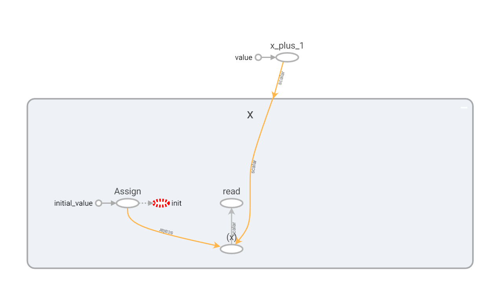

参考的网址： https://blog.csdn.net/hu_guan_jie/article/details/78495297
程序没有改动，添加了图
## 1.
下面程序的功能是，做5次循环，每次循环给x加1，赋值给y，然后打印出来，所以我们预期达到的效果是输出2，3，4，5，6。
import tensorflow as tf 
```python
#下面程序的功能是，做5次循环，每次循环给x加1，赋值给y，然后打印出来，
# 所以我们预期达到的效果是输出2，3，4，5，6
x = tf.get_variable('x',initializer=1.0)
y = tf.get_variable('y',initializer=0.0)

#返回一个op，表示给变量x加1的操作
x_plus_1 = tf.assign_add(x, 1,name='x_plus_1')

#control_dependencies的意义是，在执行with包含的内容（在这里就是 y = x）前，
#先执行control_dependencies参数中的内容（在这里就是 x_plus_1），这里的解释不准确，先接着看。。。
with tf.control_dependencies([x_plus_1]):
    y = x


with tf.Session() as session:
    tf.global_variables_initializer().run()
    for i in range(5):
        print(y.eval()) # 1 1 1 1 1
        #相当于sess.run(y)，按照我们的预期，由于control_dependencies的作用，
        # 所以应该执行print前都会先执行x_plus_1，但是这种情况会出问题
    
writer = tf.summary.FileWriter("./path/to/loga",tf.get_default_graph())
writer.close()
```


可以看到，value值并没有从（x)中读出来，中间差一个节点
## 2.
```python
import tensorflow as tf
x = tf.get_variable('x',initializer=1.0)
y = tf.get_variable('y',initializer=0.0)
x_plus_1 = tf.assign_add(x, 1,name='x_plus_1')

with tf.control_dependencies([x_plus_1]):
    y = tf.identity(x,name='x_identity')#修改部分


with tf.Session() as session:
    tf.global_variables_initializer().run()
    for i in range(5):
        print(y.eval())# 2 3 4 5 6
        writer = tf.summary.FileWriter("./path/to/loga",tf.get_default_graph())
        writer.close()
        # 如果改为输出 print(sess.run(y)) ,则结果为 1,1,1,1,1
```


解释：这里每次都将read出来的值加1，对于control_dependencies这个管理器，只有当里面的操作是一个op时，才会生效，也就是先执行传入的参数op，再执行里面的op。而y=x仅仅是tensor的一个简单赋值，不是定义的op，所以在图中不会形成一个节点，这样该管理器就失效了。tf.identity是返回一个一模一样新的tensor的op，这会增加一个新节点到gragh中，这时control_dependencies就会生效，所以第二种情况的输出符合预期。
