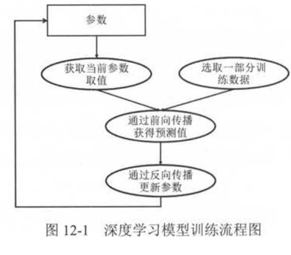
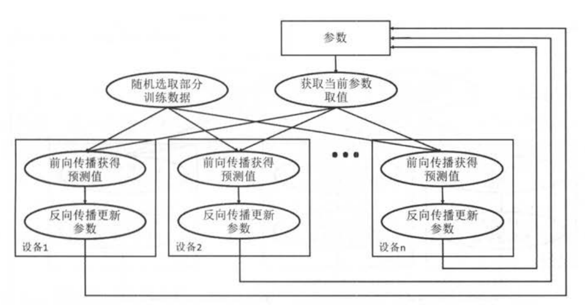
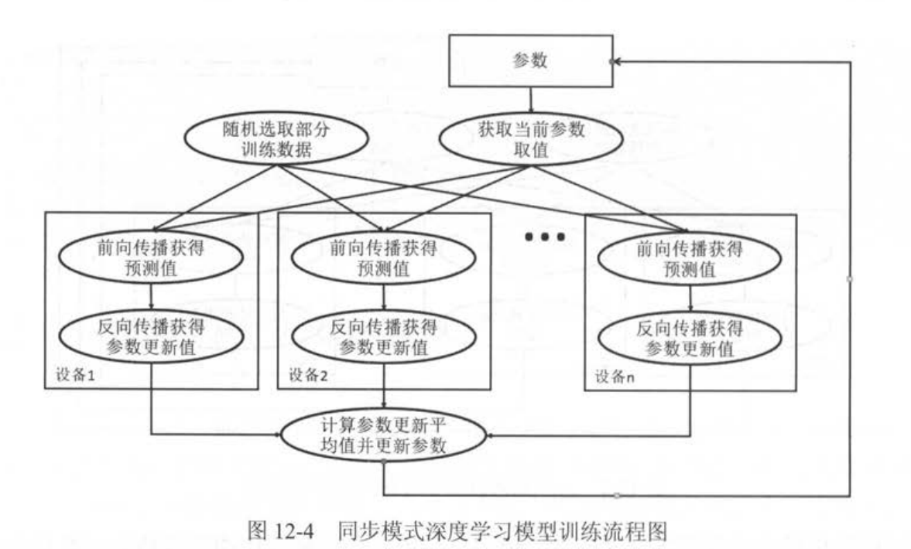

# Chapter9 Tensorflow计算加速
## 9.1 TF使用GPU
TF程序可以通过 **tf.device** 函数来指定运行每一个操作的设备，这个设备可以是本地的cpu或者GPU,本地CPU再多，TF也不会区分它们，**所有的CPU**都是用 /cpu:0作为名称。而GPU的名称是不同的，/gpu:n.
TF提供一个快捷的方式来查看运行的每一个运算的设备，在生成会话时，可以通过设置 log_device_placement 参数来打印每一个运算的设备
```python
import tensorflow as tf 

a = tf.constant([1.,2.,3.],shape=[3],name='a')
b = tf.constant([1.,2.,3.],shape=[3],name='b')
c=a+b
#通过log_device_placement参数来输出运行每一个运算的设备
sess = tf.Session(config = tf.ConfigProto(log_device_placement = True))
print(sess.run(c))

'''
在没有GPU上运行
add: (Add): /job:localhost/replica:0/task:0/device:CPU:0
2019-05-28 16:04:35.023846: I tensorflow/core/common_runtime/placer.cc:927] add: (Add)/job:localhost/replica:0/task:0/device:CPU:0
a: (Const): /job:localhost/replica:0/task:0/device:CPU:0
2019-05-28 16:04:35.027409: I tensorflow/core/common_runtime/placer.cc:927] a: (Const)/job:localhost/replica:0/task:0/device:CPU:0
b: (Const): /job:localhost/replica:0/task:0/device:CPU:0
2019-05-28 16:04:35.030455: I tensorflow/core/common_runtime/placer.cc:927] b: (Const)/job:localhost/replica:0/task:0/device:CPU:0
[2. 4. 6.]

在GPU
add: (Add): /job:localhost/replica:0/task:0/device:GPU:0
2019-05-28 16:06:46.146697: I tensorflow/core/common_runtime/placer.cc:1059] add: (Add)/job:localhost/replica:0/task:0/device:GPU:0
a: (Const): /job:localhost/replica:0/task:0/device:GPU:0
2019-05-28 16:06:46.146735: I tensorflow/core/common_runtime/placer.cc:1059] a: (Const)/job:localhost/replica:0/task:0/device:GPU:0
b: (Const): /job:localhost/replica:0/task:0/device:GPU:0
2019-05-28 16:06:46.146764: I tensorflow/core/common_runtime/placer.cc:1059] b: (Const)/job:localhost/replica:0/task:0/device:GPU:0
[2. 4. 6.]
'''

```
```python
import tensorflow as tf 

#通过 tf.device将运算指定到特定的设备上
with tf.device('cpu/:0'):
    a = tf.constanta = tf.constant([1.,2.,3.],shape=[3],name='a')
    b = tf.constant([1.,2.,3.],shape=[3],name='b')

with tf.device('/gpu:1'):
    c=a+b

sess = tf.Session(config = tf.ConfigProto(log_device_placement = True))
print(sess.run(c))

'''
add: (Add): /job:localhost/replica:0/task:0/device:GPU:0
2019-05-28 16:10:47.670763: I tensorflow/core/common_runtime/placer.cc:1059] add: (Add)/job:localhost/replica:0/task:0/device:GPU:0
a: (Const): /job:localhost/replica:0/task:0/device:CPU:0
2019-05-28 16:10:47.670807: I tensorflow/core/common_runtime/placer.cc:1059] a: (Const)/job:localhost/replica:0/task:0/device:CPU:0
b: (Const): /job:localhost/replica:0/task:0/device:CPU:0
2019-05-28 16:10:47.670826: I tensorflow/core/common_runtime/placer.cc:1059] b: (Const)/job:localhost/replica:0/task:0/device:CPU:0
[2. 4. 6.]
'''
```
有些操作不能放在GPU上，比如 tf.Variable,可以通过查看 variable_ops.cc找到定义。TF会默认占用所有的GPU，可以通过 CUDA_VISIBLE_DEVICES环境变量来控制
```python
#只是用第二块GPU
CUDA_VISIBLE_DEVICES=1
或者
os.environ["CUDA_VISIBLE_DEVICES"]="2"
```
虽然TF默认一次占用一个GPU的所有显存，但是TF也支持动态分配GPU的显存，使得一块GPU上可以运行多个任务。
```python
config = tf.ConfigProto()

#让TF按需分配显存
config.gpu_options.allow_growth = True

#或者直接按固定的比例分配现存，以下代码占用40%
#config.gpu_options.per_processs_gpu_memory_fraction=0.4
session = tf.Session(config=config)
```
## 9.2 深度学习训练并行模式
深度学习模型的训练是一个迭代的过程，在每一轮迭代中，前向传播算法会根据当前参数的取值计算出在一小部分序列数据上的预测值，然后反向传播算法再根据损失函数计算参数的梯度并更新参数。在并行化地训练深度学习模型时，不同设备(GPU或CPU)可以在不同训练数据上运行这个迭代过程。而不同模式的区别在于不同的参数更新方式。

异步模式的训练流程，每一轮迭代时，不同的设备会读取参数最新的取值，但因为不同的设备读取参数取值的时间不一样，所以得到的值也有可能不同。在异步模式下，不同设备之间是完全独立的。


同步模式下，所有的设别同时读取参数的取值，并且当反向传播算法完成之后同步跟新参数的取值，单个设备不会单独对参数进行跟新，而是会的所有的设备都完成反向传播之后再同一更新参数。

## 9.3 多GPU并行

